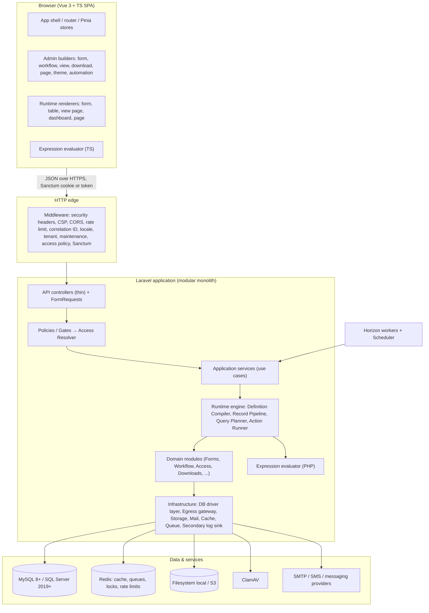
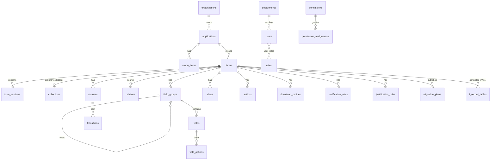
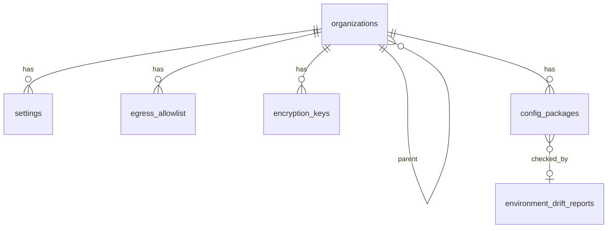
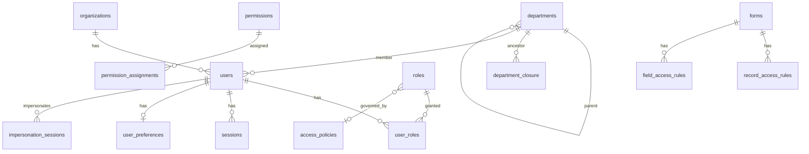
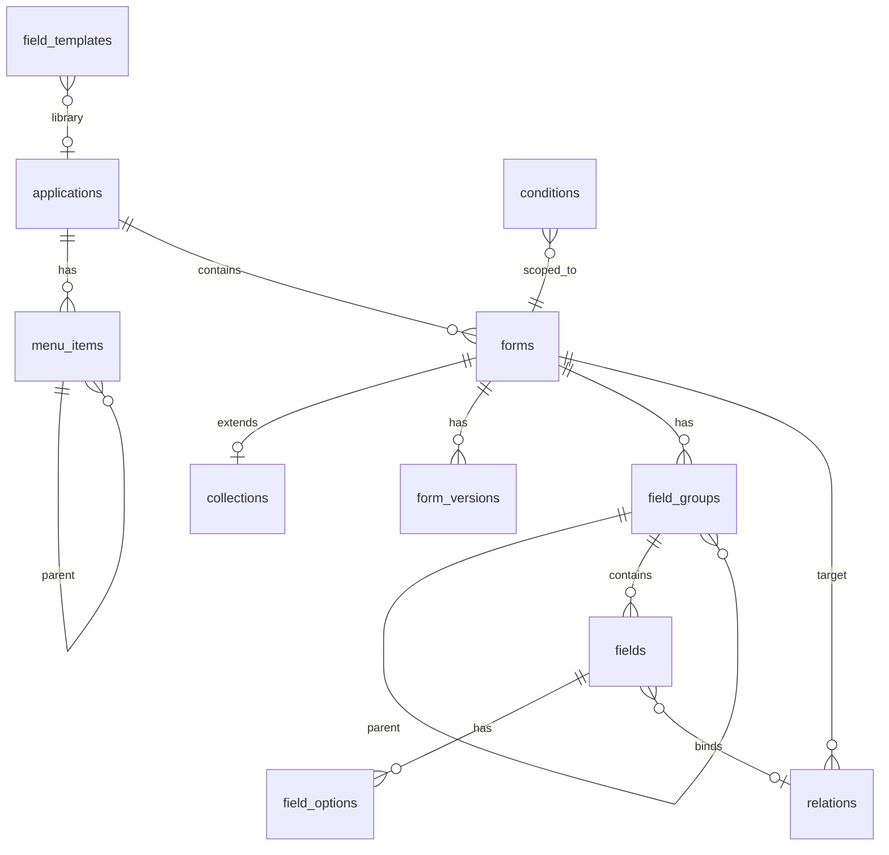
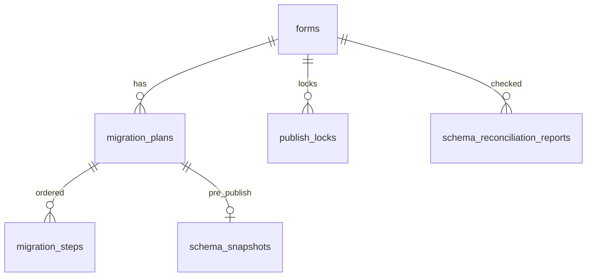
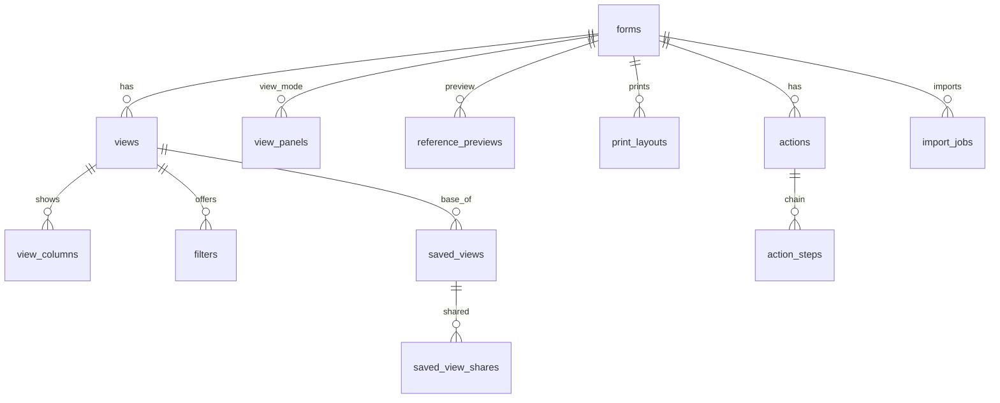
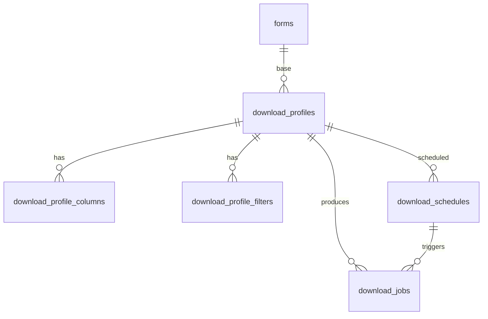
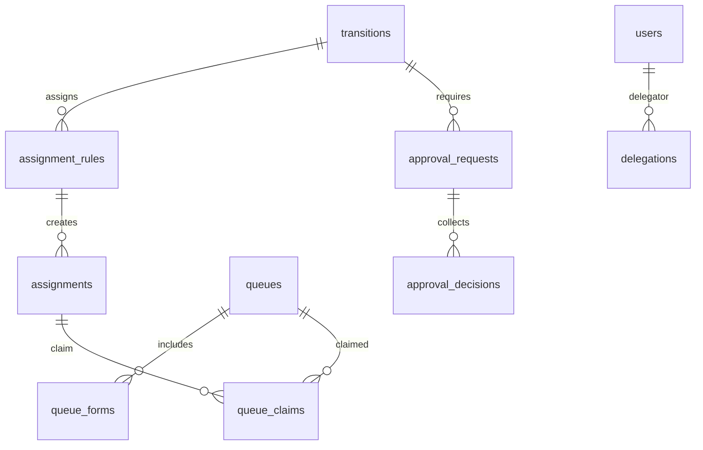

# Architecture & Data Model — Core Low-Code Framework

Status: **Phase 0 deliverable, proposed for approval.**
Contract: [`docs/specification.md`](specification.md). Where this document and
the specification disagree, the specification wins and this document is wrong.
Companion documents:

- [`docs/expression-language.md`](expression-language.md) — grammar, types, functions, AST, conformance corpus.
- [`docs/conformance/expression-corpus.json`](conformance/expression-corpus.json) — the shared conformance corpus.
- [`docs/decisions/`](decisions/) — one record per significant decision (ADR-0001 … ).
- [`docs/design-coverage.md`](design-coverage.md) — Phase 0 design coverage check (spec §2–§7 → this document).
- [`docs/progress.md`](progress.md) — phase status and resume point.

## Table of contents

1. [Guiding principles](#1-guiding-principles)
2. [System layers](#2-system-layers)
3. [Runtime engine design](#3-runtime-engine-design)
4. [Module boundaries](#4-module-boundaries)
5. [Folder structure](#5-folder-structure)
6. [Database driver layer (MySQL & SQL Server)](#6-database-driver-layer-mysql--sql-server)
7. [Security architecture](#7-security-architecture)
8. [Queue, job, and event design](#8-queue-job-and-event-design)
9. [Data model conventions](#9-data-model-conventions)
10. [ERD — complete metadata schema](#10-erd--complete-metadata-schema)
11. [Physical table generation strategy](#11-physical-table-generation-strategy)
12. [Schema change strategy](#12-schema-change-strategy)
13. [Versioning, impact analysis, rollback, environment drift](#13-versioning-impact-analysis-rollback-environment-drift)
14. [Metadata JSON schema](#14-metadata-json-schema)
15. [Expression language (summary)](#15-expression-language-summary)
16. [Permission resolution algorithm](#16-permission-resolution-algorithm)
17. [Relation traversal design](#17-relation-traversal-design)
18. [Extension model for admin-built surfaces](#18-extension-model-for-admin-built-surfaces)
19. [Domain engine designs](#19-domain-engine-designs)
20. [Performance budgets & capacity assumptions](#20-performance-budgets--capacity-assumptions)
21. [API outline](#21-api-outline)
22. [Frontend architecture](#22-frontend-architecture)
23. [Deployment, environments & CI](#23-deployment-environments--ci)
24. [Technical decisions](#24-technical-decisions)
25. [Phase map](#25-phase-map)

---

## 1. Guiding principles

1. **Metadata is the program.** Every business object (form, collection, field,
   workflow, view, action, rule, page, theme, automation, integration) is a row in
   the metadata schema (§10). The runtime engine (§3) interprets it. No business
   object is ever expressed as PHP, TypeScript, a seeder, or a configuration file.
2. **Server is authoritative.** The client evaluates conditions and access for UX
   only; every rule is re-evaluated on the server on every request (§7, §16).
3. **One definition, two runtimes.** Conditions, formulas, defaults, and
   placeholders are a single expression language stored as an AST (§15) with a
   PHP and a TypeScript evaluator kept in lock-step by a shared conformance corpus.
4. **Engine neutrality.** MySQL 8+ and SQL Server 2019+ are equal citizens. Any
   engine-specific SQL lives in the driver layer (§6) and nowhere else.
5. **Nothing is lost.** Submissions are journaled before processing, deletes are
   soft, removed fields are archived, schema steps are reversible, audit entries
   and justifications are append-only and hash-chained.
6. **Sparse, computed configuration.** Access, translation, and override data store
   only deviations; effective values are computed and cached (§16).
7. **Additive phases.** Every engine exposes interfaces, events, and registries
   (§18) so later phases plug in without rewriting earlier code.
8. **Empty shell on first run.** Seeders create only: the four core roles, the
   system permission catalog, default system settings, and the two shipped
   locales (`ar`, `en`) — locales are system settings, see ADR-0007.

## 2. System layers



| Layer | Responsibility | May depend on |
|---|---|---|
| **Presentation (SPA)** | Admin builders and runtime renderers. Holds no authority. | API contracts only |
| **HTTP edge** | Cross-cutting middleware: security headers, CSP nonce, correlation ID, locale, organization/application context, maintenance mode, access policy (IP/time window/sessions), rate limiting, authentication. | Infrastructure |
| **API** | Thin controllers; `FormRequest` validates *shape*; responses via API Resources that apply field-level masking. | Application services |
| **Authorization** | Laravel Policies/Gates that delegate to the Access Resolver (§16). Invoked on every controller action and inside every service that touches records. | Access module |
| **Application services** | Use cases (`PublishForm`, `SaveRecord`, `RunAction`, `GenerateDownload`…). Own transactions, emit domain events, write audit entries. | Runtime, domain modules |
| **Runtime engine** | Interprets metadata: compiles definitions, runs the record pipeline, plans queries over relation paths, executes actions/automations. | Domain modules, expression evaluator, driver layer |
| **Domain modules** | Entities (Eloquent models for metadata tables), domain rules, repositories, module events. | Infrastructure contracts |
| **Infrastructure** | DB driver layer, dynamic record model, egress gateway, storage + ClamAV, mail/SMS channels, cache, locks, secondary error sink. | Framework / vendor |

Rules enforced by architecture tests (Pest `arch()` in Phase 1):
controllers never touch models of another module directly; only the driver layer
may call `DB::statement` with engine-specific SQL; only `Infrastructure\Egress`
may instantiate an HTTP client; no class outside `Extensions` may load
extension code; `eval`, `create_function`, `unserialize` on untrusted input,
and `exec`-family functions are banned.

## 3. Runtime engine design

The runtime engine turns stored metadata into behavior. It has six parts.

### 3.1 Definition Compiler

Input: a published `form_versions` row (or collection version), its groups,
fields, options, conditions, relations, access rules, justification rules,
statuses, and transitions. Output: an immutable **CompiledDefinition** value
object, serialized to the cache.

```
CompiledDefinition {
  formId, versionId, versionNumber, tableName, rowVersionColumn,
  fields: map<fieldKey, CompiledField{ type, column, dbType, nullable, encrypted,
          sensitive, personal, relation?, options?, validation[], defaultExpr?,
          formulaExpr?, transforms[], mask, conditions[], events[] }>,
  groups: tree<CompiledGroup{ type, children, conditions[], validation[], repeater? }>,
  childTables: map<groupKey, CompiledDefinition>,       // repeaters / inline sub-forms
  relations: map<relationKey, CompiledRelation>,
  conditions: list<CompiledCondition{ id, scope, targetRef, ast, effects[] }>,
  dependencyGraph: { field → dependents }                // for formula/condition recompute
  workflow?: CompiledWorkflow
  justification: list<CompiledJustificationRule>
  accessBaseline: AccessDefaults                        // form/group/field defaults only
}
```

- Cache key: `def:{org}:{formId}:{versionId}`; versions are immutable so entries
  never go stale — only the *pointer* `def:current:{formId}` is invalidated on
  publish/rollback (§8 `FormPublished`).
- The compiler validates the metadata against the JSON schemas of §14 and the
  expression type checker of §15; a definition that does not compile cannot be
  published.
- The same CompiledDefinition (minus server-only data: column names, encryption
  flags, hook bindings) is sent to the client renderer as the **ClientDefinition**,
  with access already resolved for the requesting user (§16), so hidden fields are
  never sent.

### 3.2 Dynamic record model

`DynamicRecord` is a single Eloquent model class whose `$table`, casts, and
fillable set are bound at runtime from a CompiledDefinition
(`DynamicRecord::for($definition)`). It:

- sets `$fillable` to exactly the editable field columns for the *current user*
  (from the Access Resolver) — mass-assignment protection for dynamic models;
- applies casts from field types (encrypted cast for encrypted fields, decimal,
  date, JSON);
- uses the `row_version` column for optimistic concurrency (§19.1);
- uses soft deletes (`deleted_at`, `deleted_by`);
- exposes relations built from `relations` metadata (belongsTo, hasMany,
  belongsToMany through generated pivot tables).

### 3.3 Record Pipeline

Every create/update/delete/restore/transition — whether from the UI, the REST
API, an import, an action step, an automation, an inbound webhook, or an external
form — goes through one pipeline:

```
 0. Journal       → submission_journal row (status=received, payload, correlation_id,
                    idempotency_key)                         [committed before anything else]
 1. Authorize     → Access Resolver: form-level + record-level + status + transition
 2. Load          → current record (if any) + row_version check (optimistic concurrency)
 3. Hook onLoad / beforeValidate                             [Phase 5 extension point]
 4. Normalize     → transforms (trim, case), masks stripped, digits normalized
 5. Compute       → defaults (create), formulas (dependency order), set-value effects
 6. Field access  → drop non-editable keys; reject writes to read-only/hidden fields;
                    required-by-access added to rules
 7. Validate      → field rules, group rules, cross-field, uniqueness, async rules,
                    condition-driven require/block-submit (server evaluation)
 8. Hook afterValidate
 9. Justification → JustificationRule evaluation (§19.3); reject if mandatory and absent
10. Duplicate check → DuplicateRules (warn / block)                  [Phase 4]
11. Transaction BEGIN
      hook beforeSave → write parent row (row_version+1) → write child rows
      → write pivot rows → status history / approvals / assignment
      → audit entries (+ justification) → hook afterSave
      → outbox events (record.saved, status.changed …)
    COMMIT
12. Journal       → status=processed, record_id
13. Dispatch      → after-commit events: notifications, automations, webhooks, SLA timers
```

Failure at any step marks the journal row `failed` with the error, stack trace
(masked), and correlation ID; the record is not partially written because step 11
is one transaction. Retries reuse the `idempotency_key` (§19.6).

### 3.4 Query Planner

Builds list, filter, search, report, and download queries from metadata:
column selections and filters expressed as **relation paths** (§17), the user's
record-level scope (§16.6), sort, and pagination. It produces Query Builder
expressions only (parameterized), chooses joins vs. batched eager loads per path
cardinality, and hands engine-specific fragments (JSON extraction, pagination,
full-text, collation) to the driver layer.

### 3.5 Action & Automation Runner

Executes `actions` (§19.5) and `automations` (§19.9) as ordered step lists:
each step is a registered `StepHandler` (update fields, change status, email,
webhook, document, create linked record, assign, download, wait). Steps run
through the Record Pipeline when they write records, so every rule still applies.
Heavy runs are queued (§8).

### 3.6 Expression Service

Façade over the PHP evaluator: `parse` (text → AST, used only by the builder
API), `check` (type-check an AST against a definition), `evaluate` (AST +
context → value). Contexts are built by the runtime: `record`, `old`, `user`,
`mode`, `status`, `now`, `rows` (repeater), relation-path resolver with
depth/row limits. See [`expression-language.md`](expression-language.md).

### 3.7 Registries (extension points)

| Registry | Registers | Used by |
|---|---|---|
| `FieldTypeRegistry` | input/layout element types: storage mapping, validation, renderer key | builder palette, compiler, renderer |
| `ConditionEffectRegistry` | effects (show/hide, require, set value…) | conditions engine |
| `ExpressionFunctionRegistry` | expression functions (fixed library; extensions cannot add server-side functions without Manage Code + approval) | evaluators |
| `StepHandlerRegistry` | action/automation steps | action runner |
| `TriggerRegistry` | automation triggers | automations |
| `WidgetRegistry` | page/home/dashboard widgets | page renderer |
| `NotificationChannelRegistry` | email, in-app, SMS, messaging | notifications |
| `DataSourceDriverRegistry` | collection, form, REST, DB view | options, lookups, panels |
| `ExportWriterRegistry` | xlsx, csv, pdf, docx | exports, downloads, documents |
| `HookPointRegistry` | onLoad … onAction, custom endpoints | extensions |
| `PermissionCatalog` | system and auto-registered permissions | access |

## 4. Module boundaries

The backend is a **modular monolith**: one Laravel app, modules under
`app/Modules/<Module>` with their own models, services, policies, events,
controllers, routes, migrations, and tests. Cross-module calls go through the
module's public `Contracts\` interfaces or events — never through another
module's models.

| Module | Owns (tables, §10) | Public contracts | Delivered |
|---|---|---|---|
| **Core** | settings, locales, translations, organizations, egress_allowlist, feature_flags, encryption_keys, outbox_events | `Settings`, `Translator`, `TenantContext`, `Clock`, `CorrelationId` | P1 |
| **Identity** | users, sessions, user_preferences, access_policies, impersonation_sessions, password_histories, login_attempts, trusted_devices | `CurrentUser`, `PasswordPolicy`, `SessionManager` | P1 (impersonation, access policies UI P5) |
| **Organization** | departments, department_closure | `DepartmentTree` | P1 |
| **Access** | roles, user_roles, permissions, permission_assignments, field_access_rules, record_access_rules, access_cache_versions | `AccessResolver`, `PermissionCatalog`, `ExplainAccess` | P1 (system), P2 (form/field), P3 (status/record) |
| **Audit** | audit_logs, audit_chain_heads | `AuditWriter`, `ChainVerifier` | P1 |
| **Monitoring** | error_logs, error_groups | `ErrorReporter` | P1 |
| **Schema** | migration_plans, migration_steps, schema_snapshots, schema_reconciliation_reports, publish_locks | `SchemaManager`, `Introspector`, driver layer | P2 |
| **Forms** | applications, forms, form_versions, collections, field_groups, fields, field_options, conditions, relations, field_templates, menu_items | `DefinitionRepository`, `DefinitionCompiler` | P2 |
| **Expressions** | — (pure) | `ExpressionService` | P2 |
| **Records** | per-form tables, submission_journal, record_comments, record_attachments, files | `RecordPipeline`, `QueryPlanner`, `DynamicRecord` | P2 (P3 views) |
| **Reference** | business_calendars, holidays, number_sequences, currencies, exchange_rates, units_of_measure | `WorkingTimeCalculator`, `NumberGenerator`, `FxConverter` | P2 |
| **Blueprints** | blueprints, blueprint_versions, blueprint_instances | `BlueprintService` | P2 (library completed P5) |
| **Workflow** | statuses, transitions, status_history, status_mappings, sla_rules, sla_timers | `WorkflowEngine` | P3 |
| **Views** | views, view_columns, filters, saved_views, saved_view_shares, view_panels, reference_previews, print_layouts | `ViewResolver` | P3 |
| **Justification** | justification_rules, justifications, justification_reason_codes, justification_attachments | `JustificationGate` | P3 |
| **Assignment** | assignments, assignment_rules, queues, queue_forms, queue_claims, delegations, approval_requests, approval_decisions | `AssignmentService`, `DelegationResolver` | P3 |
| **Actions** | actions, action_steps, bulk_operations, import_mappings, import_jobs, export_jobs | `ActionRunner` | P4 |
| **Downloads** | download_profiles, download_profile_columns, download_profile_filters, download_schedules, download_jobs | `DownloadEngine` | P4 |
| **Notifications** | notification_rules, email_templates, email_queue, in_app_notifications, notification_channels, notification_deliveries | `Notifier` | P4 (extra channels P5) |
| **Documents** | document_templates | `DocumentRenderer` | P4 |
| **Automation** | automations, automation_triggers, automation_steps, automation_runs, scheduled_tasks | `AutomationEngine` | P4 |
| **DataQuality** | duplicate_rules, merge_history, recycle_bin | `DuplicateDetector`, `MergeService` | P4 |
| **Operations** | operations_alert_rules (reads the submission journal, the email queue, and Laravel failed jobs through their owners' contracts) | `HealthProbe` | P4 |
| **Reports** | reports, dashboards, dashboard_widgets | `ReportEngine` | P5 |
| **Platform** | api_tokens, webhooks, webhook_deliveries, inbound_endpoints, config_packages, environment_drift_reports | `OpenApiGenerator`, `PackageService` | P5 |
| **Extensions** | extensions, extension_versions | `HookRunner` | P5 |
| **Experience** | themes, theme_assets, pages, page_widgets, home_screens, announcements, announcement_dismissals, help_content, tours, tour_progress, search_configs (uses Forms' application records for navigation and theming) | `ThemeCompiler`, `PageRenderer` | P5 |
| **Integrations** | external_data_sources, sync_jobs, sync_runs | `DataSourceDriver`s | P5 |
| **External** | external_forms, external_users, access_tokens, signature_requests, submission_throttles | `ExternalGate` | P5 |
| **Adoption** | usage_metrics | `UsageRecorder` | P5 |
| **Retention** | retention_policies, retention_runs, archived_records, legal_holds, personal_data_requests, storage_quotas, subject_keys | `RetentionEngine`, `PersonalDataLocator` | P6 |

Phase 1 creates *all* tables for modules delivered in P1; each later phase adds
its own module migrations. Tables are never created ahead of the phase that uses
them (no empty schema placeholders), but every table's design is fixed here.

## 5. Folder structure

### 5.1 Repository

```
/backend              Laravel 12 application
/frontend             Vue 3 + TypeScript + Vite SPA
/docker               Dockerfiles (php-fpm, nginx, worker, scheduler), compose files
/.devcontainer        devcontainer.json + compose override (Codespaces)
/.github/workflows    ci.yml, e2e.yml, audit.yml, autobuild.yml
/.github/ISSUE_TEMPLATE, pull_request_template.md
/docs                 specification, architecture, progress, decisions, guides,
                      expression-language, conformance/ (shared corpus)
/extensions           developer extension modules (Git-friendly, §19.13); empty
README.md  CHANGELOG.md  CLAUDE.md  .env.example  .gitignore  .editorconfig
```

### 5.2 Backend (`/backend`)

```
app/
  Kernel/                       bootstrapping, module loader, arch rules
  Http/Middleware/              SecurityHeaders, ContentSecurityPolicy, CorrelationId,
                                SetLocale, ResolveTenant, EnforceAccessPolicy,
                                MaintenanceMode, ImpersonationGuard, SetupLock
  Support/                      Money, LocalizedDate, HijriCalendar, Digits, Result types
  Infrastructure/
    Database/                   Driver layer (§6): Contracts/, MySql/, SqlServer/,
                                SchemaBuilder/, Introspection/, Locks/
    Egress/                     EgressGateway, AddressValidator, PinnedResolver
    Storage/                    FileStore, VirusScanner (ClamAV), SignedUrls
    Logging/                    SecondarySink, Masker
    Cache/                      TaggedCache, VersionedKeys
  Modules/
    <Module>/
      Contracts/                public interfaces consumed by other modules
      Models/                   Eloquent models for this module's metadata tables
      Services/                 use cases
      Runtime/                  (Forms, Records, Workflow…) engine parts
      Policies/                 Laravel policies delegating to AccessResolver
      Http/Controllers/  Http/Requests/  Http/Resources/
      Events/  Listeners/  Jobs/
      Database/Migrations/      module migrations (metadata tables)
      Schemas/                  JSON schemas for this module's metadata (§14)
      routes.php
      ModuleServiceProvider.php
  Expressions/                  Lexer, Parser, TypeChecker, Evaluator, Functions/
config/  database/seeders/ (RolesSeeder, PermissionCatalogSeeder, SettingsSeeder, LocalesSeeder only)
routes/api.php (module route loader)  routes/web.php (SPA entry, signed downloads)
tests/ Unit/ Feature/ Arch/ Conformance/ (reads /docs/conformance/expression-corpus.json)
storage/  (private disk root; never web-served)
```

### 5.3 Frontend (`/frontend`)

```
src/
  app/                router/, stores/ (Pinia), plugins/ (i18n, primevue, echarts), guards/
  api/                typed API client (generated types from OpenAPI), interceptors
                      (CSRF, correlation ID, 409 conflict, 422 validation, 423 locked)
  design-system/      tokens, theme runtime, RTL utilities, base components wrapping PrimeVue
  layout/             AppShell, Sidebar, TopBar, AdminConsoleLayout, ImpersonationBanner
  expressions/        lexer, parser, type checker, evaluator (TS twin of backend)
  runtime/
    form-renderer/    FormRenderer, FieldHost, GroupHost, ConditionRuntime, FormulaRuntime
    fields/           one component per field type (registered in FieldTypeRegistry)
    table/            RecordTable, FilterBuilder, SavedViews, BulkBar, DownloadMenu
    record-view/      ViewPage, panels, timeline, comments, attachments
    pages/            PageRenderer, WidgetHost, widgets/
  builders/
    form-builder/     Palette, Canvas, PropertiesPanel, history (undo/redo), clipboard
    workflow-designer/ (Vue Flow)  view-builder/  download-builder/  rule-builder/
    page-builder/  theme-editor/  automation-builder/  report-builder/  menu-editor/
  modules/            feature areas mirroring backend modules (admin screens)
  locales/            UI chrome strings (ar.json, en.json) — business labels come from API
tests/ unit (Vitest), conformance (reads ../docs/conformance), e2e/ (Playwright)
```

## 6. Database driver layer (MySQL & SQL Server)

All application data access uses Eloquent and the Query Builder. Everything that
differs between engines is behind `Infrastructure\Database\Contracts\DatabaseDriver`,
resolved from the default connection's driver name (`mysql` → `MySqlDriver`,
`sqlsrv` → `SqlServerDriver`). Both implementations are tested in CI against real
engines (service containers).

### 6.1 Contract

```php
interface DatabaseDriver {
  // Type mapping
  public function columnType(LogicalType $t): ColumnSpec;          // §9.2 table
  // DDL
  public function createTable(TableSpec $t): array;                // SQL statements
  public function addColumn(string $table, ColumnSpec $c): array;
  public function renameColumn(string $table, string $from, string $to): array;
  public function alterColumnType(string $table, ColumnSpec $c): array;
  public function addIndex(string $table, IndexSpec $i): array;    // handles filtered unique
  public function dropIndex(string $table, string $name): array;
  public function addForeignKey(string $table, ForeignKeySpec $f): array;
  public function supportsOnlineDdl(DdlOperation $op): OnlineDdlSupport; // ALGORITHM/LOCK, ONLINE=ON
  public function estimateDdlImpact(string $table, DdlOperation $op): DdlImpact;
  public function ddlIsTransactional(): bool;                      // MySQL false, SQL Server true*
  // Introspection
  public function tables(): array; public function columns(string $t): array;
  public function indexes(string $t): array; public function foreignKeys(string $t): array;
  public function tableStats(string $t): TableStats;               // rows, data size
  // JSON
  public function jsonExtract(string $col, string $path): Expression;
  public function jsonContains(string $col, string $path, mixed $v): Expression;
  public function jsonColumnCheck(string $col): ?string;           // ISJSON on SQL Server
  // Query fragments
  public function caseInsensitiveLike(string $col): Expression;    // collation-aware
  public function fullTextMatch(array $cols, string $term): ?Expression; // fallback LIKE
  public function dateTrunc(string $col, string $unit): Expression;
  public function lockForUpdate(Builder $q): Builder;              // FOR UPDATE / UPDLOCK,ROWLOCK
  public function skipLocked(Builder $q): Builder;                 // SKIP LOCKED / READPAST
  // Locks, partitions, backups
  public function namedLock(string $name, int $timeout): bool;     // GET_LOCK / sp_getapplock
  public function releaseNamedLock(string $name): void;
  public function createTimePartitions(string $table, string $col, array $bounds): array;
  public function logicalBackup(array $tables, string $target): BackupResult;
  public function maxIdentifierLength(): int;                      // 64 / 128 → use 60
  public function maxIndexKeyBytes(): int;                         // 3072 / 1700
}
```

### 6.2 Known differences handled

| Concern | MySQL 8 | SQL Server 2019 | Driver strategy |
|---|---|---|---|
| Unicode text | `utf8mb4`, `utf8mb4_0900_ai_ci` | `nvarchar`, `Arabic_100_CI_AI_SC_UTF8`-compatible collation on DB | `string`→`varchar`/`nvarchar`. DB created with case- and accent-insensitive collation on both; binary collation for keys/tokens columns. |
| JSON | native `JSON` | `nvarchar(max)` + `CHECK (ISJSON(col)=1)` | `json` logical type; extraction via `JSON_EXTRACT`/`JSON_VALUE`; indexed JSON paths become generated/computed persisted columns. |
| Boolean | `tinyint(1)` | `bit` | `bool` logical type, cast in model. |
| Datetime | `datetime(6)` | `datetime2(6)` | All stored UTC, `datetime` logical type (no `timestamp` 2038 limit). |
| Unique + NULL | multiple NULLs allowed | one NULL only | Unique indexes on nullable columns emitted as filtered index `WHERE col IS NOT NULL` on SQL Server. |
| DDL transactions | implicit commit | transactional | Never relied upon; every DDL step individually reversible (§12). |
| Multiple cascade paths | allowed | error 1785 | FK graph designed with at most one cascading path per table; other FKs `NO ACTION` with application cascade (§9.4). |
| Identifier length | 64 | 128 | Generated names capped at 60 chars with hashed suffix. |
| Index key size | 3072 bytes | 1700 bytes (nonclustered) | Indexed strings ≤ 255 chars (`nvarchar(255)` = 510 bytes); composite keys checked by compiler. |
| Online DDL | `ALGORITHM=INSTANT/INPLACE, LOCK=NONE` | `ONLINE = ON` (Enterprise) / fallback offline | `supportsOnlineDdl` reports per op; impact analysis shows the result. |
| Named locks | `GET_LOCK` | `sp_getapplock` | Used as a secondary guard to Redis publish locks. |
| Row locking for queues | `FOR UPDATE SKIP LOCKED` | `WITH (UPDLOCK, READPAST, ROWLOCK)` | `skipLocked()` for claim/outbox pollers. |
| Pagination | `LIMIT/OFFSET` | `OFFSET/FETCH` (needs ORDER BY) | Query Builder; planner always adds a deterministic ORDER BY (`id` tiebreaker). Keyset pagination for large exports. |
| Partitioning | `PARTITION BY RANGE COLUMNS` | partition function + scheme | `createTimePartitions`; PK includes partition column (§10.21). |
| Full-text | `FULLTEXT` index | Full-Text catalog (optional) | Global search uses an indexed `search_text` column with LIKE prefix fallback when full-text is unavailable. |
| Backups before destructive steps | `SELECT … INTO` dump via chunked export to file | same | Logical backup = chunked JSONL+schema export to private storage (engine-neutral, restorable to either engine). |

### 6.3 Testing

Every driver method has a contract test run against both engines in CI
(`tests/Database/DriverContractTest.php`). The full suite runs twice per CI job
matrix entry: `DB_CONNECTION=mysql` and `DB_CONNECTION=sqlsrv`.

## 7. Security architecture

### 7.1 Authentication & sessions

- **Sanctum SPA cookie auth** for the SPA (stateful domains, `XSRF-TOKEN`
  CSRF cookie) and **Sanctum personal access tokens** for API clients, with
  abilities (scopes) mapped to permissions; tokens stored hashed (`api_tokens`).
- **Fortify** for login, password reset, password confirmation, and TOTP 2FA
  with recovery codes (encrypted). 2FA is mandatory for any user holding a role
  flagged `requires_2fa` (Super Admin, Admin, Developer by default); login
  completes only after 2FA enrollment.
- **Password policy** (settings): minimum length, character classes, history
  (`password_histories`), expiry, and an offline common-password list shipped with
  the application (no outbound call is made at login — ADR-0012).
- **Lockout**: per-account and per-IP counters in Redis + `login_attempts` table
  for audit; progressive delay then lock for N minutes (settings).
- **Sessions**: database session driver (`sessions` table) so active sessions can
  be listed and revoked; idle timeout and absolute lifetime from access policy;
  concurrent-session cap enforced at login; session ID regenerated on login,
  privilege change, and impersonation start/stop.
- **SSO**: Socialite OIDC/OAuth2 providers configured in settings (client secret
  encrypted); JIT provisioning optional with role mapping from claims.
  **LDAP**: LdapRecord with bind credentials encrypted in settings, group → role
  mapping. Both still subject to 2FA policy unless the IdP asserts MFA (`amr`).
- **Setup lock**: `settings.setup.completed_at`; `SetupLock` middleware returns
  404 for all `/setup/*` routes once set; the flag can only be changed by direct DB
  access.

### 7.2 Authorization

- Every route is behind `auth:sanctum` (except login, setup, public external
  surfaces, signed downloads, inbound webhooks) and a policy check.
- Policies delegate to `AccessResolver` (§16): system permission, form-level,
  status/transition, action, download profile, record-level scope, group/field
  access. Record IDs in URLs are always resolved *through* the record scope query
  (`whereScope($user)`) — an out-of-scope ID returns 404, never 403 (IDOR).
- API Resources serialize only fields the user may see; sensitive fields are
  masked unless `view_sensitive` is granted for that field.
- Mass assignment: dynamic models fill only the access-filtered fillable set;
  metadata models use explicit `$fillable`.
- Deny overrides allow (§16).

### 7.3 Input & output safety

| Threat | Control |
|---|---|
| SQL injection (A03) | Query Builder bindings only; identifiers (table/column names) come from metadata and are validated against `^[a-z][a-z0-9_]{0,59}$` and a reserved-word list, then quoted by the grammar. Visual query builder emits AST, never SQL. |
| Metadata injection | Every metadata write validated against its JSON schema (§14) + semantic checks (references exist, AST type-checks, limits). |
| XSS | Vue escapes by default; `v-html` allowed only in a `SafeHtml` component fed by server-sanitized HTML (HTML Purifier profile per content type: rich text, email template, page content, help). |
| CSP | Strict CSP with per-request nonce: `default-src 'self'; script-src 'self' 'nonce-…'; object-src 'none'; frame-ancestors 'none'; base-uri 'self'; img-src 'self' data: blob: <tile server>; connect-src 'self'`; Monaco loaded from self (workers via blob allowed only on code-editor routes). |
| CSRF | Sanctum CSRF cookie + `VerifyCsrfToken`; SameSite=Lax; token API requests are header-authenticated and immune. |
| Headers | HSTS (1y, includeSubDomains), `X-Frame-Options: DENY`, `X-Content-Type-Options: nosniff`, `Referrer-Policy: strict-origin-when-cross-origin`, `Permissions-Policy` (camera/geolocation self only). |
| Custom CSS | Parsed with a CSS parser; allowed properties whitelist; no `url()` to external hosts, no `@import`, no `expression`, no `position:fixed` over chrome; scoped under `.app-content` so it cannot hide security banners (§19.11). |
| Spreadsheet / document parsing | PhpSpreadsheet with XXE disabled (`libxml` entity loader off), read-data-only, formulas read as text; DOCX via PhpWord with entity loading disabled; size/row/time limits; background jobs. |
| CSV/Excel injection | Export writers prefix cells starting with `= + - @ \t \r` with `'`. |
| File uploads | Extension + MIME sniff (finfo) + allowlist per field, size limits, image re-encoding to strip payloads, ClamAV scan before the file is linked, private disk outside web root, served only via signed expiring routes after a policy check. |
| SSRF | Single **Egress Gateway** (§7.4). |
| Deserialization | Queue payloads signed (Laravel encrypts/serializes only own classes); no `unserialize` of user input. |
| Expression abuse | Pure language, depth/time/row bounds (§15). |
| Error leakage | Users see message + reference ID; details only in Error Monitoring with masking. |

### 7.4 Egress gateway

`Infrastructure\Egress\EgressGateway` is the **only** class allowed to perform
outbound HTTP (enforced by arch test banning `Http::`, Guzzle, `curl_*`,
`file_get_contents('http…')` elsewhere). Per request:

1. Parse URL; scheme must be `https` (or `http` only if the allowlist entry
   explicitly allows it); no userinfo.
2. Host must match an `egress_allowlist` entry (exact host or `*.suffix`, port list).
3. Resolve DNS (A and AAAA). Every resolved address is checked against blocked
   ranges: `0.0.0.0/8, 10/8, 100.64/10, 127/8, 169.254/16, 172.16/12, 192.0.0/24,
   192.168/16, 198.18/15, 224/4, 240/4, ::/128, ::1/128, ::ffff:0:0/96 (re-checked
   as IPv4), 64:ff9b::/96, fc00::/7, fe80::/10, ff00::/8`, plus metadata endpoints
   (`169.254.169.254`, `fd00:ec2::254`, `metadata.google.internal`).
4. Connect to the validated IP with `CURLOPT_RESOLVE` pinning (SNI/Host header kept)
   so a second DNS answer cannot redirect.
5. Redirects: followed only to the same scheme+host+port, max 3, each re-validated.
6. Timeout (connect 5 s, total configurable ≤ 60 s), response size cap
   (configurable, default 10 MB, streamed), retry with exponential backoff (max 5).
7. Signing: HMAC-SHA256 over `timestamp.body` with the per-webhook secret
   (`X-Signature`, `X-Timestamp`).
8. Logging: `webhook_deliveries` / integration logs with headers masked
   (Authorization, cookies, configured secret headers) and bodies truncated.

### 7.5 Data protection & key management

- Encrypted fields use an envelope scheme: per-organization **data keys**
  (`encryption_keys` table, each wrapped by the app master key `APP_KEY` /
  external KMS key ID), and per-field key reference stored in field metadata.
  Ciphertext format `v1:{keyId}:{base64}` so rotation can re-encrypt lazily and via
  a batch job; documented rotation procedure in Phase 6 guide.
- Secrets (SMTP password, SSO secrets, webhook secrets, data source credentials)
  stored encrypted in their tables; masked in API responses (write-only fields).
- Encrypted columns are not filterable or sortable except for exact-match through a
  keyed blind index column (`<col>__bidx`, HMAC-SHA256) when the admin enables
  "searchable encrypted" on the field.
- Logs: `Masker` removes values of fields flagged sensitive/encrypted, passwords,
  tokens, and configured header names before writing to any sink.

### 7.6 External surfaces

Public forms, external users, and tokenized links use a **separate guard**
(`external`) and separate route group `/x/*` with its own rate limiter, CSP, and
session cookie name. They have no implicit permissions: an external principal
resolves access only through the `external_forms` publication and the
`access_tokens` scope (one record, one action, expiry, single use or N uses,
revocable). See §19.12.

### 7.7 Impersonation

Requires `impersonate_users`; cannot target a user holding any permission the
impersonator lacks (no escalation); cannot target Super Admin unless the actor is
Super Admin; time-limited (`impersonation_sessions.expires_at`); persistent
banner; actions flagged in `settings.security.impersonation_blocked_actions`
denied; every audit entry carries `actor_user_id` (admin) and
`subject_user_id` (impersonated) with `impersonation_session_id`.

### 7.8 OWASP Top 10 (2021) mapping

| Risk | Primary controls (sections) |
|---|---|
| A01 Broken access control | §7.2, §16, record scope 404s, arch tests that every route has a policy |
| A02 Cryptographic failures | TLS + HSTS, §7.5 envelope encryption, hashed tokens, bcrypt/argon2id passwords |
| A03 Injection | §7.3, identifier validation, AST-only expressions |
| A04 Insecure design | journaling, idempotency, optimistic concurrency, egress gateway, approvals for code |
| A05 Security misconfiguration | secure defaults in settings seeder, setup wizard, headers/CSP, debug off in prod check on health page |
| A06 Vulnerable components | composer audit + npm audit in CI, Dependabot |
| A07 Identification & auth failures | §7.1 lockout, 2FA, session management, rate limits |
| A08 Software & data integrity | hash-chained audit, signed webhooks, extension approval workflow, signed queue payloads |
| A09 Logging & monitoring failures | audit log, error monitoring with secondary sink, alerts |
| A10 SSRF | §7.4 |

## 8. Queue, job, and event design

### 8.1 Queues (Horizon + Redis)

| Queue | Workloads | Notes |
|---|---|---|
| `critical` | submission retries, approvals fan-out, publish (schema) jobs | low latency, `tries=3` |
| `default` | notifications dispatch, automations (event-triggered), SLA evaluations | |
| `mail` | `SendEmailJob` per `email_queue` row | rate-limited per SMTP settings |
| `webhooks` | outbound webhook deliveries, integration calls | backoff, egress only |
| `heavy` | imports, exports, custom downloads, document generation, bulk ops, merges, retention runs, reconciliation, logical backups | long timeout, `maxProcesses` capped |
| `scheduled` | jobs dispatched by the scheduler tick | |

Every job implements `CorrelatedJob` (carries correlation ID, organization ID,
acting user, on-behalf-of user) and `TracksProgress` where user-visible
(writes `progress` to its tracking row: download_jobs, import_jobs, bulk_operations…).
Failed jobs go to Laravel `failed_jobs` (+ our tracking row `status=failed`) and
surface in the Operations Center (§19.7). All jobs are idempotent: keyed by the
tracking row id; a retry checks state before acting.

### 8.2 Scheduler

A single `schedule:run` cron entry. Scheduled items are **data** in
`scheduled_tasks` (§10.18): the scheduler tick (every minute) loads due tasks and
dispatches their jobs with an atomic claim (`skipLocked`) so multiple scheduler
containers cannot double-run. System tasks (registered by modules, not editable
business logic): SLA tick, stuck-email detection, schema reconciliation, audit
chain verification, retention runs, exchange-rate refresh, scheduled downloads,
sync jobs, threshold alerts, partition maintenance, recycle-bin purge. Each run
writes `last_run_at`, `last_status`, and an audit entry.

### 8.3 Events

Domain events are PHP classes dispatched by services. Events that cross the
transaction boundary use a **transactional outbox** (`outbox_events` table,
§10.21): written in the same transaction as the change, relayed by a poller to
Laravel events/queues after commit. This guarantees that notifications,
automations, and webhooks fire if and only if the data committed.

| Event | Producer | Consumers |
|---|---|---|
| `RecordCreated/Updated/Deleted/Restored` | Records | Notifications, Automations, Webhooks, Search index, Usage, Duplicate sweep |
| `RecordFieldChanged` (per field diff) | Records | Notifications (field changed), Automations |
| `StatusChanged` | Workflow | Notifications, SLA, Assignment, Automations, Webhooks |
| `TransitionApprovalRequested/Decided` | Assignment | Notifications, queues |
| `RecordAssigned/Claimed/Released` | Assignment | Notifications, My Work cache |
| `FormPublished/RolledBack/Unpublished` | Forms | Definition cache, Access cache, Menus, OpenAPI regen, Blueprints |
| `AccessChanged` (roles, perms, user roles, departments, rules) | Access/Identity | Access cache version bump |
| `SettingsChanged` | Core | Config cache, theme compile |
| `SubmissionFailed`, `JobFailed`, `EmailFailed`, `WebhookFailed` | various | Operations alert evaluator |
| `ConditionBecameTrue` (evaluated on save) | Records | Automations, Notifications |
| `ErrorCaptured` | Monitoring | Error alerts |
| `UserLoggedIn/LoginFailed/LockedOut` | Identity | Audit, alerts |

### 8.4 Correlation

`CorrelationId` middleware accepts a valid inbound `X-Correlation-ID` (UUID) or
generates a ULID; it is placed in the log context, every audit/error/journal row,
every job payload, every outbound email header (`X-Correlation-ID`) and webhook,
and returned in the response header so users can quote it.

## 9. Data model conventions

### 9.1 Naming

- Tables: `snake_case`, plural (`form_versions`). Columns: `snake_case`.
- Physical record tables generated per form: `f_{form_key}` (forms),
  `c_{collection_key}` (collections), child tables `f_{form_key}__{group_key}`,
  pivots `p_{relation_key}`; archived columns renamed `zz_{column}_{yyyymmddhhmm}`.
  All generated identifiers ≤ 60 chars (hash suffix when truncated). See §11.
- Indexes: `{table}_{cols}_idx`, unique `{table}_{cols}_uq`, FKs `{table}_{col}_fk`.

### 9.2 Logical types (both engines)

| Logical type | MySQL 8 | SQL Server 2019 | Notes |
|---|---|---|---|
| `bigint` / `id` | `BIGINT UNSIGNED` (`AUTO_INCREMENT` for PK) | `BIGINT` (`IDENTITY(1,1)` for PK) | all PKs and FKs |
| `int` | `INT` | `INT` | |
| `smallint` | `SMALLINT` | `SMALLINT` | small enums by number, orders |
| `bool` | `TINYINT(1)` | `BIT` | |
| `decimal(p,s)` | `DECIMAL(p,s)` | `DECIMAL(p,s)` | money uses `decimal(19,4)`, rates `decimal(20,10)` |
| `string(n)` | `VARCHAR(n)` utf8mb4 | `NVARCHAR(n)` | n ≤ 255 when indexed |
| `code(n)` | `VARCHAR(n)` `utf8mb4_bin` | `VARCHAR(n)` `Latin1_General_BIN2` | machine keys, hashes, tokens (case-sensitive, ASCII) |
| `text` | `TEXT` / `MEDIUMTEXT` | `NVARCHAR(MAX)` | |
| `longtext` | `LONGTEXT` | `NVARCHAR(MAX)` | |
| `json` | `JSON` | `NVARCHAR(MAX)` + `CHECK (ISJSON(col)=1)` | never filtered directly; indexed paths → generated/computed columns |
| `uuid` | `CHAR(36)` | `UNIQUEIDENTIFIER` | Laravel `uuid()`; generated as UUIDv7 (time-ordered) |
| `datetime` | `DATETIME(6)` | `DATETIME2(6)` | always UTC |
| `date` | `DATE` | `DATE` | |
| `time` | `TIME` | `TIME` | |
| `hash` | `CHAR(64)` binary collation | `CHAR(64)` BIN2 | SHA-256 hex |
| `enum<…>` | `VARCHAR(32)` + PHP backed enum | `NVARCHAR(32)` + `CHECK` constraint | listed values are exhaustive |

### 9.3 Column mixins

To keep the ERD readable, recurring column sets are written as mixins. A mixin
expands to exactly these columns (they are real columns of the table):

| Mixin | Columns |
|---|---|
| `@pk` | `id` id PK |
| `@uuid` | `uuid` uuid NOT NULL, **unique** — stable cross-environment identity used by configuration packages, blueprints, drift compare, and public URLs |
| `@org` | `organization_id` bigint NOT NULL FK → `organizations.id` (NO ACTION); every composite index on the table starts with it |
| `@ts` | `created_at` datetime NOT NULL, `updated_at` datetime NOT NULL |
| `@by` | `created_by` bigint NULL FK → `users.id` (SET NULL is avoided for SQL Server cascade paths: NO ACTION; user rows are never hard-deleted), `updated_by` bigint NULL FK → `users.id` (NO ACTION) |
| `@soft` | `deleted_at` datetime NULL, `deleted_by` bigint NULL FK → `users.id` (NO ACTION); index (`organization_id`, `deleted_at`) |
| `@meta` | `@pk @uuid @org @ts @by` |

**Translatable attributes** are listed per table as *Translatable:* and stored in
`translations` (§10.3) — never as columns.

### 9.4 Foreign keys and deletion

- Metadata rows are archived or soft-deleted, not hard-deleted, once referenced by
  data. FKs default to **NO ACTION** (restrict).
- **CASCADE** is used only for strict composition (a child cannot exist without
  its parent: `field_options` → `fields`, `action_steps` → `actions`, …) and only
  where the table has a single cascading path (SQL Server rule 1785).
- Polymorphic references (`owner_type` + `owner_id`, `subject_type` +
  `subject_id`) have no DB FK; integrity is enforced by the owning service and
  verified by the data-repair tool (§19.10).
- References into generated record tables (`record_id`) carry no DB FK (the
  target table varies by form); the pair (`form_id`, `record_id`) is always
  stored and indexed.

### 9.5 Organizations and the platform root

Every row belongs to an organization. The seeders create one **platform
organization** (`organizations.id = 1`, `is_platform = 1`) that owns the seeded
roles, permission catalog, global settings, and locales. In *single organization*
mode the setup wizard renames it and all business data lives there. In
*multi-organization* mode each tenant is a child organization; platform users
holding Super Admin are the global administrators (ADR-0004).

## 10. ERD — complete metadata schema

Every entity of specification §7 appears below with every column, type, index,
and foreign key. Additional supporting tables required by §2–§6 are marked
**(supporting)**. Notation: `?` after a type means NULL allowed; otherwise NOT
NULL. `→` denotes a foreign key with its delete rule.

### 10.1 Domain overview



### 10.2 System & tenancy



**`organizations`** (supporting — tenancy root, §4.27)

| Column | Type | Notes |
|---|---|---|
| `@pk @uuid @ts @by` | | |
| `parent_id` | bigint? | → `organizations.id` NO ACTION; NULL only for the platform org |
| `key` | code(64) | unique |
| `is_platform` | bool | exactly one row = 1 |
| `status` | enum<active,suspended,archived> | |
| `default_locale` | code(10) | |
| `timezone` | string(64) | IANA name |
| `theme_id` | bigint? | → `themes.id` NO ACTION (default theme) |
| `settings_overrides` | json? | org-specific overrides of global settings keys allowed to vary |

Translatable: `name`. Indexes: `key` unique; `parent_id`.

**`settings`** (§7 System)

| Column | Type | Notes |
|---|---|---|
| `@pk @org @ts` | | |
| `group` | code(64) | e.g. `branding`, `mail`, `security`, `formats`, `files`, `sso`, `ldap`, `clamav`, `operations`, `retention`, `setup` |
| `key` | code(128) | |
| `value` | json? | non-secret values |
| `encrypted_value` | text? | secrets (SMTP password, SSO client secret, LDAP bind password) — never returned by the API |
| `is_encrypted` | bool | |
| `updated_by` | bigint? | → `users.id` |

Indexes: (`organization_id`, `group`, `key`) unique.

**`egress_allowlist`** (§7 System, §4.15)

| Column | Type | Notes |
|---|---|---|
| `@meta` | | |
| `host_pattern` | string(253) | exact host or `*.example.com`; IP literals rejected |
| `ports` | json | e.g. `[443]` |
| `allow_http` | bool | default 0 |
| `description` | string(255)? | |
| `is_active` | bool | |

Indexes: (`organization_id`, `host_pattern`) unique.

**`encryption_keys`** (supporting — §5 key management)

| Column | Type | Notes |
|---|---|---|
| `@pk @org @ts` | | |
| `key_id` | code(64) | unique; embedded in ciphertext prefix |
| `wrapped_key` | text | data key encrypted by the master key / KMS |
| `kms_key_ref` | string(255)? | external KMS key identifier when used |
| `algorithm` | code(32) | `aes-256-gcm` |
| `purpose` | enum<fields,files,secrets,blind_index> | |
| `status` | enum<active,retiring,retired> | one active per (org, purpose) |
| `rotated_at` | datetime? | |

Indexes: `key_id` unique; (`organization_id`, `purpose`, `status`).

**`config_packages`** (§7 System, §4.22)

| Column | Type | Notes |
|---|---|---|
| `@meta` | | |
| `direction` | enum<export,import> | |
| `name` | string(255) | |
| `manifest` | json | object list: type, uuid, version, hash, dependencies |
| `file_id` | bigint? | → `files.id` (package archive, signed) |
| `checksum` | hash | |
| `source_environment` | string(128)? | |
| `status` | enum<draft,validated,conflicts,applying,applied,failed,rolled_back> | |
| `conflict_report` | json? | per object: none / changed-in-target / missing-dependency / drift |
| `resolution` | json? | admin choice per conflict: keep target / take package / rename |
| `drift_report_id` | bigint? | → `environment_drift_reports.id` |
| `applied_at` | datetime? | |
| `applied_by` | bigint? | → `users.id` |

Indexes: (`organization_id`, `status`); (`organization_id`, `created_at`).

**`environment_drift_reports`** (supporting — §4.10 compare environments)

| Column | Type | Notes |
|---|---|---|
| `@meta` | | |
| `source_label` | string(128) | environment name of the package / remote snapshot |
| `target_label` | string(128) | |
| `source_manifest_hash` | hash | |
| `metadata_differences` | json | per object uuid: added/removed/changed with field-level diff |
| `schema_differences` | json | per physical table: column/index/FK differences |
| `is_ambiguous` | bool | import refused when 1 |
| `conflicting_objects` | json? | |

Indexes: (`organization_id`, `created_at`).

### 10.3 Localization

**`locales`** (§7 Localization)

| Column | Type | Notes |
|---|---|---|
| `@pk @ts` | | global (platform) |
| `code` | code(10) | unique, BCP 47 (`ar`, `en`) |
| `native_name` | string(64) | |
| `direction` | enum<ltr,rtl> | |
| `calendar` | enum<gregorian,hijri,both> | preference |
| `digits` | enum<western,arabic_indic> | |
| `date_format` | string(32) | |
| `time_format` | enum<12h,24h> | |
| `number_format` | json | decimal & group separators, grouping |
| `first_day_of_week` | smallint | 0=Sunday … 6=Saturday |
| `fallback_locale_id` | bigint? | → `locales.id` NO ACTION |
| `is_enabled` | bool | |
| `is_default` | bool | exactly one |
| `sort_order` | int | |

Indexes: `code` unique.

**`translations`** (§7 Localization; §3 Languages)

| Column | Type | Notes |
|---|---|---|
| `@pk @org` | | |
| `object_type` | code(64) | morph alias: `form`, `field`, `field_option`, `status`, `ui`, … |
| `object_id` | bigint | 0 for `ui` strings |
| `field` | code(191) | attribute (`label`, `placeholder`, `validation.required`, UI message key) |
| `locale` | code(10) | → `locales.code` (FK on code, NO ACTION) |
| `value` | text | |
| `updated_by` | bigint? | → `users.id` |
| `updated_at` | datetime | |

Indexes: (`object_type`, `object_id`, `field`, `locale`) unique;
(`organization_id`, `locale`, `object_type`). Missing rows fall back along
`fallback_locale_id` then the default locale; the translation manager lists
(object × translatable field × enabled locale) combinations with no row.

### 10.4 Identity & access



**`users`** (§7 Access)

| Column | Type | Notes |
|---|---|---|
| `@meta @soft` | | users are never hard-deleted; anonymization (§4.26) overwrites PII |
| `name` | string(255) | |
| `email` | string(255) | unique across installation |
| `username` | string(128)? | unique when present (LDAP) |
| `password` | string(255)? | argon2id; NULL for SSO-only |
| `email_verified_at` | datetime? | |
| `two_factor_secret` | text? | encrypted |
| `two_factor_recovery_codes` | text? | encrypted |
| `two_factor_confirmed_at` | datetime? | |
| `department_id` | bigint? | → `departments.id` NO ACTION |
| `manager_id` | bigint? | → `users.id` NO ACTION |
| `job_title` | string(255)? | |
| `phone` | string(32)? | |
| `status` | enum<pending,active,suspended,disabled> | |
| `auth_source` | enum<local,ldap,oidc> | |
| `external_subject` | string(255)? | IdP subject / LDAP objectGUID |
| `attributes` | json? | admin-defined user attributes used by conditions |
| `password_changed_at` | datetime? | |
| `last_login_at` | datetime? | |
| `last_login_ip` | string(45)? | |
| `failed_login_count` | smallint | default 0 |
| `locked_until` | datetime? | |
| `remember_token` | string(100)? | |
| `anonymized_at` | datetime? | |

Indexes: `email` unique; `username` unique (filtered/generated, nullable);
(`organization_id`, `department_id`); (`auth_source`, `external_subject`) unique (nullable-partial); `manager_id`.

**`departments`** (§7 Access)

| Column | Type | Notes |
|---|---|---|
| `@meta @soft` | | |
| `parent_id` | bigint? | → `departments.id` NO ACTION |
| `code` | code(64) | unique per org |
| `manager_user_id` | bigint? | → `users.id` NO ACTION |
| `business_calendar_id` | bigint? | → `business_calendars.id` NO ACTION |
| `depth` | smallint | |
| `sort_order` | int | |
| `is_active` | bool | |

Translatable: `name`. Indexes: (`organization_id`, `code`) unique; `parent_id`.

**`department_closure`** (supporting — department tree queries)

| Column | Type | Notes |
|---|---|---|
| `ancestor_id` | bigint | → `departments.id` CASCADE |
| `descendant_id` | bigint | → `departments.id` NO ACTION (single cascade path) |
| `depth` | smallint | 0 = self |

PK (`ancestor_id`, `descendant_id`); index (`descendant_id`, `depth`).

**`roles`** (§7 Access)

| Column | Type | Notes |
|---|---|---|
| `@meta` | | seeded: `super_admin`, `admin`, `developer`, `user` on the platform org |
| `key` | code(64) | |
| `is_system` | bool | system roles cannot be deleted or renamed by key |
| `audience` | enum<internal,external> | external roles serve external users (§4.32) |
| `application_id` | bigint? | → `applications.id` NO ACTION — application-scoped role |
| `requires_2fa` | bool | |
| `is_admin_role` | bool | stricter access policy applies |
| `access_policy_id` | bigint? | → `access_policies.id` NO ACTION |
| `sort_order` | int | |

Translatable: `name`, `description`. Indexes: (`organization_id`, `key`) unique.

**`user_roles`** (§7 Access)

| Column | Type | Notes |
|---|---|---|
| `@pk` | | |
| `user_id` | bigint | → `users.id` CASCADE |
| `role_id` | bigint | → `roles.id` NO ACTION |
| `valid_from` | datetime? | |
| `valid_until` | datetime? | |
| `assigned_by` | bigint? | → `users.id` NO ACTION |
| `created_at` | datetime | |

Indexes: (`user_id`, `role_id`) unique; `role_id`.

**`permissions`** (§7 Access) — the catalog; seeded system rows + auto-registered rows

| Column | Type | Notes |
|---|---|---|
| `@pk @org @ts` | | |
| `key` | code(191) | `system.manage_forms`, `form.{uuid}.export`, `action.{uuid}.run`, `download.{uuid}.use`, `menu.{uuid}.view`, `transition.{uuid}.perform`, `app.{uuid}.access`, `page.{uuid}.view`, `report.{uuid}.view`, `dashboard.{uuid}.view`, `view.{uuid}.use`, `field.{uuid}.view_sensitive` |
| `scope_type` | enum<system,application,form,action,download_profile,menu_item,transition,page,report,dashboard,view,field> | |
| `scope_id` | bigint? | id of the scoped object (polymorphic) |
| `ability` | code(64) | `view`, `create`, `edit`, `delete`, `restore`, `export`, `import`, `print`, `view_log`, `run`, `use`, `perform`, `access`, `view_sensitive`, or system ability |
| `category` | code(64) | grouping for the UI |
| `is_system` | bool | |
| `is_dangerous` | bool | requires 2FA re-confirmation to grant |

Translatable: `label`, `description`. Indexes: `key` unique; (`scope_type`, `scope_id`).

**`permission_assignments`** (§7 Access)

| Column | Type | Notes |
|---|---|---|
| `@pk @org @ts` | | |
| `permission_id` | bigint | → `permissions.id` CASCADE |
| `subject_type` | enum<role,user,department> | |
| `subject_id` | bigint | |
| `effect` | enum<allow,deny> | |
| `include_descendants` | bool | department subject applies to sub-departments |
| `condition_id` | bigint? | → `conditions.id` NO ACTION (custom condition) |
| `valid_until` | datetime? | |
| `granted_by` | bigint? | → `users.id` NO ACTION |

Indexes: (`permission_id`, `subject_type`, `subject_id`) unique;
(`subject_type`, `subject_id`).

**`field_access_rules`** (§7 Structure — sparse overrides, §16)

| Column | Type | Notes |
|---|---|---|
| `@meta` | | |
| `form_id` | bigint | → `forms.id` CASCADE |
| `target_type` | enum<form,group,field> | |
| `group_id` | bigint? | → `field_groups.id` NO ACTION |
| `field_id` | bigint? | → `fields.id` NO ACTION |
| `subject_type` | enum<everyone,role,department,user> | |
| `subject_id` | bigint? | NULL for `everyone` |
| `status_id` | bigint? | → `statuses.id` NO ACTION; NULL = any status |
| `mode` | enum<create,edit,view,print>? | NULL = any mode |
| `access` | enum<hidden,read_only,editable,required> | |
| `is_deny` | bool | an explicit ceiling: beats any allow at any specificity (§16.3) |
| `rule_hash` | hash | SHA-256 of (`form_id`, `target_type`, `group_id`, `field_id`, `subject_type`, `subject_id`, `status_id`, `mode`) — nullable-safe uniqueness on both engines |

Indexes: `rule_hash` unique; (`form_id`, `target_type`, `group_id`, `field_id`); (`form_id`, `subject_type`, `subject_id`); (`form_id`, `status_id`, `mode`).

**`record_access_rules`** (§7 Access)

| Column | Type | Notes |
|---|---|---|
| `@meta` | | |
| `form_id` | bigint | → `forms.id` CASCADE |
| `subject_type` | enum<everyone,role,department,user> | |
| `subject_id` | bigint? | |
| `operation` | enum<view,edit,delete,all> | |
| `scope` | enum<none,own,own_department,department_tree,assigned,all,custom> | |
| `condition_id` | bigint? | → `conditions.id` NO ACTION; for `custom` |
| `effect` | enum<allow,deny> | |
| `priority` | int | display ordering only; resolution per §16.6 |

Indexes: (`form_id`, `subject_type`, `subject_id`, `operation`).

**`sessions`** (§7 Access)

| Column | Type | Notes |
|---|---|---|
| `id` | code(128) | PK (session ID) |
| `user_id` | bigint? | → `users.id` CASCADE |
| `external_user_id` | bigint? | → `external_users.id` NO ACTION |
| `guard` | enum<web,external> | |
| `ip_address` | string(45)? | |
| `user_agent` | text? | |
| `payload` | longtext | encrypted session data |
| `last_activity` | int | unix time |
| `created_at` | datetime | |
| `absolute_expires_at` | datetime | |
| `two_factor_passed_at` | datetime? | |
| `trusted_device_id` | bigint? | → `trusted_devices.id` NO ACTION |
| `impersonation_session_id` | bigint? | → `impersonation_sessions.id` NO ACTION |

Indexes: `user_id`; `last_activity`; `external_user_id`.

**`password_histories`** (supporting)

| Column | Type | Notes |
|---|---|---|
| `@pk` | | |
| `user_id` | bigint | → `users.id` CASCADE |
| `password_hash` | string(255) | |
| `created_at` | datetime | |

Index (`user_id`, `created_at`).

**`login_attempts`** (supporting — lockout evidence and alerts)

| Column | Type | Notes |
|---|---|---|
| `@pk @org` | | |
| `identifier_hash` | hash | HMAC of the submitted login (no plaintext) |
| `user_id` | bigint? | → `users.id` NO ACTION |
| `guard` | enum<web,external,api> | |
| `ip_address` | string(45) | |
| `user_agent` | text? | |
| `successful` | bool | |
| `failure_reason` | code(32)? | `bad_password`, `locked`, `2fa_failed`, `policy_ip`, `policy_time`, … |
| `attempted_at` | datetime | |

Indexes: (`identifier_hash`, `attempted_at`); (`ip_address`, `attempted_at`); (`organization_id`, `attempted_at`).

**`trusted_devices`** (supporting — §4.36 device trust)

| Column | Type | Notes |
|---|---|---|
| `@pk @ts` | | |
| `user_id` | bigint | → `users.id` CASCADE |
| `device_hash` | hash | HMAC of device cookie value |
| `label` | string(255)? | derived from user agent |
| `last_used_at` | datetime? | |
| `expires_at` | datetime | |
| `revoked_at` | datetime? | |

Indexes: (`user_id`, `device_hash`) unique.

### 10.5 Structure (applications, forms, fields)



**`applications`** (§7 Structure, §4.27)

| Column | Type | Notes |
|---|---|---|
| `@meta @soft` | | |
| `key` | code(64) | |
| `icon` | string(64)? | |
| `color` | string(16)? | |
| `theme_id` | bigint? | → `themes.id` NO ACTION |
| `home_screen_id` | bigint? | → `home_screens.id` NO ACTION (default) |
| `status` | enum<active,archived,retired> | |
| `data_sharing_default` | enum<shared,isolated> | default for new forms |
| `maintenance_mode` | bool | |
| `maintenance_until` | datetime? | |
| `settings` | json? | per-application setting overrides |
| `sort_order` | int | |

Translatable: `name`, `description`, `maintenance_message`. Indexes: (`organization_id`, `key`) unique.
Access: permission `app.{uuid}.access` (auto-registered) granted to roles/departments enables it.

**`menu_items`** (§7 Structure, §4.13, §4.29)

| Column | Type | Notes |
|---|---|---|
| `@meta` | | |
| `application_id` | bigint | → `applications.id` CASCADE |
| `parent_id` | bigint? | → `menu_items.id` NO ACTION |
| `type` | enum<form,collection,page,report,dashboard,my_work,link,separator,header> | |
| `target_type` | code(32)? | morph alias |
| `target_id` | bigint? | |
| `url` | string(2048)? | for `link` (validated `https://` or app-relative) |
| `open_in_new_tab` | bool | |
| `icon` | string(64)? | |
| `badge` | json? | `{source:"my_work"|"query", form_uuid, filter AST}` live count |
| `visibility_condition_id` | bigint? | → `conditions.id` NO ACTION |
| `sort_order` | int | |
| `is_active` | bool | |

Translatable: `label`. Indexes: (`application_id`, `parent_id`, `sort_order`); (`target_type`, `target_id`).
Visibility by role/department/user via permission `menu.{uuid}.view`.

**`forms`** (§7 Structure)

| Column | Type | Notes |
|---|---|---|
| `@meta @soft` | | |
| `application_id` | bigint | → `applications.id` NO ACTION |
| `kind` | enum<form,collection> | collections use the same engine (§4.8) |
| `key` | code(48) | immutable after first publish; drives table name |
| `table_name` | code(60) | `f_{key}` / `c_{key}` or a bound existing table |
| `binding_mode` | enum<managed,bound> | `bound` = existing table via introspection |
| `state` | enum<draft,published,unpublished,archived,schema_inconsistent> | |
| `current_version_id` | bigint? | → `form_versions.id` NO ACTION (published) |
| `draft_version_number` | int | next version number |
| `draft_updated_at` | datetime? | autosave timestamp |
| `draft_updated_by` | bigint? | → `users.id` NO ACTION |
| `icon` | string(64)? | |
| `data_sharing` | enum<shared,isolated> | §4.27 |
| `workflow_enabled` | bool | |
| `numbering_sequence_id` | bigint? | → `number_sequences.id` NO ACTION (record number) |
| `business_calendar_id` | bigint? | → `business_calendars.id` NO ACTION |
| `title_template` | json? | expression AST producing the record title |
| `settings` | json | §14.2 form settings (autosave, conflict UI, print, comments, attachments, etc.) |
| `blueprint_instance_id` | bigint? | → `blueprint_instances.id` NO ACTION |
| `record_count_cache` | bigint | admin record counts (refreshed by job) |

Translatable: `name`, `description`. Indexes: (`organization_id`, `key`) unique; (`organization_id`, `table_name`) unique; (`application_id`, `state`).

**`collections`** (§7 Structure, §4.8)

| Column | Type | Notes |
|---|---|---|
| `@pk @ts` | | |
| `form_id` | bigint | → `forms.id` CASCADE; unique (1:1 with a `kind=collection` form) |
| `collection_type` | enum<key_value,table> | |
| `is_shared_reference` | bool | §4.34 shared reference collection |
| `owner_application_id` | bigint? | → `applications.id` NO ACTION; others read-only |
| `value_field_id` | bigint? | → `fields.id` NO ACTION (default option value) |
| `label_field_id` | bigint? | → `fields.id` NO ACTION (default option label) |
| `parent_field_id` | bigint? | → `fields.id` NO ACTION (cascading/hierarchical lists) |

Indexes: `form_id` unique.

**`form_versions`** (§7 Structure, §4.10)

| Column | Type | Notes |
|---|---|---|
| `@pk @uuid @org @ts @by` | | |
| `form_id` | bigint | → `forms.id` CASCADE |
| `version_number` | int | |
| `state` | enum<published,superseded,rolled_back> | drafts live in the working tables |
| `definition` | json | full snapshot: form, groups, fields, options, conditions, relations, access rules, justification rules, statuses, transitions (§14) |
| `definition_hash` | hash | |
| `schema_hash` | hash | hash of the physical-schema-relevant subset |
| `change_class` | enum<metadata_only,additive_schema,destructive> | rollback class (§13.4) |
| `diff_from_previous` | json? | structured diff for the visual diff screen |
| `impact_report` | json? | impact analysis shown before publish |
| `migration_plan_id` | bigint? | → `migration_plans.id` NO ACTION |
| `snapshot_id` | bigint? | → `schema_snapshots.id` NO ACTION (pre-publish) |
| `rollback_of_version_id` | bigint? | → `form_versions.id` NO ACTION |
| `published_at` | datetime | |
| `published_by` | bigint | → `users.id` NO ACTION |
| `change_note` | text? | |

Indexes: (`form_id`, `version_number`) unique; (`form_id`, `state`).

**`field_groups`** (§7 Structure, §4.5)

| Column | Type | Notes |
|---|---|---|
| `@meta` | | |
| `form_id` | bigint | → `forms.id` CASCADE |
| `parent_group_id` | bigint? | → `field_groups.id` NO ACTION |
| `key` | code(48) | unique per form |
| `type` | enum<section,fieldset,card,tabs,tab,wizard,step,row,column,panel,accordion,repeater,subform> | |
| `sort_order` | int | |
| `layout` | json | columns per breakpoint, column span (for `column`), spacing, border, background, css_class, icon |
| `collapsible` | bool | |
| `default_state` | enum<open,closed> | |
| `validation` | json? | `{min_filled, rules:[{ast, message_key}]}` |
| `repeater` | json? | `{min_rows, max_rows, default_rows, display:"table"|"cards", aggregates:[…], row_permissions:{add,remove,reorder:[role uuids]}}` |
| `wizard` | json? | `{validate_before_next, allow_jump}` |
| `child_table_name` | code(60)? | repeater / subform child table |
| `subform_form_id` | bigint? | → `forms.id` NO ACTION (inline sub-form of a linked form) |
| `relation_id` | bigint? | → `relations.id` NO ACTION (repeater/subform FK) |
| `justification_level` | enum<inherit,not_required,optional,mandatory> | default for fields inside (§4.24) |
| `archived_at` | datetime? | removed from draft but retained for history |

Translatable: `title`, `description`. Indexes: (`form_id`, `key`) unique; (`form_id`, `parent_group_id`, `sort_order`).

**`fields`** (§7 Structure, §4.6)

| Column | Type | Notes |
|---|---|---|
| `@meta` | | |
| `form_id` | bigint | → `forms.id` CASCADE |
| `group_id` | bigint? | → `field_groups.id` NO ACTION |
| `key` | code(48) | unique per form (auto-generated, editable before first publish) |
| `type` | code(48) | registered field type (§14.4) |
| `sort_order` | int | |
| `is_stored` | bool | false for display elements (heading, divider, static HTML…) |
| `column_name` | code(60)? | physical column |
| `db_type` | code(32)? | logical type (§9.2) |
| `length` | int? | |
| `precision` | smallint? | |
| `scale` | smallint? | |
| `is_nullable` | bool | |
| `db_default` | json? | DB-level default |
| `index_type` | enum<none,index,unique> | |
| `unique_scope` | json? | field keys the uniqueness is scoped by (e.g. department) |
| `is_encrypted` | bool | |
| `blind_index` | bool | exact-match search on encrypted value |
| `is_sensitive` | bool | masked in logs/errors/exports without permission |
| `is_personal_data` | bool | §4.26 |
| `track_changes` | bool | audit field-level diff |
| `relation_id` | bigint? | → `relations.id` NO ACTION |
| `options_source` | json? | §14.5 |
| `validation` | json | §14.6 |
| `behavior` | json | defaults, formula AST, transforms, masks, number/date formatting, calendar, file storage, autofill (§14.7) |
| `ui` | json | size, icon, width per breakpoint, label position, autofocus, tab index, autocomplete, spellcheck, css class |
| `table_settings` | json | visible by default, sortable, filterable, searchable, display format |
| `export_settings` | json | exportable, importable, excel column name, print/PDF inclusion |
| `events` | json? | on change/focus/blur → actions (§14.8) |
| `hook_binding` | json? | developer hook reference (visible with Manage Code only) |
| `justification_level` | enum<inherit,not_required,optional,mandatory> | |
| `template_id` | bigint? | → `field_templates.id` NO ACTION (created from library) |
| `archived_at` | datetime? | field removed: column archived (§11.5) |
| `archived_column_name` | code(60)? | |

Translatable: `label`, `placeholder`, `help_text`, `tooltip`, `description`, `prefix`, `suffix`, `column_label`, `validation.<rule>` messages, `consent_terms`.
Indexes: (`form_id`, `key`) unique; (`form_id`, `group_id`, `sort_order`); (`form_id`, `column_name`); `relation_id`.

**`field_options`** (§7 Structure)

| Column | Type | Notes |
|---|---|---|
| `@pk @uuid @org @ts` | | |
| `field_id` | bigint | → `fields.id` CASCADE |
| `value` | string(255) | stored value |
| `group_key` | code(48)? | optgroup / option grouping |
| `parent_value` | string(255)? | static cascading |
| `color` | string(16)? | |
| `icon` | string(64)? | |
| `is_default` | bool | |
| `is_active` | bool | |
| `sort_order` | int | |
| `condition_id` | bigint? | → `conditions.id` NO ACTION (option visibility) |

Translatable: `label`. Indexes: (`field_id`, `value`) unique; (`field_id`, `sort_order`).

**`conditions`** (§7 Structure, §4.7)

| Column | Type | Notes |
|---|---|---|
| `@meta` | | |
| `form_id` | bigint? | → `forms.id` CASCADE; NULL for non-form owners (menus, permissions…) |
| `owner_type` | enum<field,group,option,action,action_step,transition,notification_rule,justification_rule,automation,automation_step,view,view_panel,menu_item,page_widget,permission_assignment,record_access_rule,sla_rule,assignment_rule,legal_hold,form> | |
| `owner_id` | bigint | |
| `name` | string(255)? | |
| `ast` | json | expression AST (boolean) — §15 |
| `effects` | json | `[{effect, target_ref?, params?}]` (§14.3); empty for pure predicates |
| `else_effects` | json? | effects applied when the predicate is false |
| `evaluate_on` | enum<always,change> | `change` supports *changed from/to* |
| `runtime` | enum<client_and_server,server_only> | server_only for secrets/lookups beyond client scope |
| `sort_order` | int | |
| `is_active` | bool | |

Indexes: (`owner_type`, `owner_id`); (`form_id`, `is_active`).

**`relations`** (§7 Structure)

| Column | Type | Notes |
|---|---|---|
| `@meta` | | |
| `key` | code(48) | unique per source form |
| `source_form_id` | bigint | → `forms.id` NO ACTION |
| `target_form_id` | bigint | → `forms.id` NO ACTION |
| `type` | enum<one_to_one,one_to_many,many_to_one,many_to_many> | |
| `kind` | enum<reference,child_table,subform> | repeaters & inline sub-forms are `child_table` / `subform` |
| `fk_table` | code(60) | table holding the FK column |
| `fk_column` | code(60)? | NULL for many_to_many |
| `pivot_table` | code(60)? | `p_{key}` for many_to_many |
| `display_field_id` | bigint? | → `fields.id` NO ACTION |
| `value_field_id` | bigint? | → `fields.id` NO ACTION (default target PK) |
| `on_delete` | enum<restrict,cascade,set_null> | enforced in DB where the cascade graph allows, otherwise in the pipeline (§9.4) |
| `inverse_key` | code(48)? | name of the reverse relation for traversal |
| `is_cross_application` | bool | |

Indexes: (`source_form_id`, `key`) unique; `target_form_id`.

**`field_templates`** (§7 Structure — reusable field library, §4.3)

| Column | Type | Notes |
|---|---|---|
| `@meta` | | |
| `application_id` | bigint? | → `applications.id` NO ACTION; NULL = global |
| `kind` | enum<field,group> | |
| `category` | code(64)? | |
| `definition` | json | field or group subtree in §14 format (keys regenerated on insert) |
| `usage_count` | int | |

Translatable: `name`, `description`. Indexes: (`organization_id`, `kind`, `category`).

### 10.6 Records support

**`files`** (supporting — every upload, attachment, generated file)

| Column | Type | Notes |
|---|---|---|
| `@pk @uuid @org @ts` | | |
| `disk` | code(32) | storage disk name (local private / s3) |
| `path` | string(1024) | never under the public root |
| `original_name` | string(255) | sanitized |
| `mime_type` | string(127) | sniffed |
| `extension` | code(16) | |
| `size_bytes` | bigint | |
| `sha256` | hash | |
| `scan_status` | enum<pending,clean,infected,skipped,error> | |
| `scanned_at` | datetime? | |
| `width` | int? | |
| `height` | int? | |
| `is_encrypted` | bool | |
| `is_temporary` | bool | uploaded but not yet linked; purged after 24 h |
| `owner_type` | code(32)? | morph alias (record, justification, theme_asset, …) |
| `owner_id` | bigint? | |
| `form_id` | bigint? | → `forms.id` NO ACTION |
| `record_id` | bigint? | |
| `field_id` | bigint? | → `fields.id` NO ACTION |
| `uploaded_by` | bigint? | → `users.id` NO ACTION |
| `external_user_id` | bigint? | → `external_users.id` NO ACTION |
| `deleted_at` | datetime? | |

Indexes: (`form_id`, `record_id`); (`owner_type`, `owner_id`); (`organization_id`, `is_temporary`, `created_at`); `sha256`.

**`record_comments`** (supporting — §4.14 comments thread)

| Column | Type | Notes |
|---|---|---|
| `@pk @uuid @org @ts @soft` | | |
| `form_id` | bigint | → `forms.id` NO ACTION |
| `record_id` | bigint | |
| `parent_id` | bigint? | → `record_comments.id` NO ACTION |
| `body` | text | sanitized rich text |
| `author_user_id` | bigint | → `users.id` NO ACTION |
| `on_behalf_of_user_id` | bigint? | → `users.id` NO ACTION |

Indexes: (`form_id`, `record_id`, `created_at`).

**`submission_journal`** (§7 Operations — durable journal, §4.2)

| Column | Type | Notes |
|---|---|---|
| `@pk @uuid @org @ts` | | |
| `idempotency_key` | code(64) | unique; client-generated per submit attempt or derived for imports/API |
| `form_id` | bigint | → `forms.id` NO ACTION |
| `form_version_id` | bigint | → `form_versions.id` NO ACTION |
| `record_id` | bigint? | set when processed |
| `operation` | enum<create,update,delete,restore,transition,action> | |
| `source` | enum<ui,api,import,automation,action,external,inbound_webhook,sync> | |
| `user_id` | bigint? | → `users.id` NO ACTION |
| `on_behalf_of_user_id` | bigint? | → `users.id` NO ACTION |
| `external_user_id` | bigint? | → `external_users.id` NO ACTION |
| `payload` | longtext | JSON; values of encrypted/sensitive fields encrypted with the field key |
| `expected_row_version` | bigint? | |
| `status` | enum<received,processing,processed,failed,retrying,discarded> | |
| `attempts` | smallint | |
| `error_message` | text? | masked |
| `error_trace` | longtext? | masked |
| `error_log_id` | bigint? | → `error_logs.id` (logical; no FK — partitioned table) |
| `correlation_id` | code(36) | |
| `edited_payload` | longtext? | admin edit before retry (original kept) |
| `edited_by` | bigint? | → `users.id` NO ACTION |
| `discard_reason` | text? | mandatory on discard |
| `discarded_by` | bigint? | → `users.id` NO ACTION |
| `processed_at` | datetime? | |
| `import_job_id` | bigint? | → `import_jobs.id` NO ACTION |

Indexes: `idempotency_key` unique; (`organization_id`, `status`, `created_at`); (`form_id`, `record_id`); `correlation_id`.

**`outbox_events`** — see §10.21.

**`import_jobs`** / **`import_mappings`** / **`export_jobs`** — see §10.9.

### 10.7 Schema management



**`migration_plans`**

| Column | Type | Notes |
|---|---|---|
| `@meta` | | |
| `form_id` | bigint | → `forms.id` NO ACTION |
| `from_version_id` | bigint? | → `form_versions.id` NO ACTION |
| `to_version_number` | int | |
| `purpose` | enum<publish,rollback,status_mapping,repair,restore_snapshot> | |
| `status` | enum<pending,locked,running,applied,failed,reversing,reversed,inconsistent> | |
| `steps_total` | int | |
| `steps_applied` | int | |
| `snapshot_id` | bigint? | → `schema_snapshots.id` NO ACTION |
| `impact` | json | estimated duration, lock impact, online/offline per step, affected rows |
| `lock_token` | code(64)? | |
| `confirmed_by` | bigint? | → `users.id` NO ACTION |
| `confirmed_at` | datetime? | |
| `started_at` | datetime? | |
| `finished_at` | datetime? | |
| `error` | text? | |
| `correlation_id` | code(36) | |

Indexes: (`form_id`, `status`); (`organization_id`, `status`).

**`migration_steps`**

| Column | Type | Notes |
|---|---|---|
| `@pk @ts` | | |
| `migration_plan_id` | bigint | → `migration_plans.id` CASCADE |
| `sequence` | int | |
| `operation` | enum<create_table,drop_table_archive,add_column,rename_column,alter_column,archive_column,restore_column,add_index,drop_index,add_foreign_key,drop_foreign_key,create_pivot,copy_data,backfill,validate_data,map_status,rename_table> | |
| `table_name` | code(60) | |
| `forward` | json | operation spec (driver-neutral) |
| `reverse` | json | inverse operation spec; `{"irreversible":true,"restore":"snapshot"}` if lossy |
| `sql_preview` | longtext? | statements per engine for review |
| `is_destructive` | bool | requires backup before execution |
| `is_online` | bool | |
| `estimated_ms` | bigint? | |
| `status` | enum<pending,applied,failed,reversed,reverse_failed,skipped> | |
| `started_at` | datetime? | |
| `applied_at` | datetime? | |
| `reversed_at` | datetime? | |
| `duration_ms` | bigint? | |
| `error` | text? | |

Indexes: (`migration_plan_id`, `sequence`) unique.

**`schema_snapshots`**

| Column | Type | Notes |
|---|---|---|
| `@meta` | | |
| `form_id` | bigint | → `forms.id` NO ACTION |
| `migration_plan_id` | bigint? | → `migration_plans.id` NO ACTION |
| `kind` | enum<metadata,physical_schema,data_backup> | |
| `tables` | json | tables included with row counts |
| `disk` | code(32) | |
| `path` | string(1024) | |
| `size_bytes` | bigint | |
| `checksum` | hash | |
| `expires_at` | datetime | retention shown to admin |
| `restored_at` | datetime? | |

Indexes: (`form_id`, `created_at`); `expires_at`.

**`schema_reconciliation_reports`**

| Column | Type | Notes |
|---|---|---|
| `@pk @org @ts` | | |
| `form_id` | bigint? | → `forms.id` NO ACTION; NULL = all forms |
| `trigger` | enum<on_demand,scheduled,post_publish,post_failure> | |
| `engine` | enum<mysql,sqlsrv> | |
| `status` | enum<running,clean,drift,error> | |
| `difference_count` | int | |
| `differences` | json | `[{table, kind: missing_table|missing_column|extra_column|type_mismatch|nullability|index|fk, expected, actual}]` |
| `triggered_by` | bigint? | → `users.id` NO ACTION |
| `started_at` | datetime | |
| `finished_at` | datetime? | |

Indexes: (`organization_id`, `created_at`); (`form_id`, `created_at`).

**`publish_locks`**

| Column | Type | Notes |
|---|---|---|
| `@pk @org @ts` | | |
| `form_id` | bigint | → `forms.id` CASCADE |
| `lock_group` | hash | hash of the sorted set of related form ids locked together |
| `status` | enum<held,waiting,released,expired> | |
| `migration_plan_id` | bigint? | → `migration_plans.id` NO ACTION |
| `owner_user_id` | bigint | → `users.id` NO ACTION |
| `blocked_by_lock_id` | bigint? | → `publish_locks.id` NO ACTION (why queued) |
| `acquired_at` | datetime? | |
| `heartbeat_at` | datetime? | |
| `expires_at` | datetime | |
| `held_key` | code(32)? | = form_id while `status=held`, else NULL; **unique** → at most one holder per form (MySQL allows many NULLs; SQL Server uses a filtered index) |

Indexes: `held_key` unique (partial); (`form_id`, `status`, `created_at`).

### 10.8 Workflow

```mermaid
erDiagram
  forms ||--o{ statuses : has
  statuses ||--o{ transitions : from
  statuses ||--o{ transitions : to
  statuses ||--o{ sla_rules : timed_by
  sla_rules ||--o{ sla_timers : runs
  status_history }o--|| statuses : to
  status_mappings }o--|| form_versions : applied_in
```

**`statuses`**

| Column | Type | Notes |
|---|---|---|
| `@meta` | | |
| `form_id` | bigint | → `forms.id` CASCADE |
| `key` | code(48) | |
| `color` | string(16) | |
| `icon` | string(64)? | |
| `is_initial` | bool | exactly one per form |
| `is_final` | bool | |
| `sort_order` | int | |
| `diagram_position` | json? | Vue Flow node position |
| `archived_at` | datetime? | |

Translatable: `name`, `description`. Indexes: (`form_id`, `key`) unique.

**`transitions`**

| Column | Type | Notes |
|---|---|---|
| `@meta` | | |
| `form_id` | bigint | → `forms.id` CASCADE |
| `key` | code(48) | |
| `from_status_id` | bigint? | → `statuses.id` NO ACTION; NULL = from any status |
| `to_status_id` | bigint | → `statuses.id` NO ACTION |
| `condition_id` | bigint? | → `conditions.id` NO ACTION |
| `required_fields` | json? | field uuids that must be filled |
| `comment_level` | enum<none,optional,mandatory> | |
| `attachments_level` | enum<none,optional,mandatory> | |
| `approval_mode` | enum<none,all,any_n,quorum> | §4.25 |
| `approval_config` | json? | approvers `[{type:user|role|department, uuid, weight}]`, `n`, `quorum_weight` |
| `rejection_behavior` | enum<immediate,wait_all> | |
| `rejection_status_id` | bigint? | → `statuses.id` NO ACTION |
| `confirmation` | bool | |
| `button_style` | json? | color/icon/placement |
| `sort_order` | int | |
| `diagram_edge` | json? | Vue Flow edge data |

Translatable: `label`, `confirmation_text`. Indexes: (`form_id`, `key`) unique; (`form_id`, `from_status_id`).
Who performs it: permission `transition.{uuid}.perform` (auto-registered).

**`status_history`**

| Column | Type | Notes |
|---|---|---|
| `@pk @org` | | append-only |
| `form_id` | bigint | → `forms.id` NO ACTION |
| `record_id` | bigint | |
| `from_status_id` | bigint? | → `statuses.id` NO ACTION |
| `to_status_id` | bigint | → `statuses.id` NO ACTION |
| `transition_id` | bigint? | → `transitions.id` NO ACTION (NULL for mapping/automation) |
| `source` | enum<user,automation,sla_escalation,status_mapping,bulk,api,external> | |
| `comment` | text? | |
| `attachment_file_ids` | json? | |
| `acted_by` | bigint? | → `users.id` NO ACTION |
| `on_behalf_of_user_id` | bigint? | → `users.id` NO ACTION |
| `external_user_id` | bigint? | → `external_users.id` NO ACTION |
| `justification_id` | bigint? | → `justifications.id` NO ACTION |
| `approval_request_id` | bigint? | → `approval_requests.id` NO ACTION |
| `seconds_in_previous` | bigint? | |
| `working_seconds_in_previous` | bigint? | |
| `correlation_id` | code(36) | |
| `acted_at` | datetime | |

Indexes: (`form_id`, `record_id`, `acted_at`); (`to_status_id`, `acted_at`).

**`status_mappings`** (§4.10 guided mapping)

| Column | Type | Notes |
|---|---|---|
| `@pk @org @ts @by` | | |
| `form_id` | bigint | → `forms.id` NO ACTION |
| `form_version_id` | bigint? | → `form_versions.id` NO ACTION (version applying it) |
| `change_type` | enum<rename,add,remove,merge> | |
| `from_status_key` | code(48) | |
| `to_status_id` | bigint? | → `statuses.id` NO ACTION |
| `records_affected` | int | |
| `migration_plan_id` | bigint? | → `migration_plans.id` NO ACTION |
| `applied_at` | datetime? | |

Indexes: (`form_id`, `form_version_id`).

**`sla_rules`**

| Column | Type | Notes |
|---|---|---|
| `@meta` | | |
| `form_id` | bigint | → `forms.id` CASCADE |
| `status_id` | bigint | → `statuses.id` NO ACTION |
| `duration_minutes` | int | |
| `use_working_time` | bool | |
| `business_calendar_id` | bigint? | → `business_calendars.id` NO ACTION; NULL = form/department calendar |
| `warn_before_minutes` | int? | |
| `escalations` | json | `[{after_minutes, action: notify|reassign|transition, params}]` |
| `condition_id` | bigint? | → `conditions.id` NO ACTION |
| `is_active` | bool | |

Indexes: (`form_id`, `status_id`).

**`sla_timers`** (supporting — runtime state)

| Column | Type | Notes |
|---|---|---|
| `@pk @org @ts` | | |
| `form_id` | bigint | → `forms.id` NO ACTION |
| `record_id` | bigint | |
| `sla_rule_id` | bigint | → `sla_rules.id` NO ACTION |
| `status_history_id` | bigint | → `status_history.id` NO ACTION |
| `started_at` | datetime | |
| `due_at` | datetime | precomputed with the business calendar |
| `warned_at` | datetime? | |
| `breached_at` | datetime? | |
| `escalation_level` | smallint | |
| `next_check_at` | datetime | |
| `state` | enum<running,warned,breached,completed,cancelled> | |
| `completed_at` | datetime? | |

Indexes: (`state`, `next_check_at`); (`form_id`, `record_id`).

### 10.9 Views & actions



**`views`** (table configuration per form, per role)

| Column | Type | Notes |
|---|---|---|
| `@meta` | | |
| `form_id` | bigint | → `forms.id` CASCADE |
| `key` | code(48) | |
| `is_default` | bool | fallback when no role-specific view matches |
| `priority` | int | lowest wins when a user's roles match several views |
| `page_size` | smallint | |
| `default_sort` | json | `[{path, dir}]` |
| `show_totals` | bool | |
| `allow_column_chooser` | bool | |
| `allow_global_search` | bool | |
| `row_options` | json | `{view, edit, log}` toggles (still permission-checked) |
| `include_in_queues` | bool | |

Translatable: `name`. Indexes: (`form_id`, `key`) unique. Audience: permission `view.{uuid}.use`.

**`view_columns`**

| Column | Type | Notes |
|---|---|---|
| `@pk @uuid @ts` | | |
| `view_id` | bigint | → `views.id` CASCADE |
| `path` | json | relation path (§17): `["employee","department","name"]` |
| `path_hash` | hash | |
| `sort_order` | int | |
| `width` | smallint? | px |
| `pinned` | enum<none,start,end> | logical start/end for RTL |
| `is_visible` | bool | |
| `is_sortable` | bool | |
| `format` | json? | display format override |
| `aggregate` | enum<none,count,sum,avg,min,max> | totals row |

Translatable: `label`. Indexes: (`view_id`, `path_hash`) unique; (`view_id`, `sort_order`).

**`filters`**

| Column | Type | Notes |
|---|---|---|
| `@pk @uuid @ts` | | |
| `view_id` | bigint | → `views.id` CASCADE |
| `path` | json | |
| `path_hash` | hash | |
| `filter_type` | code(32) | derived from field type (text, number_range, date_range, options, user, boolean, status…) |
| `operators` | json | allowed operators |
| `is_quick` | bool | |
| `default_value` | json? | |
| `sort_order` | int | |

Translatable: `label`. Indexes: (`view_id`, `path_hash`) unique.

**`saved_views`**

| Column | Type | Notes |
|---|---|---|
| `@pk @uuid @org @ts` | | |
| `form_id` | bigint | → `forms.id` CASCADE |
| `view_id` | bigint | → `views.id` NO ACTION |
| `owner_user_id` | bigint | → `users.id` NO ACTION |
| `name` | string(255) | user text (not translated) |
| `state` | json | columns, order, widths, filters, sort, page size, search |
| `is_shared` | bool | |
| `is_default` | bool | user's default for this form |

Indexes: (`owner_user_id`, `form_id`); (`form_id`, `is_shared`).

**`saved_view_shares`** (supporting)

| Column | Type | Notes |
|---|---|---|
| `@pk` | | |
| `saved_view_id` | bigint | → `saved_views.id` CASCADE |
| `subject_type` | enum<role,department,user,everyone> | |
| `subject_id` | bigint? | |
| `created_at` | datetime | |

Indexes: (`saved_view_id`); (`subject_type`, `subject_id`).

**`view_panels`** (View Mode composition)

| Column | Type | Notes |
|---|---|---|
| `@meta` | | |
| `form_id` | bigint | → `forms.id` CASCADE |
| `parent_panel_id` | bigint? | → `view_panels.id` NO ACTION (tabs/sections) |
| `type` | enum<tabs,tab,section,related_table,derived_fields,summary_widget,status_timeline,comments,attachments,form_body,html> | |
| `relation_path` | json? | for related tables / derived fields |
| `config` | json | columns, filters, actions, widget definition, derived field paths |
| `visibility_condition_id` | bigint? | → `conditions.id` NO ACTION (per role etc.) |
| `sort_order` | int | |

Translatable: `title`, `content` (html). Indexes: (`form_id`, `parent_panel_id`, `sort_order`).

**`reference_previews`**

| Column | Type | Notes |
|---|---|---|
| `@meta` | | |
| `target_form_id` | bigint | → `forms.id` CASCADE (form being previewed) |
| `field_id` | bigint? | → `fields.id` NO ACTION (lookup-specific override) |
| `display_paths` | json | fields shown on the card |
| `layout` | json | |
| `autofill_map` | json? | `[{from_path, to_field_uuid, overwrite}]` |
| `drawer_enabled` | bool | |

Indexes: (`target_form_id`, `field_id`).

**`print_layouts`** (supporting — §4.14 print view)

| Column | Type | Notes |
|---|---|---|
| `@meta` | | |
| `form_id` | bigint | → `forms.id` CASCADE |
| `key` | code(48) | |
| `paper` | enum<a4,a3,letter,legal> | |
| `orientation` | enum<portrait,landscape> | |
| `layout` | json | sections/fields/panels included, page breaks |
| `show_logo` | bool | |
| `is_default` | bool | |

Translatable: `name`, `header_html`, `footer_html`. Indexes: (`form_id`, `key`) unique.

**`actions`**

| Column | Type | Notes |
|---|---|---|
| `@meta` | | |
| `form_id` | bigint | → `forms.id` CASCADE |
| `key` | code(48) | |
| `kind` | enum<builtin,custom> | |
| `builtin` | enum<export,import,print,duplicate,bulk_delete,bulk_status,bulk_update,download>? | |
| `placements` | json | subset of `row`,`bulk`,`toolbar`,`view_page` |
| `condition_id` | bigint? | → `conditions.id` NO ACTION (availability) |
| `requires_confirmation` | bool | |
| `run_mode` | enum<sync,queued,auto> | auto = queued above threshold |
| `queue_threshold` | int? | |
| `max_records` | int? | |
| `justification_level` | enum<not_required,optional,mandatory> | |
| `icon` | string(64)? | |
| `color` | string(16)? | |
| `sort_order` | int | |
| `is_active` | bool | |

Translatable: `label`, `confirmation_text`, `success_message`. Indexes: (`form_id`, `key`) unique. Permission: `action.{uuid}.run`.

**`action_steps`**

| Column | Type | Notes |
|---|---|---|
| `@pk @uuid @ts` | | |
| `action_id` | bigint | → `actions.id` CASCADE |
| `sort_order` | int | |
| `type` | enum<update_fields,change_status,send_email,send_notification,call_webhook,generate_document,create_linked_record,assign,run_download> | |
| `config` | json | step-specific (§14.9) |
| `condition_id` | bigint? | → `conditions.id` NO ACTION (run only if) |
| `on_failure` | enum<stop,continue> | |

Indexes: (`action_id`, `sort_order`).

**`import_mappings`** (supporting — saved import mappings)

| Column | Type | Notes |
|---|---|---|
| `@meta` | | |
| `form_id` | bigint | → `forms.id` CASCADE |
| `name` | string(255) | |
| `mapping` | json | `[{column_header, field_uuid, transform}]` |
| `mode` | enum<insert,update,upsert> | |
| `key_field_id` | bigint? | → `fields.id` NO ACTION |

Indexes: (`form_id`).

**`import_jobs`** (supporting)

| Column | Type | Notes |
|---|---|---|
| `@pk @uuid @org @ts` | | |
| `form_id` | bigint | → `forms.id` NO ACTION |
| `user_id` | bigint | → `users.id` NO ACTION |
| `file_id` | bigint | → `files.id` NO ACTION |
| `import_mapping_id` | bigint? | → `import_mappings.id` NO ACTION |
| `mapping` | json | effective mapping |
| `mode` | enum<insert,update,upsert> | |
| `key_field_id` | bigint? | → `fields.id` NO ACTION |
| `dry_run` | bool | |
| `status` | enum<queued,validating,running,completed,completed_with_errors,failed,cancelled> | |
| `total_rows` | int | |
| `processed_rows` | int | |
| `created_count` | int | |
| `updated_count` | int | |
| `error_count` | int | |
| `last_committed_batch` | int | resume point for idempotent retry |
| `error_report_file_id` | bigint? | → `files.id` NO ACTION |
| `justification_id` | bigint? | → `justifications.id` NO ACTION |
| `started_at` | datetime? | |
| `finished_at` | datetime? | |
| `error` | text? | |
| `correlation_id` | code(36) | |

Indexes: (`form_id`, `created_at`); (`organization_id`, `status`).

**`export_jobs`** (supporting — built-in exports)

| Column | Type | Notes |
|---|---|---|
| `@pk @uuid @org @ts` | | |
| `form_id` | bigint | → `forms.id` NO ACTION |
| `view_id` | bigint? | → `views.id` NO ACTION |
| `user_id` | bigint | → `users.id` NO ACTION |
| `format` | enum<xlsx,csv,pdf> | |
| `columns` | json | effective (permission-filtered) columns |
| `filters` | json | |
| `selected_ids` | json? | |
| `status` | enum<queued,running,completed,failed,expired,cancelled> | |
| `row_count` | int? | |
| `progress` | smallint | 0–100 |
| `file_id` | bigint? | → `files.id` NO ACTION |
| `expires_at` | datetime? | |
| `error` | text? | |
| `correlation_id` | code(36) | |

Indexes: (`user_id`, `created_at`); (`organization_id`, `status`).

### 10.10 Custom downloads



**`download_profiles`**

| Column | Type | Notes |
|---|---|---|
| `@meta @soft` | | |
| `form_id` | bigint | → `forms.id` NO ACTION (base form) |
| `key` | code(48) | |
| `is_personal` | bool | |
| `owner_user_id` | bigint? | → `users.id` NO ACTION (personal profiles) |
| `formats` | json | subset of `xlsx`,`csv`,`pdf` |
| `sheet_mode` | enum<single,per_related_form> | |
| `file_name_pattern` | string(255) | placeholders `{form}`, `{date:yyyyMMdd}`, `{user}`, `{param.x}` |
| `xlsx_options` | json | styled headers, frozen header, logo, title row, RTL for Arabic |
| `csv_options` | json | delimiter, UTF-8 BOM (always on for Arabic locales) |
| `pdf_options` | json | orientation, header/footer, page numbers |
| `apply_user_filters` | bool | |
| `allow_selected_records` | bool | |
| `available_in` | json | `table_toolbar`, `record_view` |
| `parameters` | json | runtime parameter definitions `[{key, type, required, default}]` |
| `max_rows` | int | |
| `is_active` | bool | |

Translatable: `name`, `description`, `parameters.<key>.label`. Indexes: (`form_id`, `key`) unique; (`owner_user_id`). Permission: `download.{uuid}.use`.

**`download_profile_columns`**

| Column | Type | Notes |
|---|---|---|
| `@pk @uuid @ts` | | |
| `download_profile_id` | bigint | → `download_profiles.id` CASCADE |
| `sort_order` | int | |
| `kind` | enum<field,calculated,static,system,justification> | |
| `path` | json? | full relation path, both directions |
| `path_hash` | hash? | |
| `system_column` | enum<record_id,status,created_by,created_at,updated_by,updated_at,last_transition_at>? | |
| `expression` | json? | AST for calculated columns |
| `static_value` | string(1024)? | |
| `to_many_mode` | enum<flatten,aggregate,separate_sheet>? | when the path crosses a one-to-many hop |
| `aggregate_fn` | enum<count,sum,avg,min,max,first,last,join>? | |
| `join_separator` | string(16)? | |
| `sheet_key` | code(48)? | |
| `width` | smallint? | |
| `format` | json? | date/number/currency/digits |

Translatable: `header`. Indexes: (`download_profile_id`, `sort_order`).

**`download_profile_filters`**

| Column | Type | Notes |
|---|---|---|
| `@pk @uuid @ts` | | |
| `download_profile_id` | bigint | → `download_profiles.id` CASCADE |
| `path` | json | |
| `operator` | code(32) | |
| `value` | json? | fixed value |
| `value_expression` | json? | AST (e.g. `today() - 30`) |
| `parameter_key` | code(48)? | bound to a runtime parameter |
| `sort_order` | int | |

Indexes: (`download_profile_id`).

**`download_schedules`**

| Column | Type | Notes |
|---|---|---|
| `@meta` | | |
| `download_profile_id` | bigint | → `download_profiles.id` CASCADE |
| `frequency` | enum<daily,weekly,monthly,cron> | |
| `cron_expression` | code(64)? | |
| `timezone` | string(64) | |
| `format` | enum<xlsx,csv,pdf> | |
| `parameters` | json? | |
| `recipients` | json | `{users:[uuid], roles:[uuid]}` — each recipient receives only data they can access (run per recipient) |
| `run_as_policy` | enum<per_recipient> | fixed: never a shared identity |
| `scheduled_task_id` | bigint? | → `scheduled_tasks.id` NO ACTION |
| `is_active` | bool | |

Indexes: (`download_profile_id`).

**`download_jobs`**

| Column | Type | Notes |
|---|---|---|
| `@pk @uuid @org @ts` | | |
| `download_profile_id` | bigint | → `download_profiles.id` NO ACTION |
| `download_schedule_id` | bigint? | → `download_schedules.id` NO ACTION |
| `user_id` | bigint | → `users.id` NO ACTION |
| `format` | enum<xlsx,csv,pdf> | |
| `parameters` | json? | |
| `filters_snapshot` | json? | |
| `selected_ids` | json? | |
| `effective_columns` | json | after field-level permission filtering |
| `status` | enum<queued,running,completed,failed,expired,cancelled> | |
| `progress` | smallint | |
| `row_count` | int? | |
| `file_id` | bigint? | → `files.id` NO ACTION |
| `expires_at` | datetime? | signed link expiry |
| `attempts` | smallint | |
| `error` | text? | |
| `started_at` | datetime? | |
| `finished_at` | datetime? | |
| `correlation_id` | code(36) | |

Indexes: (`user_id`, `created_at`); (`organization_id`, `status`); (`download_profile_id`, `created_at`).

### 10.11 Justification & change control

**`justification_rules`**

| Column | Type | Notes |
|---|---|---|
| `@meta` | | |
| `form_id` | bigint | → `forms.id` CASCADE |
| `scope` | enum<form,group,field,status,action,transition,delete,restore,import,bulk,reassign,merge> | |
| `group_id` | bigint? | → `field_groups.id` NO ACTION |
| `field_id` | bigint? | → `fields.id` NO ACTION |
| `status_id` | bigint? | → `statuses.id` NO ACTION ("once reached") |
| `action_id` | bigint? | → `actions.id` NO ACTION |
| `transition_id` | bigint? | → `transitions.id` NO ACTION |
| `subject_type` | enum<everyone,role,department,user> | |
| `subject_id` | bigint? | |
| `level` | enum<not_required,optional,mandatory> | |
| `condition_id` | bigint? | → `conditions.id` NO ACTION |
| `level_when_condition` | enum<not_required,optional,mandatory>? | level applied when the condition is true |
| `min_length` | smallint? | |
| `max_length` | smallint? | |
| `reason_code_mode` | enum<none,optional,required> | |
| `reason_code_source` | enum<codes,collection> | |
| `reason_code_set` | code(48)? | set key in `justification_reason_codes` |
| `reason_code_collection_id` | bigint? | → `forms.id` NO ACTION (kind=collection) |
| `attachments_mode` | enum<none,optional,required> | |
| `max_attachments` | smallint? | |
| `attachment_rules` | json? | file rules (§4.6) |
| `show_change_summary` | bool | |
| `is_active` | bool | default rules none → off by default |

Translatable: `prompt_title`, `help_text`. Indexes: (`form_id`, `scope`); (`form_id`, `field_id`); (`form_id`, `transition_id`).

**`justification_reason_codes`**

| Column | Type | Notes |
|---|---|---|
| `@meta` | | |
| `set_key` | code(48) | |
| `code` | code(48) | |
| `requires_note` | bool | e.g. "Other" |
| `sort_order` | int | |
| `is_active` | bool | |

Translatable: `label`. Indexes: (`organization_id`, `set_key`, `code`) unique.

**`justifications`** — immutable

| Column | Type | Notes |
|---|---|---|
| `@pk @uuid @org` | | no `updated_at`; no update/delete path exists |
| `form_id` | bigint? | → `forms.id` NO ACTION |
| `record_id` | bigint? | |
| `context` | enum<edit,delete,restore,transition,action,bulk,import,reassign,merge,personal_data,manual_sequence_adjust> | |
| `rule_ids` | json | rules that demanded it |
| `reason_text` | text? | |
| `reason_code_id` | bigint? | → `justification_reason_codes.id` NO ACTION |
| `reason_code_record_id` | bigint? | when sourced from a collection |
| `reason_code_label_snapshot` | string(255)? | label at time of entry |
| `note` | text? | |
| `changed_fields` | json | field uuids + labels snapshot |
| `affected_count` | int | 1, or N for bulk/import |
| `bulk_operation_id` | bigint? | → `bulk_operations.id` NO ACTION |
| `import_job_id` | bigint? | → `import_jobs.id` NO ACTION |
| `user_id` | bigint? | → `users.id` NO ACTION |
| `on_behalf_of_user_id` | bigint? | → `users.id` NO ACTION |
| `external_user_id` | bigint? | → `external_users.id` NO ACTION |
| `locale` | code(10) | |
| `content_hash` | hash | integrity hash; also included in the audit entry hash |
| `created_at` | datetime | |

Indexes: (`form_id`, `record_id`, `created_at`); (`user_id`, `created_at`).

**`justification_attachments`**

| Column | Type | Notes |
|---|---|---|
| `@pk` | | |
| `justification_id` | bigint | → `justifications.id` NO ACTION |
| `file_id` | bigint | → `files.id` NO ACTION |
| `created_at` | datetime | |

Indexes: (`justification_id`, `file_id`) unique.

### 10.12 Assignment, queues & delegation



**`assignments`**

| Column | Type | Notes |
|---|---|---|
| `@pk @uuid @org @ts` | | |
| `form_id` | bigint | → `forms.id` NO ACTION |
| `record_id` | bigint | |
| `assignee_type` | enum<user,role,department> | |
| `assignee_id` | bigint | |
| `assignment_rule_id` | bigint? | → `assignment_rules.id` NO ACTION |
| `transition_id` | bigint? | → `transitions.id` NO ACTION |
| `approval_request_id` | bigint? | → `approval_requests.id` NO ACTION |
| `status` | enum<active,completed,reassigned,cancelled> | |
| `priority` | smallint | |
| `due_at` | datetime? | |
| `assigned_by` | bigint? | → `users.id` NO ACTION |
| `on_behalf_of_user_id` | bigint? | → `users.id` NO ACTION |
| `justification_id` | bigint? | → `justifications.id` NO ACTION |
| `completed_at` | datetime? | |

Indexes: (`assignee_type`, `assignee_id`, `status`, `due_at`); (`form_id`, `record_id`, `status`).

**`assignment_rules`**

| Column | Type | Notes |
|---|---|---|
| `@meta` | | |
| `form_id` | bigint | → `forms.id` CASCADE |
| `transition_id` | bigint? | → `transitions.id` NO ACTION; NULL = on create |
| `strategy` | enum<user,role,department,field_user,creator_manager,round_robin,least_loaded> | |
| `target_type` | enum<user,role,department>? | |
| `target_id` | bigint? | |
| `field_id` | bigint? | → `fields.id` NO ACTION (`field_user`) |
| `condition_id` | bigint? | → `conditions.id` NO ACTION |
| `due_in_minutes` | int? | |
| `use_working_time` | bool | |
| `priority` | smallint | |
| `round_robin_cursor_user_id` | bigint? | → `users.id` NO ACTION (updated under row lock) |
| `sort_order` | int | first matching rule applies |

Indexes: (`form_id`, `transition_id`, `sort_order`).

**`queues`**

| Column | Type | Notes |
|---|---|---|
| `@meta` | | |
| `key` | code(48) | |
| `type` | enum<role,department> | |
| `role_id` | bigint? | → `roles.id` NO ACTION |
| `department_id` | bigint? | → `departments.id` NO ACTION |
| `claim_timeout_minutes` | int? | auto-release |
| `is_active` | bool | |

Translatable: `name`. Indexes: (`organization_id`, `key`) unique.

**`queue_forms`** (supporting — forms and columns shown in queues)

| Column | Type | Notes |
|---|---|---|
| `@pk` | | |
| `queue_id` | bigint | → `queues.id` CASCADE |
| `form_id` | bigint | → `forms.id` NO ACTION |
| `columns` | json | relation paths shown |
| `sort_order` | int | |

Indexes: (`queue_id`, `form_id`) unique.

**`queue_claims`**

| Column | Type | Notes |
|---|---|---|
| `@pk @org @ts` | | |
| `queue_id` | bigint? | → `queues.id` NO ACTION |
| `assignment_id` | bigint | → `assignments.id` NO ACTION |
| `form_id` | bigint | → `forms.id` NO ACTION |
| `record_id` | bigint | |
| `claimed_by` | bigint | → `users.id` NO ACTION |
| `claimed_at` | datetime | |
| `released_at` | datetime? | |
| `release_reason` | enum<released,completed,timeout,reassigned,admin>? | |
| `active_key` | code(48)? | `{form_id}:{record_id}` while active, NULL after release; **unique** → one active claim per record |

Indexes: `active_key` unique (partial); (`claimed_by`, `released_at`).

**`delegations`**

| Column | Type | Notes |
|---|---|---|
| `@meta` | | |
| `delegator_user_id` | bigint | → `users.id` NO ACTION |
| `delegate_user_id` | bigint | → `users.id` NO ACTION |
| `type` | enum<delegation,out_of_office> | out_of_office set by admin |
| `starts_at` | datetime | |
| `ends_at` | datetime | |
| `reason` | text | |
| `form_ids` | json? | NULL = all forms permitted |
| `status` | enum<scheduled,active,expired,revoked> | |
| `revoked_at` | datetime? | |
| `revoked_by` | bigint? | → `users.id` NO ACTION |

Indexes: (`delegator_user_id`, `status`, `starts_at`); (`delegate_user_id`, `status`).

**`approval_requests`**

| Column | Type | Notes |
|---|---|---|
| `@pk @uuid @org @ts` | | |
| `form_id` | bigint | → `forms.id` NO ACTION |
| `record_id` | bigint | |
| `transition_id` | bigint | → `transitions.id` NO ACTION |
| `mode` | enum<all,any_n,quorum> | |
| `required_count` | smallint? | |
| `quorum_weight` | decimal(9,2)? | |
| `rejection_behavior` | enum<immediate,wait_all> | |
| `rejection_status_id` | bigint? | → `statuses.id` NO ACTION |
| `status` | enum<pending,approved,rejected,cancelled,expired> | |
| `requested_by` | bigint | → `users.id` NO ACTION |
| `record_row_version` | bigint | version at request time |
| `due_at` | datetime? | |
| `completed_at` | datetime? | |

Indexes: (`form_id`, `record_id`, `status`).

**`approval_decisions`**

| Column | Type | Notes |
|---|---|---|
| `@pk @ts` | | |
| `approval_request_id` | bigint | → `approval_requests.id` CASCADE |
| `approver_type` | enum<user,role,department> | |
| `approver_id` | bigint | |
| `weight` | decimal(9,2) | |
| `decision` | enum<pending,approved,rejected> | |
| `decided_by_user_id` | bigint? | → `users.id` NO ACTION |
| `on_behalf_of_user_id` | bigint? | → `users.id` NO ACTION |
| `comment` | text? | |
| `decided_at` | datetime? | |
| `reminded_at` | datetime? | |

Indexes: (`approval_request_id`, `approver_type`, `approver_id`) unique; (`approver_type`, `approver_id`, `decision`).

### 10.13 Notifications

**`notification_rules`**

| Column | Type | Notes |
|---|---|---|
| `@meta` | | |
| `form_id` | bigint | → `forms.id` CASCADE |
| `key` | code(48) | |
| `trigger` | enum<record_created,record_updated,status_changed,field_changed,condition_met,scheduled_reminder,sla_warning,sla_escalation,approval_requested,assigned> | |
| `from_status_id` | bigint? | → `statuses.id` NO ACTION |
| `to_status_id` | bigint? | → `statuses.id` NO ACTION |
| `field_id` | bigint? | → `fields.id` NO ACTION |
| `condition_id` | bigint? | → `conditions.id` NO ACTION |
| `schedule` | json? | reminder: `{date_field_uuid, offset_minutes}` or cron |
| `email_template_id` | bigint? | → `email_templates.id` NO ACTION |
| `channels` | json | `["email","in_app","sms",…]` channel keys |
| `recipients` | json | `{to:[…], cc:[…], bcc:[…]}`, items `{type: user|role|department|field_user|creator|linked_record_users|static, ref}` |
| `attachments` | json? | document template uuids, record file fields |
| `delay_minutes` | int? | |
| `respect_user_preferences` | bool | |
| `is_active` | bool | |

Translatable: `name`. Indexes: (`form_id`, `trigger`, `is_active`).

**`email_templates`**

| Column | Type | Notes |
|---|---|---|
| `@meta` | | |
| `application_id` | bigint? | → `applications.id` NO ACTION |
| `form_id` | bigint? | → `forms.id` NO ACTION (placeholder context) |
| `key` | code(48) | |
| `design` | json | visual editor document (blocks, styles, conditional blocks, repeater tables) |
| `is_active` | bool | |

Translatable: `subject`, `body_html` (compiled from `design` per locale), `preheader`. Indexes: (`organization_id`, `key`) unique.

**`email_queue`**

| Column | Type | Notes |
|---|---|---|
| `@pk @uuid @org @ts` | | |
| `notification_rule_id` | bigint? | → `notification_rules.id` NO ACTION |
| `email_template_id` | bigint? | → `email_templates.id` NO ACTION |
| `form_id` | bigint? | → `forms.id` NO ACTION |
| `record_id` | bigint? | |
| `source` | enum<rule,action,automation,system,test,download,alert> | |
| `locale` | code(10) | |
| `to` | json | |
| `cc` | json? | |
| `bcc` | json? | |
| `subject` | string(998) | |
| `body_html` | longtext | rendered, sanitized |
| `attachment_file_ids` | json? | |
| `status` | enum<pending,sending,sent,failed,cancelled> | Stuck = `pending` older than `settings.operations.stuck_email_minutes` (computed) |
| `attempts` | smallint | |
| `max_attempts` | smallint | |
| `next_attempt_at` | datetime? | |
| `last_error` | text? | exact SMTP failure reason |
| `message_id` | string(255)? | |
| `sent_at` | datetime? | |
| `cancelled_by` | bigint? | → `users.id` NO ACTION |
| `resent_from_id` | bigint? | → `email_queue.id` NO ACTION |
| `on_behalf_of_user_id` | bigint? | → `users.id` NO ACTION |
| `correlation_id` | code(36) | |

Indexes: (`organization_id`, `status`, `created_at`); (`form_id`, `record_id`); (`status`, `next_attempt_at`).

**`in_app_notifications`**

| Column | Type | Notes |
|---|---|---|
| `@pk @uuid @org` | | |
| `user_id` | bigint | → `users.id` CASCADE |
| `type` | code(48) | |
| `title` | string(255) | rendered in recipient's locale |
| `body` | text? | |
| `link` | string(2048)? | app-relative |
| `data` | json? | |
| `notification_rule_id` | bigint? | → `notification_rules.id` NO ACTION |
| `form_id` | bigint? | → `forms.id` NO ACTION |
| `record_id` | bigint? | |
| `on_behalf_of_user_id` | bigint? | → `users.id` NO ACTION |
| `read_at` | datetime? | |
| `created_at` | datetime | |

Indexes: (`user_id`, `read_at`, `created_at`).

**`notification_deliveries`** (supporting — non-email channel log)

| Column | Type | Notes |
|---|---|---|
| `@pk @org @ts` | | |
| `notification_channel_id` | bigint | → `notification_channels.id` NO ACTION |
| `notification_rule_id` | bigint? | → `notification_rules.id` NO ACTION |
| `user_id` | bigint? | → `users.id` NO ACTION |
| `recipient` | string(255) | masked phone/handle |
| `payload` | json | rendered message |
| `status` | enum<pending,sent,failed,cancelled> | |
| `attempts` | smallint | |
| `error` | text? | |
| `sent_at` | datetime? | |
| `correlation_id` | code(36) | |

Indexes: (`organization_id`, `status`, `created_at`).

### 10.14 Documents & reports

**`document_templates`**

| Column | Type | Notes |
|---|---|---|
| `@meta` | | |
| `form_id` | bigint? | → `forms.id` NO ACTION (placeholder context) |
| `key` | code(48) | |
| `type` | enum<docx,html> | |
| `file_id` | bigint? | → `files.id` NO ACTION (DOCX source, per locale via `locale_files`) |
| `locale_files` | json? | `{locale: file_uuid}` |
| `output_formats` | json | `docx`, `pdf` |
| `paper` | json | size, orientation, margins |
| `placeholders_detected` | json | validated against the form definition |
| `is_active` | bool | |

Translatable: `name`, `html` (for `type=html`). Indexes: (`organization_id`, `key`) unique.

**`reports`**

| Column | Type | Notes |
|---|---|---|
| `@meta` | | |
| `application_id` | bigint? | → `applications.id` NO ACTION |
| `base_form_id` | bigint | → `forms.id` NO ACTION |
| `key` | code(48) | |
| `definition` | json | columns (paths), joins via relations, grouping, aggregates, filters, sort, pivot, chart config |
| `visualization` | enum<table,pivot,bar,line,pie,area,kpi> | |
| `is_personal` | bool | |
| `owner_user_id` | bigint? | → `users.id` NO ACTION |
| `cache_ttl_seconds` | int? | |

Translatable: `name`, `description`. Indexes: (`organization_id`, `key`) unique; `base_form_id`. Permission `report.{uuid}.view`.

**`dashboards`**

| Column | Type | Notes |
|---|---|---|
| `@meta` | | |
| `application_id` | bigint? | → `applications.id` NO ACTION |
| `key` | code(48) | |
| `layout` | json | grid settings per breakpoint |
| `is_active` | bool | |

Translatable: `name`. Indexes: (`organization_id`, `key`) unique. Permission `dashboard.{uuid}.view`.

**`dashboard_widgets`**

| Column | Type | Notes |
|---|---|---|
| `@pk @uuid @ts` | | |
| `dashboard_id` | bigint | → `dashboards.id` CASCADE |
| `type` | code(48) | registered widget type (§18) |
| `report_id` | bigint? | → `reports.id` NO ACTION |
| `config` | json | |
| `layout` | json | `{x,y,w,h}` per breakpoint |
| `visibility_condition_id` | bigint? | → `conditions.id` NO ACTION |
| `sort_order` | int | |

Translatable: `title`. Indexes: (`dashboard_id`, `sort_order`).

### 10.15 Reference data, calendars & numbering

**`business_calendars`**

| Column | Type | Notes |
|---|---|---|
| `@meta` | | |
| `key` | code(48) | |
| `timezone` | string(64) | |
| `working_days` | json | `[0..6]` |
| `working_hours` | json | `[{day, start:"08:00", end:"16:00"}]` (multiple spans per day allowed) |
| `country_code` | code(2)? | |
| `is_default` | bool | |

Translatable: `name`. Indexes: (`organization_id`, `key`) unique.

**`holidays`**

| Column | Type | Notes |
|---|---|---|
| `@pk @uuid @ts` | | |
| `business_calendar_id` | bigint | → `business_calendars.id` CASCADE |
| `starts_on` | date | Gregorian date of the occurrence |
| `ends_on` | date | |
| `recurrence` | enum<none,yearly_gregorian,yearly_hijri> | |
| `hijri_month` | smallint? | |
| `hijri_day` | smallint? | |

Translatable: `name`. Indexes: (`business_calendar_id`, `starts_on`).

**`number_sequences`**

| Column | Type | Notes |
|---|---|---|
| `@meta` | | |
| `key` | code(48) | |
| `scope` | enum<form,shared> | |
| `form_id` | bigint? | → `forms.id` NO ACTION |
| `field_id` | bigint? | → `fields.id` NO ACTION |
| `pattern` | string(255) | e.g. `{prefix}-{yyyy}-{seq:5}` |
| `prefix` | string(32)? | |
| `padding` | smallint | |
| `step` | int | |
| `reset_period` | enum<never,daily,monthly,yearly> | |
| `calendar` | enum<gregorian,hijri> | for date parts and reset boundaries |
| `period_key` | code(16) | current period bucket (`2026`, `202610`, …) |
| `current_value` | bigint | incremented under `lockForUpdate` |
| `last_adjusted_at` | datetime? | manual adjustment (audited + justification) |

Indexes: (`organization_id`, `key`) unique; (`form_id`, `field_id`).

**`currencies`**

| Column | Type | Notes |
|---|---|---|
| `@meta` | | |
| `code` | code(3) | ISO 4217 |
| `symbol` | string(8) | |
| `decimals` | smallint | |
| `rounding` | enum<half_up,half_even,down,up> | |
| `symbol_position` | enum<before,after> | |
| `is_base` | bool | one per org |
| `is_enabled` | bool | |

Translatable: `name`. Indexes: (`organization_id`, `code`) unique.

**`exchange_rates`**

| Column | Type | Notes |
|---|---|---|
| `@pk @org @ts @by` | | |
| `base_currency_id` | bigint | → `currencies.id` NO ACTION |
| `quote_currency_id` | bigint | → `currencies.id` NO ACTION |
| `rate` | decimal(20,10) | |
| `effective_at` | datetime | |
| `source` | enum<manual,scheduled> | scheduled refresh goes through the egress gateway |

Indexes: (`base_currency_id`, `quote_currency_id`, `effective_at`) unique.

**`units_of_measure`**

| Column | Type | Notes |
|---|---|---|
| `@meta` | | |
| `code` | code(16) | |
| `dimension` | code(32) | length, mass, volume, time, area, … |
| `symbol` | string(16) | |
| `base_unit_id` | bigint? | → `units_of_measure.id` NO ACTION |
| `factor` | decimal(30,15) | value_in_base = value × factor + offset |
| `offset` | decimal(30,15) | |
| `precision` | smallint | |

Translatable: `name`. Indexes: (`organization_id`, `code`) unique.

Shared reference collections (countries, cities, departments-as-data, job titles,
document types) are **collections** (`collections.is_shared_reference = 1`) —
admin-created, never seeded.

### 10.16 Data quality

**`duplicate_rules`**

| Column | Type | Notes |
|---|---|---|
| `@meta` | | |
| `form_id` | bigint | → `forms.id` CASCADE |
| `match_fields` | json | `[{field_uuid, method: exact|normalized|fuzzy, threshold?}]` |
| `match_mode` | enum<all,any> | |
| `action` | enum<warn,block> | |
| `applies_on` | enum<create,update,both> | |
| `is_active` | bool | |
| `last_sweep_at` | datetime? | |
| `last_sweep_operation_id` | bigint? | → `bulk_operations.id` NO ACTION |

Translatable: `name`, `message`. Indexes: (`form_id`, `is_active`).

**`merge_history`**

| Column | Type | Notes |
|---|---|---|
| `@pk @uuid @org` | | immutable |
| `form_id` | bigint | → `forms.id` NO ACTION |
| `survivor_record_id` | bigint | |
| `merged_record_ids` | json | |
| `field_choices` | json | `{field_uuid: source_record_id}` |
| `merged_snapshots` | json | full pre-merge values (sensitive values encrypted) |
| `relations_repointed` | json | `{relation_key: count}` |
| `justification_id` | bigint? | → `justifications.id` NO ACTION |
| `merged_by` | bigint | → `users.id` NO ACTION |
| `merged_at` | datetime | |

Indexes: (`form_id`, `survivor_record_id`).

**`bulk_operations`**

| Column | Type | Notes |
|---|---|---|
| `@pk @uuid @org @ts` | | |
| `form_id` | bigint | → `forms.id` NO ACTION |
| `type` | enum<update,reassign,status_change,delete,restore,duplicate_sweep,validation_sweep,orphan_scan,repair> | |
| `criteria` | json | filter AST or explicit ids |
| `payload` | json? | values / target status / assignee |
| `dry_run` | bool | |
| `preview_count` | int? | |
| `max_count` | int | guard |
| `confirmed_above_max` | bool | |
| `status` | enum<previewing,awaiting_confirmation,queued,running,completed,completed_with_errors,failed,cancelled> | |
| `progress` | smallint | |
| `affected_count` | int | |
| `failed_count` | int | |
| `result` | json? | per-record failures / findings |
| `justification_id` | bigint? | → `justifications.id` NO ACTION |
| `created_by` | bigint | → `users.id` NO ACTION |
| `started_at` | datetime? | |
| `finished_at` | datetime? | |
| `error` | text? | |
| `correlation_id` | code(36) | |

Indexes: (`form_id`, `created_at`); (`organization_id`, `status`).

**`recycle_bin`**

| Column | Type | Notes |
|---|---|---|
| `@pk @org` | | |
| `form_id` | bigint | → `forms.id` NO ACTION |
| `record_id` | bigint | |
| `title_snapshot` | string(255) | |
| `deleted_by` | bigint? | → `users.id` NO ACTION |
| `deleted_at` | datetime | |
| `justification_id` | bigint? | → `justifications.id` NO ACTION |
| `purge_after` | datetime | from retention policy |
| `restored_at` | datetime? | |
| `restored_by` | bigint? | → `users.id` NO ACTION |
| `purged_at` | datetime? | |

Indexes: (`form_id`, `record_id`) ; (`organization_id`, `purge_after`, `purged_at`).

### 10.17 Blueprints

**`blueprints`**

| Column | Type | Notes |
|---|---|---|
| `@meta @soft` | | |
| `kind` | enum<form,collection,workflow,view,action,notification,dashboard,application> | |
| `category` | code(64)? | |
| `tags` | json? | |
| `is_library` | bool | appears in template library |
| `preview_file_id` | bigint? | → `files.id` NO ACTION |
| `current_version_id` | bigint? | → `blueprint_versions.id` NO ACTION |
| `source_type` | code(32)? | object it was saved from |
| `source_id` | bigint? | |

Translatable: `name`, `description`. Indexes: (`organization_id`, `kind`, `category`).

**`blueprint_versions`**

| Column | Type | Notes |
|---|---|---|
| `@pk @uuid @ts @by` | | |
| `blueprint_id` | bigint | → `blueprints.id` CASCADE |
| `version` | int | |
| `content` | json | package format (§14.12) with dependency list |
| `content_hash` | hash | |
| `include_mode` | enum<structure,structure_permissions,everything> | |
| `changelog` | text? | |

Indexes: (`blueprint_id`, `version`) unique.

**`blueprint_instances`**

| Column | Type | Notes |
|---|---|---|
| `@pk @uuid @org @ts @by` | | |
| `blueprint_id` | bigint | → `blueprints.id` NO ACTION |
| `blueprint_version_id` | bigint | → `blueprint_versions.id` NO ACTION |
| `object_type` | code(32) | |
| `object_id` | bigint | |
| `include_mode` | enum<structure,structure_permissions,everything> | |
| `last_propagated_version_id` | bigint? | → `blueprint_versions.id` NO ACTION |
| `is_detached` | bool | stops propagation offers |

Indexes: (`blueprint_id`); (`object_type`, `object_id`) unique.

### 10.18 Automation & scheduler

**`automations`**

| Column | Type | Notes |
|---|---|---|
| `@meta` | | |
| `application_id` | bigint? | → `applications.id` NO ACTION |
| `form_id` | bigint? | → `forms.id` NO ACTION |
| `key` | code(48) | |
| `is_enabled` | bool | |
| `condition_id` | bigint? | → `conditions.id` NO ACTION |
| `run_as` | enum<system,triggering_user,specific_user> | system runs still obey record rules with a dedicated service principal |
| `run_as_user_id` | bigint? | → `users.id` NO ACTION |
| `concurrency_limit` | smallint | |
| `retry_policy` | json | `{max_attempts, backoff_seconds[]}` |
| `max_records_per_run` | int | |
| `confirm_above` | int? | runs above it wait for confirmation |
| `max_chain_depth` | smallint | loop protection (default 3) |

Translatable: `name`, `description`. Indexes: (`organization_id`, `key`) unique; (`form_id`, `is_enabled`).

**`automation_triggers`**

| Column | Type | Notes |
|---|---|---|
| `@pk @uuid @ts` | | |
| `automation_id` | bigint | → `automations.id` CASCADE |
| `type` | enum<record_created,record_updated,record_deleted,field_changed,status_changed,condition_true,schedule,date_reached,inbound_webhook,watched_folder,manual> | |
| `form_id` | bigint? | → `forms.id` NO ACTION |
| `field_id` | bigint? | → `fields.id` NO ACTION |
| `from_status_id` | bigint? | → `statuses.id` NO ACTION |
| `to_status_id` | bigint? | → `statuses.id` NO ACTION |
| `cron_expression` | code(64)? | hourly/daily/weekly/monthly normalized to cron |
| `timezone` | string(64)? | |
| `date_field_id` | bigint? | → `fields.id` NO ACTION |
| `offset_minutes` | int? | negative = before |
| `inbound_endpoint_id` | bigint? | → `inbound_endpoints.id` NO ACTION |
| `watched_disk` | code(32)? | |
| `watched_path` | string(1024)? | |
| `config` | json? | |
| `scheduled_task_id` | bigint? | → `scheduled_tasks.id` NO ACTION |
| `last_fired_at` | datetime? | |

Indexes: (`type`, `form_id`); (`automation_id`).

**`automation_steps`**

| Column | Type | Notes |
|---|---|---|
| `@pk @uuid @ts` | | |
| `automation_id` | bigint | → `automations.id` CASCADE |
| `sort_order` | int | |
| `type` | enum<update_fields,change_status,assign,create_linked_record,send_email,send_notification,generate_document,run_download,call_webhook,wait_delay,wait_condition> | |
| `config` | json | |
| `condition_id` | bigint? | → `conditions.id` NO ACTION |
| `on_failure` | enum<stop,continue,retry> | |

Indexes: (`automation_id`, `sort_order`).

**`automation_runs`**

| Column | Type | Notes |
|---|---|---|
| `@pk @uuid @org @ts` | | |
| `automation_id` | bigint | → `automations.id` NO ACTION |
| `trigger_type` | code(32) | |
| `trigger_ref` | json | record ids / schedule time / webhook delivery id |
| `parent_run_id` | bigint? | → `automation_runs.id` NO ACTION (chain) |
| `chain_depth` | smallint | |
| `is_test` | bool | test against a sample record (no side effects committed) |
| `status` | enum<queued,awaiting_confirmation,running,waiting,succeeded,failed,partially_failed,cancelled,skipped_loop> | |
| `records_affected` | int | |
| `steps_log` | json | per step: status, duration, output summary, error |
| `current_step` | int? | for waits |
| `resume_at` | datetime? | |
| `attempts` | smallint | |
| `started_at` | datetime? | |
| `finished_at` | datetime? | |
| `duration_ms` | bigint? | |
| `error` | text? | |
| `triggered_by` | bigint? | → `users.id` NO ACTION |
| `correlation_id` | code(36) | |

Indexes: (`automation_id`, `created_at`); (`status`, `resume_at`).

**`scheduled_tasks`**

| Column | Type | Notes |
|---|---|---|
| `@pk @uuid @org @ts` | | |
| `kind` | enum<system,automation,download,sync,retention,report,reconciliation> | |
| `owner_type` | code(32)? | |
| `owner_id` | bigint? | |
| `name` | string(255) | |
| `cron_expression` | code(64) | |
| `timezone` | string(64) | |
| `is_enabled` | bool | |
| `next_run_at` | datetime | |
| `last_run_at` | datetime? | |
| `last_status` | enum<succeeded,failed,running,skipped>? | |
| `last_duration_ms` | bigint? | |
| `last_error` | text? | |
| `claimed_until` | datetime? | atomic claim |
| `claimed_by` | string(128)? | worker host |

Indexes: (`is_enabled`, `next_run_at`); (`owner_type`, `owner_id`).

### 10.19 External access

**`external_forms`**

| Column | Type | Notes |
|---|---|---|
| `@meta` | | |
| `form_id` | bigint | → `forms.id` NO ACTION |
| `slug` | code(64) | unique; URL `/x/f/{slug}` |
| `theme_id` | bigint? | → `themes.id` NO ACTION |
| `initial_status_id` | bigint? | → `statuses.id` NO ACTION |
| `exposed_fields` | json | field uuids published externally (allow-list) |
| `captcha` | bool | |
| `rate_limit_per_ip` | int | per hour |
| `opens_at` | datetime? | |
| `closes_at` | datetime? | |
| `daily_window` | json? | allowed time of day |
| `submission_cap` | int? | |
| `submissions_count` | int | |
| `verification` | enum<none,email,sms> | |
| `password_hash` | string(255)? | |
| `run_as_user_id` | bigint | → `users.id` NO ACTION (service principal recorded as creator) |
| `is_active` | bool | |

Translatable: `title`, `intro`, `success_message`. Indexes: `slug` unique; `form_id`.

**`external_users`**

| Column | Type | Notes |
|---|---|---|
| `@meta @soft` | | |
| `email` | string(255) | |
| `name` | string(255) | |
| `password` | string(255) | |
| `role_id` | bigint | → `roles.id` NO ACTION (audience=external) |
| `status` | enum<pending_verification,pending_approval,approved,rejected,suspended> | |
| `email_verified_at` | datetime? | |
| `two_factor_secret` | text? | encrypted |
| `two_factor_confirmed_at` | datetime? | |
| `approved_by` | bigint? | → `users.id` NO ACTION |
| `approved_at` | datetime? | |
| `last_login_at` | datetime? | |
| `failed_login_count` | smallint | |
| `locked_until` | datetime? | |
| `anonymized_at` | datetime? | |

Indexes: (`organization_id`, `email`) unique; (`organization_id`, `status`).

**`access_tokens`** (tokenized single-record links)

| Column | Type | Notes |
|---|---|---|
| `@pk @uuid @org @ts @by` | | |
| `token_hash` | hash | SHA-256 of a 256-bit random token; plaintext only in the sent link |
| `purpose` | enum<record_action,signature,external_resume,email_verification> | |
| `form_id` | bigint | → `forms.id` NO ACTION |
| `record_id` | bigint | |
| `action` | enum<view,approve,reject,complete_section,sign> | |
| `section_key` | code(48)? | |
| `recipient_email` | string(255)? | |
| `max_uses` | smallint | |
| `uses` | smallint | |
| `expires_at` | datetime | |
| `revoked_at` | datetime? | |
| `revoked_by` | bigint? | → `users.id` NO ACTION |
| `last_used_at` | datetime? | |
| `last_used_ip` | string(45)? | |

Indexes: `token_hash` unique; (`form_id`, `record_id`).

**`signature_requests`**

| Column | Type | Notes |
|---|---|---|
| `@meta` | | |
| `form_id` | bigint | → `forms.id` NO ACTION |
| `record_id` | bigint | |
| `signer_type` | enum<user,external_user,email> | |
| `signer_user_id` | bigint? | → `users.id` NO ACTION |
| `signer_external_user_id` | bigint? | → `external_users.id` NO ACTION |
| `signer_email` | string(255)? | |
| `access_token_id` | bigint? | → `access_tokens.id` NO ACTION |
| `document_template_id` | bigint? | → `document_templates.id` NO ACTION |
| `status` | enum<pending,viewed,signed,declined,expired,cancelled> | |
| `signature_file_id` | bigint? | → `files.id` NO ACTION (signature image) |
| `signed_file_id` | bigint? | → `files.id` NO ACTION (signed output) |
| `signed_document_hash` | hash? | |
| `signed_at` | datetime? | |
| `signer_ip` | string(45)? | |
| `signer_user_agent` | text? | |
| `decline_reason` | text? | |
| `expires_at` | datetime | |

Indexes: (`form_id`, `record_id`); (`organization_id`, `status`).

**`submission_throttles`**

| Column | Type | Notes |
|---|---|---|
| `@pk` | | |
| `external_form_id` | bigint | → `external_forms.id` CASCADE |
| `key_type` | enum<ip,email,global> | |
| `key_hash` | hash | HMAC of the IP/email |
| `window_start` | datetime | |
| `count` | int | |

Indexes: (`external_form_id`, `key_type`, `key_hash`, `window_start`) unique.

### 10.20 Integrations

**`external_data_sources`**

| Column | Type | Notes |
|---|---|---|
| `@meta` | | |
| `key` | code(48) | |
| `type` | enum<rest,db_view> | |
| `rest_config` | json? | base URL, method, path, query template, pagination (calls via egress gateway) |
| `db_connection` | code(64)? | name of a connection defined in environment config (no credentials in DB) |
| `db_view` | code(128)? | view name, validated by introspection |
| `auth_type` | enum<none,api_key,bearer,basic,oauth2_client_credentials> | |
| `credentials` | text? | encrypted |
| `headers` | text? | encrypted JSON |
| `response_mapping` | json | JSON-path → field keys, value/label columns |
| `cache_policy` | enum<none,ttl,stale_while_revalidate> | |
| `cache_ttl_seconds` | int? | |
| `is_active` | bool | |
| `last_tested_at` | datetime? | |
| `last_test_status` | code(32)? | |

Translatable: `name`. Indexes: (`organization_id`, `key`) unique.

**`sync_jobs`**

| Column | Type | Notes |
|---|---|---|
| `@meta` | | |
| `external_data_source_id` | bigint | → `external_data_sources.id` NO ACTION |
| `form_id` | bigint | → `forms.id` NO ACTION |
| `direction` | enum<import,export> | |
| `field_mapping` | json | |
| `match_keys` | json | |
| `conflict_rule` | enum<source_wins,target_wins,newest_wins,skip> | |
| `run_as_user_id` | bigint | → `users.id` NO ACTION |
| `scheduled_task_id` | bigint? | → `scheduled_tasks.id` NO ACTION |
| `is_active` | bool | |

Translatable: `name`. Indexes: (`form_id`).

**`sync_runs`**

| Column | Type | Notes |
|---|---|---|
| `@pk @uuid @org @ts` | | |
| `sync_job_id` | bigint | → `sync_jobs.id` NO ACTION |
| `dry_run` | bool | |
| `status` | enum<queued,running,succeeded,failed,partially_failed> | |
| `created_count` | int | |
| `updated_count` | int | |
| `skipped_count` | int | |
| `error_count` | int | |
| `log_file_id` | bigint? | → `files.id` NO ACTION |
| `started_at` | datetime? | |
| `finished_at` | datetime? | |
| `error` | text? | |
| `triggered_by` | bigint? | → `users.id` NO ACTION |
| `correlation_id` | code(36) | |

Indexes: (`sync_job_id`, `created_at`).

**`notification_channels`**

| Column | Type | Notes |
|---|---|---|
| `@meta` | | |
| `key` | code(48) | |
| `type` | enum<email,in_app,sms,messaging> | |
| `provider` | code(48) | registered provider driver |
| `config` | text? | encrypted JSON (API keys, sender ids) |
| `rate_limit_per_minute` | int? | |
| `is_active` | bool | |
| `is_default` | bool | |

Translatable: `name`. Indexes: (`organization_id`, `key`) unique.

**`inbound_endpoints`**

| Column | Type | Notes |
|---|---|---|
| `@meta` | | |
| `form_id` | bigint | → `forms.id` NO ACTION |
| `kind` | enum<api,webhook> | |
| `slug` | code(64) | URL `/api/inbound/{slug}` |
| `operation` | enum<create,update,upsert> | |
| `match_field_id` | bigint? | → `fields.id` NO ACTION |
| `payload_mapping` | json | |
| `signature_secret` | text? | encrypted (webhooks) |
| `signature_header` | string(64)? | |
| `signature_algorithm` | enum<hmac_sha256,hmac_sha512>? | |
| `run_as_user_id` | bigint | → `users.id` NO ACTION |
| `initial_status_id` | bigint? | → `statuses.id` NO ACTION |
| `is_active` | bool | |

Indexes: (`organization_id`, `slug`) unique.

### 10.21 Operations & monitoring

**`audit_logs`** — append-only, hash-chained, time-partitioned

| Column | Type | Notes |
|---|---|---|
| `id` | bigint | auto-increment; PK is (`id`, `occurred_at`) for partitioning |
| `occurred_at` | datetime | partition key (monthly) |
| `organization_id` | bigint | → `organizations.id` NO ACTION |
| `chain_id` | smallint | shard of the hash chain (0–15) |
| `chain_seq` | bigint | |
| `event` | code(48) | `record.created`, `record.updated`, `record.deleted`, `record.restored`, `status.changed`, `import`, `export`, `download`, `print`, `auth.login`, `auth.login_failed`, `auth.logout`, `ops.retry`, `ops.resend`, `access.changed`, `config.changed`, `impersonation.started`, … |
| `category` | enum<data,workflow,auth,access,config,operations,export,schema,security> | |
| `object_type` | code(48)? | |
| `object_id` | bigint? | |
| `form_id` | bigint? | |
| `record_id` | bigint? | |
| `changes` | json? | `[{field_uuid, field_key, old, new}]` — sensitive values masked, encrypted fields as `«encrypted»` |
| `actor_user_id` | bigint? | acting user (impersonating admin when impersonating) |
| `subject_user_id` | bigint? | impersonated user |
| `on_behalf_of_user_id` | bigint? | delegation |
| `external_user_id` | bigint? | |
| `impersonation_session_id` | bigint? | |
| `justification_id` | bigint? | |
| `ip_address` | string(45)? | |
| `user_agent` | string(512)? | |
| `correlation_id` | code(36)? | |
| `meta` | json? | |
| `prev_hash` | hash | |
| `hash` | hash | SHA-256(prev_hash ‖ canonical JSON of the row incl. justification content_hash) |

Indexes: PK (`id`, `occurred_at`); (`chain_id`, `chain_seq`, `occurred_at`) unique; (`form_id`, `record_id`, `occurred_at`); (`actor_user_id`, `occurred_at`); (`object_type`, `object_id`); (`organization_id`, `event`, `occurred_at`); `correlation_id`.
No FKs (partitioned tables cannot carry FKs on MySQL; integrity via the chain).

**`audit_chain_heads`** (supporting)

| Column | Type | Notes |
|---|---|---|
| `chain_id` | smallint | PK |
| `last_seq` | bigint | |
| `last_hash` | hash | |
| `last_verified_seq` | bigint | |
| `last_verified_at` | datetime? | |
| `updated_at` | datetime | |

Appenders lock the head row (`lockForUpdate`) inside the writing transaction;
16 chains keep contention low; the verification job walks each chain.

**`error_logs`** — time-partitioned

| Column | Type | Notes |
|---|---|---|
| `id` | bigint | PK (`id`, `occurred_at`) |
| `occurred_at` | datetime | |
| `organization_id` | bigint? | |
| `error_group_id` | bigint | logical ref → `error_groups.id` |
| `reference_code` | code(16) | shown to the user |
| `severity` | enum<debug,info,notice,warning,error,critical,alert,emergency> | |
| `module` | code(48)? | |
| `exception_class` | string(255) | |
| `message` | text | masked |
| `file` | string(1024)? | |
| `line` | int? | |
| `trace` | longtext? | masked |
| `request` | json? | method, route, url (query masked), masked payload, masked headers |
| `user_id` | bigint? | |
| `role_keys` | json? | |
| `form_id` | bigint? | |
| `record_id` | bigint? | |
| `hook` | string(255)? | |
| `job` | string(255)? | |
| `environment` | code(32) | |
| `release` | code(64)? | |
| `correlation_id` | code(36)? | |

Indexes: (`error_group_id`, `occurred_at`); (`organization_id`, `occurred_at`); `reference_code`; `correlation_id`; (`form_id`, `occurred_at`); (`user_id`, `occurred_at`).

**`error_groups`**

| Column | Type | Notes |
|---|---|---|
| `@pk @org @ts` | | |
| `fingerprint` | hash | class + normalized message + top frames |
| `exception_class` | string(255) | |
| `message_sample` | text | |
| `module` | code(48)? | |
| `severity` | enum<…same as error_logs…> | |
| `first_seen_at` | datetime | |
| `last_seen_at` | datetime | |
| `occurrences` | bigint | |
| `status` | enum<new,in_progress,resolved,ignored> | |
| `assignee_user_id` | bigint? | → `users.id` NO ACTION |
| `notes` | text? | |
| `resolved_at` | datetime? | |
| `resolved_by` | bigint? | → `users.id` NO ACTION |
| `last_alerted_at` | datetime? | |

Indexes: (`organization_id`, `fingerprint`) unique; (`status`, `last_seen_at`).

**`outbox_events`** (supporting — transactional outbox, §8.3)

| Column | Type | Notes |
|---|---|---|
| `@pk` | | |
| `organization_id` | bigint | |
| `event_type` | code(128) | |
| `payload` | json | |
| `correlation_id` | code(36) | |
| `created_at` | datetime | |
| `available_at` | datetime | |
| `dispatched_at` | datetime? | |
| `attempts` | smallint | |
| `last_error` | text? | |

Indexes: (`dispatched_at`, `available_at`).

**`operations_alert_rules`** (supporting — §4.2 threshold alerts)

| Column | Type | Notes |
|---|---|---|
| `@meta` | | |
| `metric` | enum<failed_submissions,failed_jobs,failed_emails,stuck_emails,failed_webhooks,failed_integrations,queue_size,error_rate,storage_usage,scheduler_lag> | |
| `threshold` | int | |
| `window_minutes` | int | |
| `recipient_role_ids` | json | |
| `cooldown_minutes` | int | |
| `is_active` | bool | |
| `last_triggered_at` | datetime? | |

Indexes: (`organization_id`, `is_active`).

Laravel's `failed_jobs` and `job_batches` tables are used unchanged (plus our tracking rows).

### 10.22 Extensibility & platform

**`extensions`**

| Column | Type | Notes |
|---|---|---|
| `@meta` | | |
| `key` | code(64) | module directory name under `/extensions` |
| `type` | enum<server_hook,api_endpoint,client_validator,client_field,form_script> | |
| `hook_point` | enum<onLoad,beforeValidate,afterValidate,beforeSave,afterSave,beforeDelete,afterDelete,onStatusChange,onAction>? | |
| `form_id` | bigint? | → `forms.id` NO ACTION |
| `status` | enum<draft,testing,pending_approval,approved,deployed,disabled,rejected> | |
| `current_version_id` | bigint? | → `extension_versions.id` NO ACTION |
| `deployed_version_id` | bigint? | → `extension_versions.id` NO ACTION |
| `timeout_ms` | int | |

Translatable: `name`, `description`. Indexes: (`organization_id`, `key`) unique.

**`extension_versions`**

| Column | Type | Notes |
|---|---|---|
| `@pk @uuid @ts` | | |
| `extension_id` | bigint | → `extensions.id` CASCADE |
| `version` | int | |
| `source_path` | string(1024) | file in `/extensions/{key}/v{n}/` |
| `checksum` | hash | verified before every load |
| `manifest` | json | entry class, hook point, permissions requested |
| `test_status` | enum<not_run,passed,failed> | |
| `test_report` | json? | |
| `submitted_by` | bigint | → `users.id` NO ACTION |
| `approved_by` | bigint? | → `users.id` NO ACTION (≠ submitter) |
| `approved_at` | datetime? | |
| `deployed_at` | datetime? | |
| `rejected_reason` | text? | |

Indexes: (`extension_id`, `version`) unique.

**`api_tokens`** (Sanctum token model `ApiToken`)

| Column | Type | Notes |
|---|---|---|
| `@pk @uuid @org @ts` | | |
| `tokenable_type` | code(64) | |
| `tokenable_id` | bigint | |
| `name` | string(255) | |
| `token` | hash | SHA-256 |
| `abilities` | json | scopes: `form:{uuid}:read`, `form:{uuid}:write`, … ⊆ owner's permissions |
| `ip_allowlist` | json? | |
| `rate_limit_per_minute` | int? | |
| `last_used_at` | datetime? | |
| `expires_at` | datetime? | |
| `revoked_at` | datetime? | |
| `created_by` | bigint? | → `users.id` NO ACTION |

Indexes: `token` unique; (`tokenable_type`, `tokenable_id`).

**`webhooks`** (outgoing)

| Column | Type | Notes |
|---|---|---|
| `@meta` | | |
| `form_id` | bigint? | → `forms.id` NO ACTION |
| `key` | code(48) | |
| `url` | string(2048) | validated against the egress allowlist on save and at send |
| `method` | enum<POST,PUT,PATCH,DELETE,GET> | |
| `headers` | text? | encrypted JSON |
| `body_template` | json? | placeholders as expression ASTs |
| `events` | json | subscribed event types |
| `secret` | text | encrypted signing secret |
| `timeout_seconds` | smallint | |
| `max_retries` | smallint | |
| `is_active` | bool | |

Translatable: `name`. Indexes: (`organization_id`, `key`) unique.

**`webhook_deliveries`**

| Column | Type | Notes |
|---|---|---|
| `@pk @uuid @org @ts` | | |
| `direction` | enum<outgoing,incoming> | |
| `webhook_id` | bigint? | → `webhooks.id` NO ACTION |
| `inbound_endpoint_id` | bigint? | → `inbound_endpoints.id` NO ACTION |
| `action_step_id` | bigint? | → `action_steps.id` NO ACTION |
| `automation_run_id` | bigint? | → `automation_runs.id` NO ACTION |
| `url` | string(2048) | |
| `method` | code(8) | |
| `resolved_ip` | string(45)? | pinned address |
| `request_headers` | json? | masked |
| `request_body` | text? | truncated, masked |
| `response_status` | smallint? | |
| `response_headers` | json? | |
| `response_body` | text? | truncated |
| `duration_ms` | int? | |
| `attempt` | smallint | |
| `status` | enum<pending,succeeded,failed,retrying,blocked,signature_invalid> | |
| `error` | text? | |
| `next_attempt_at` | datetime? | |
| `correlation_id` | code(36) | |

Indexes: (`organization_id`, `status`, `created_at`); (`webhook_id`, `created_at`); (`inbound_endpoint_id`, `created_at`).

### 10.23 Appearance, pages & help

**`themes`**

| Column | Type | Notes |
|---|---|---|
| `@meta` | | |
| `application_id` | bigint? | → `applications.id` NO ACTION; NULL = organization/global |
| `key` | code(48) | |
| `is_default` | bool | |
| `is_preset` | bool | built-in presets are system rows (not business content) |
| `tokens` | json | colors (primary, accent, semantic, surface, border) light & dark, radius, shadow depth, density, font family per script (arabic, latin) |
| `custom_css` | text? | as authored |
| `custom_css_compiled` | text? | sanitized + scoped output |
| `contrast_report` | json? | WCAG checks; warnings shown before save |
| `version` | int | cache-busting |

Translatable: `name`, `login_welcome`, `legal_links`, `support_contact`, `browser_title`. Indexes: (`organization_id`, `key`) unique.

**`theme_assets`**

| Column | Type | Notes |
|---|---|---|
| `@pk @ts` | | |
| `theme_id` | bigint | → `themes.id` CASCADE |
| `kind` | enum<logo,logo_dark,favicon,login_background,email_header,email_footer,font_arabic,font_latin> | |
| `locale` | code(10)? | |
| `file_id` | bigint | → `files.id` NO ACTION |

Indexes: (`theme_id`, `kind`, `locale`).

**`pages`**

| Column | Type | Notes |
|---|---|---|
| `@meta @soft` | | |
| `application_id` | bigint | → `applications.id` NO ACTION |
| `key` | code(48) | |
| `type` | enum<content,link,dashboard,report,form_host,knowledge,changelog> | |
| `url` | string(2048)? | |
| `dashboard_id` | bigint? | → `dashboards.id` NO ACTION |
| `report_id` | bigint? | → `reports.id` NO ACTION |
| `form_id` | bigint? | → `forms.id` NO ACTION |
| `layout` | json? | |
| `is_published` | bool | |
| `published_at` | datetime? | |

Translatable: `title`, `content` (sanitized HTML). Indexes: (`application_id`, `key`) unique. Permission `page.{uuid}.view`.

**`page_widgets`**

| Column | Type | Notes |
|---|---|---|
| `@pk @uuid @ts` | | |
| `page_id` | bigint? | → `pages.id` CASCADE |
| `home_screen_id` | bigint? | → `home_screens.id` NO ACTION |
| `type` | enum<my_work,my_records,chart,kpi,shortcuts,announcements,recent_activity,pinned_links,embedded_table,report,html> | registry-extensible |
| `config` | json | |
| `layout` | json | |
| `visibility_condition_id` | bigint? | → `conditions.id` NO ACTION |
| `sort_order` | int | |

Translatable: `title`, `content`. Indexes: (`page_id`, `sort_order`); (`home_screen_id`, `sort_order`).

**`home_screens`**

| Column | Type | Notes |
|---|---|---|
| `@meta` | | |
| `application_id` | bigint? | → `applications.id` NO ACTION |
| `target_type` | enum<default,role,department,user> | |
| `target_id` | bigint? | |
| `priority` | int | user > department > role > default; then priority |
| `layout` | json | |
| `is_active` | bool | |

Translatable: `name`. Indexes: (`organization_id`, `application_id`, `target_type`, `target_id`).

**`announcements`**

| Column | Type | Notes |
|---|---|---|
| `@meta` | | |
| `application_id` | bigint? | → `applications.id` NO ACTION |
| `severity` | enum<info,success,warning,danger> | |
| `placement` | enum<banner,home,bell> | |
| `audience_role_ids` | json? | NULL = everyone |
| `starts_at` | datetime | |
| `ends_at` | datetime? | |
| `is_dismissible` | bool | |
| `is_published` | bool | |
| `published_by` | bigint? | → `users.id` NO ACTION |

Translatable: `title`, `body`. Indexes: (`organization_id`, `is_published`, `starts_at`).

**`announcement_dismissals`** (supporting)

| Column | Type | Notes |
|---|---|---|
| `announcement_id` | bigint | → `announcements.id` CASCADE |
| `user_id` | bigint | → `users.id` NO ACTION |
| `dismissed_at` | datetime | |

PK (`announcement_id`, `user_id`).

**`help_content`**

| Column | Type | Notes |
|---|---|---|
| `@meta` | | |
| `target_type` | enum<form,field,group,page,application,admin_area> | |
| `target_id` | bigint? | |
| `display` | enum<tooltip,side_panel,help_page> | |
| `is_published` | bool | |
| `sort_order` | int | |

Translatable: `title`, `body`. Indexes: (`target_type`, `target_id`).

**`tours`**

| Column | Type | Notes |
|---|---|---|
| `@meta` | | |
| `form_id` | bigint? | → `forms.id` NO ACTION |
| `route_key` | code(128)? | page/admin area |
| `audience_role_ids` | json? | |
| `trigger` | enum<first_use,manual> | |
| `steps` | json | `[{target_selector, placement, step_key}]` |
| `version` | int | bump re-shows to users |
| `is_active` | bool | |

Translatable: `name`, `steps.<step_key>.title`, `steps.<step_key>.body`. Indexes: (`form_id`); (`route_key`).

**`tour_progress`** (supporting)

| Column | Type | Notes |
|---|---|---|
| `tour_id` | bigint | → `tours.id` CASCADE |
| `user_id` | bigint | → `users.id` NO ACTION |
| `version` | int | |
| `completed_at` | datetime? | |
| `dismissed_at` | datetime? | |

PK (`tour_id`, `user_id`). Reset = delete rows for a user/role (not audit data).

**`search_configs`** (supporting — §4.29 global search)

| Column | Type | Notes |
|---|---|---|
| `@pk @org @ts @by` | | |
| `form_id` | bigint | → `forms.id` CASCADE |
| `is_enabled` | bool | |
| `fields` | json | `[{field_uuid, weight}]` |
| `result_template` | json | title/subtitle paths |
| `role_scope_ids` | json? | roles allowed to search this form (still record-scoped) |

Indexes: `form_id` unique.

### 10.24 Access policies, flags, impersonation, preferences, usage

**`access_policies`**

| Column | Type | Notes |
|---|---|---|
| `@meta` | | |
| `key` | code(48) | |
| `ip_allowlist` | json? | CIDRs |
| `time_windows` | json? | `[{days:[…], from, to, timezone}]` |
| `max_concurrent_sessions` | smallint? | |
| `session_idle_minutes` | int | |
| `session_absolute_minutes` | int | |
| `require_trusted_device` | bool | |
| `require_2fa` | bool | |
| `is_admin_policy` | bool | |

Translatable: `name`. Indexes: (`organization_id`, `key`) unique. A user's effective policy is the strictest combination across roles.

**`feature_flags`**

| Column | Type | Notes |
|---|---|---|
| `@meta` | | |
| `key` | code(64) | |
| `application_id` | bigint? | → `applications.id` NO ACTION |
| `target_type` | enum<form,action,page,capability> | |
| `target_id` | bigint? | |
| `is_enabled` | bool | |
| `audience` | json | `{roles:[], departments:[], users:[]}`; empty = everyone when enabled |

Translatable: `description`. Indexes: (`organization_id`, `key`) unique.

**`impersonation_sessions`**

| Column | Type | Notes |
|---|---|---|
| `@pk @uuid @org @ts` | | |
| `impersonator_user_id` | bigint | → `users.id` NO ACTION |
| `impersonated_user_id` | bigint | → `users.id` NO ACTION |
| `reason` | text | |
| `started_at` | datetime | |
| `expires_at` | datetime | |
| `ended_at` | datetime? | |
| `end_reason` | enum<manual,expired,logout,revoked>? | |
| `ip_address` | string(45) | |
| `user_agent` | text? | |

Indexes: (`impersonator_user_id`, `started_at`); (`impersonated_user_id`).

**`user_preferences`**

| Column | Type | Notes |
|---|---|---|
| `@pk @ts` | | |
| `user_id` | bigint | → `users.id` CASCADE; unique |
| `locale` | code(10)? | |
| `timezone` | string(64)? | |
| `calendar` | enum<gregorian,hijri,both>? | |
| `date_format` | string(32)? | |
| `number_format` | json? | |
| `digits` | enum<western,arabic_indic>? | |
| `theme_mode` | enum<light,dark,system> | |
| `density` | enum<compact,normal,comfortable>? | |
| `notification_channels` | json? | per notification type → channel keys |
| `digest_frequency` | enum<none,daily,weekly> | |
| `landing_page` | json? | |
| `pinned_records` | json? | `[{form_uuid, record_id}]` (max 50) |
| `shortcuts` | json? | |

Indexes: `user_id` unique. All values validated against admin-set limits (`settings.self_service`).

**`usage_metrics`**

| Column | Type | Notes |
|---|---|---|
| `@pk @org` | | |
| `day` | date | |
| `metric` | enum<form_view,form_start,form_submit,form_abandon,field_left_empty,page_view,search> | |
| `form_id` | bigint? | → `forms.id` NO ACTION |
| `field_id` | bigint? | → `fields.id` NO ACTION |
| `user_id` | bigint? | → `users.id` NO ACTION |
| `dims_hash` | hash | of (`metric`, `form_id`, `field_id`, `user_id`) |
| `count` | int | |

Indexes: (`day`, `dims_hash`) unique; (`form_id`, `day`).

### 10.25 Retention & personal data

**`retention_policies`**

| Column | Type | Notes |
|---|---|---|
| `@meta` | | |
| `data_class` | enum<records,audit_logs,error_logs,email_logs,notification_logs,submission_journal,download_files,attachments,recycle_bin> | |
| `application_id` | bigint? | → `applications.id` NO ACTION |
| `form_id` | bigint? | → `forms.id` NO ACTION |
| `retention_days` | int | |
| `date_basis` | enum<created_at,updated_at,final_status_at> | |
| `end_action` | enum<archive,export_then_delete,delete> | audit logs: archive only (chain preserved) |
| `archive_disk` | code(32)? | cold storage disk |
| `scheduled_task_id` | bigint? | → `scheduled_tasks.id` NO ACTION |
| `is_active` | bool | |

Translatable: `name`. Indexes: (`organization_id`, `data_class`).

**`retention_runs`**

| Column | Type | Notes |
|---|---|---|
| `@pk @uuid @org @ts` | | |
| `retention_policy_id` | bigint | → `retention_policies.id` NO ACTION |
| `status` | enum<running,succeeded,failed,partially_failed> | |
| `scanned_count` | bigint | |
| `archived_count` | bigint | |
| `deleted_count` | bigint | |
| `skipped_legal_hold` | bigint | |
| `export_file_id` | bigint? | → `files.id` NO ACTION |
| `started_at` | datetime | |
| `finished_at` | datetime? | |
| `error` | text? | |
| `triggered_by` | bigint? | → `users.id` NO ACTION |
| `correlation_id` | code(36) | |

Indexes: (`retention_policy_id`, `started_at`).

**`archived_records`**

| Column | Type | Notes |
|---|---|---|
| `@pk @org` | | |
| `source_table` | code(60) | |
| `form_id` | bigint? | → `forms.id` NO ACTION |
| `record_id` | bigint | |
| `retention_run_id` | bigint | → `retention_runs.id` NO ACTION |
| `disk` | code(32) | |
| `path` | string(1024) | |
| `payload_hash` | hash | |
| `archived_at` | datetime | |
| `restorable_until` | datetime? | |
| `restored_at` | datetime? | |
| `restored_by` | bigint? | → `users.id` NO ACTION |

Indexes: (`form_id`, `record_id`); (`source_table`, `archived_at`).

**`legal_holds`**

| Column | Type | Notes |
|---|---|---|
| `@meta` | | |
| `form_id` | bigint | → `forms.id` NO ACTION |
| `record_id` | bigint? | single record |
| `condition_id` | bigint? | → `conditions.id` NO ACTION — set of records |
| `reason` | text | |
| `placed_at` | datetime | |
| `lifted_at` | datetime? | |
| `lifted_by` | bigint? | → `users.id` NO ACTION |
| `lift_reason` | text? | |

Indexes: (`form_id`, `record_id`, `lifted_at`).
Records under hold also carry `legal_hold` = 1 in their table for fast exclusion (§11.2).

**`personal_data_requests`**

| Column | Type | Notes |
|---|---|---|
| `@meta` | | |
| `type` | enum<locate,export,delete,anonymize> | |
| `subject` | text | encrypted JSON of identifiers (email, national id, user id, name) |
| `subject_hash` | hash | blind index for lookups |
| `status` | enum<received,locating,awaiting_review,executing,completed,rejected,failed> | |
| `findings` | json? | per form/log: counts and record ids |
| `result_file_id` | bigint? | → `files.id` NO ACTION |
| `justification_id` | bigint? | → `justifications.id` NO ACTION |
| `completed_at` | datetime? | |
| `completed_by` | bigint? | → `users.id` NO ACTION |

Indexes: (`organization_id`, `status`); `subject_hash`.

**`subject_keys`** (supporting — crypto-shredding of personal data in logs, ADR-0014)

| Column | Type | Notes |
|---|---|---|
| `@pk @org @ts` | | |
| `form_id` | bigint? | → `forms.id` NO ACTION; NULL for user-account subjects |
| `record_id` | bigint? | |
| `user_id` | bigint? | → `users.id` NO ACTION (subject is a user account) |
| `wrapped_key` | text? | data key wrapped by the org `blind_index`/`fields` key; NULL once destroyed |
| `destroyed_at` | datetime? | |
| `destroyed_by_request_id` | bigint? | → `personal_data_requests.id` NO ACTION |

Indexes: (`form_id`, `record_id`) unique (partial); `user_id` unique (partial).

**`storage_quotas`**

| Column | Type | Notes |
|---|---|---|
| `@meta` | | |
| `scope_type` | enum<organization,application,form> | |
| `scope_id` | bigint | |
| `warn_bytes` | bigint | |
| `limit_bytes` | bigint | |
| `used_bytes` | bigint | |
| `measured_at` | datetime? | |
| `state` | enum<ok,warning,exceeded> | |

Indexes: (`scope_type`, `scope_id`) unique.

### 10.26 Entity checklist (specification §7)

| §7 group | Entities → tables |
|---|---|
| Structure | Applications→`applications`, MenuItems→`menu_items`, Collections→`collections`, Forms→`forms`, FormVersions→`form_versions`, FieldGroups→`field_groups`, Fields→`fields`, FieldOptions→`field_options`, FieldAccessRules→`field_access_rules`, Conditions→`conditions`, Relations→`relations`, FieldTemplates→`field_templates` |
| Access | Users→`users`, Departments→`departments`, Roles→`roles`, UserRoles→`user_roles`, Permissions→`permissions`, PermissionAssignments→`permission_assignments`, RecordAccessRules→`record_access_rules`, Sessions→`sessions` |
| Workflow | Statuses, Transitions, StatusHistory→`status_history`, StatusMappings, SlaRules |
| Views & actions | Views, ViewColumns, Filters, SavedViews, ViewPanels, ReferencePreviews, Actions, ActionSteps |
| Custom downloads | DownloadProfiles, DownloadProfileColumns, DownloadProfileFilters, DownloadSchedules, DownloadJobs |
| Justification | JustificationRules, Justifications, JustificationReasonCodes, JustificationAttachments |
| Assignment | Assignments, AssignmentRules, Queues, QueueClaims, Delegations, ApprovalRequests, ApprovalDecisions |
| Retention | RetentionPolicies, RetentionRuns, ArchivedRecords, LegalHolds, PersonalDataRequests, StorageQuotas |
| Schema management | MigrationPlans, MigrationSteps, SchemaSnapshots, SchemaReconciliationReports, PublishLocks |
| Localization | Locales, Translations |
| Appearance & pages | Themes, ThemeAssets, Pages, PageWidgets, HomeScreens, Announcements, HelpContent→`help_content`, Tours |
| Blueprints | Blueprints, BlueprintVersions, BlueprintInstances |
| Automation | Automations, AutomationTriggers, AutomationSteps, AutomationRuns, ScheduledTasks |
| External access | ExternalForms, ExternalUsers, AccessTokens, SignatureRequests, SubmissionThrottles |
| Integrations | ExternalDataSources, SyncJobs, SyncRuns, NotificationChannels, InboundEndpoints |
| Reference data | BusinessCalendars, Holidays, NumberSequences, Currencies, ExchangeRates, UnitsOfMeasure→`units_of_measure` |
| Data quality | DuplicateRules, MergeHistory→`merge_history`, BulkOperations, RecycleBin→`recycle_bin` |
| Access & adoption | AccessPolicies, FeatureFlags, ImpersonationSessions, UserPreferences, UsageMetrics |
| Notifications | NotificationRules, EmailTemplates, EmailQueue→`email_queue`, InAppNotifications |
| Documents & reports | DocumentTemplates, Reports, Dashboards, DashboardWidgets |
| Operations & monitoring | SubmissionJournal→`submission_journal`, AuditLogs, ErrorLogs, ErrorGroups |
| Extensibility & integration | Extensions, ExtensionVersions, ApiTokens, Webhooks, WebhookDeliveries |
| System | ConfigPackages, Settings, EgressAllowlist→`egress_allowlist` |

Supporting tables: `organizations`, `encryption_keys`, `environment_drift_reports`,
`department_closure`, `password_histories`, `login_attempts`, `trusted_devices`,
`files`, `record_comments`, `sla_timers`, `saved_view_shares`, `print_layouts`,
`import_mappings`, `import_jobs`, `export_jobs`, `queue_forms`,
`notification_deliveries`, `audit_chain_heads`, `outbox_events`,
`operations_alert_rules`, `announcement_dismissals`, `tour_progress`,
`search_configs`, `subject_keys`, plus Laravel's `failed_jobs`, `job_batches`, `cache`, `cache_locks`.

## 11. Physical table generation strategy

### 11.1 What gets a table

| Metadata | Physical table |
|---|---|
| Form (`kind=form`, `binding_mode=managed`) | `f_{form_key}` |
| Collection (`kind=collection`) | `c_{collection_key}` |
| Repeater group / inline sub-form group | `f_{form_key}__{group_key}` (child table with real FK `parent_id`) — for an inline sub-form of a *linked* form, the linked form's own table with the relation FK |
| many-to-many relation | `p_{relation_key}` pivot (`source_id`, `target_id`, `sort_order`, `created_at`, `created_by`) with FKs to both tables and a unique pair |
| Bound form (`binding_mode=bound`) | an existing table found by introspection; the framework adds only its system columns after admin confirmation in the impact analysis, and never drops anything |

### 11.2 System columns of every record table

| Column | Type | Purpose |
|---|---|---|
| `id` | id | PK |
| `uuid` | uuid | unique — public identity (API, links, packages) |
| `organization_id` | bigint | FK → `organizations.id` NO ACTION; tenant isolation |
| `form_version_id` | bigint | FK → `form_versions.id` NO ACTION — version the record was last submitted with (§4.10) |
| `record_number` | string(64)? | auto-number when configured; unique |
| `status_id` | bigint? | FK → `statuses.id` NO ACTION (workflow forms) |
| `status_changed_at` | datetime? | |
| `row_version` | bigint | optimistic concurrency, starts at 1 |
| `owner_user_id` | bigint? | FK → `users.id` — "own records" scope (creator unless reassigned ownership) |
| `owner_department_id` | bigint? | FK → `departments.id` — department scope |
| `created_by`, `updated_by` | bigint? | FK → `users.id` |
| `created_at`, `updated_at` | datetime | |
| `deleted_at`, `deleted_by` | datetime?, bigint? | soft delete / recycle bin |
| `legal_hold` | bool | denormalized hold flag |
| `search_text` | text? | normalized concatenation of searchable fields (Arabic normalization: alef/ya/ta-marbuta folding, diacritics stripped, digits unified) |
| `external_user_id` | bigint? | FK → `external_users.id` — owner for portal submissions |
| Child tables add | `parent_id` bigint FK → parent table `id` (CASCADE — single path), `sort_order` int | |

Default indexes: `uuid` unique; (`organization_id`, `deleted_at`, `id`);
(`status_id`, `updated_at`); (`owner_user_id`); (`owner_department_id`);
(`created_at`); `record_number` unique (when used); plus one index per field marked
filterable/sortable/indexed or unique (with its scope columns), and every FK
column.

### 11.3 Field → column mapping

The `FieldTypeRegistry` declares each type's storage. Defaults (overridable within
compatible types in the field's *Data & Database Binding* tab):

| Field types | Column(s) |
|---|---|
| text, password (hashed only if flagged as secret), email, tel, url, search, hidden, color, phone, national ID, IBAN, barcode value | `string(n)` (default 255) |
| textarea, rich text, markdown, code, static HTML (not stored) | `text` / `longtext` |
| number, range, slider, rating | `int` / `decimal(p,s)` from step/precision |
| currency | `decimal(19,4)` + `{col}__currency code(3)` when multi-currency |
| percentage, decimal | `decimal(p,s)` |
| auto-number | `string(64)` unique (scope) |
| formula / calculated | stored column of the result type (recomputed on write; read-only) |
| date, month, week | `date` (`month`/`week` stored as first day + display format) |
| time | `time` |
| datetime-local | `datetime` (UTC) + field's timezone handling |
| date range / time range / datetime range | `{col}__from`, `{col}__to` |
| duration | `bigint` seconds |
| checkbox, toggle, consent | `bool` (+ `{col}__at datetime` for consent) |
| radio, select, dropdown, button group, single lookup | `string(255)` for static options; `bigint` FK for collection/form lookups |
| checkbox group, multi-select, tags | `json` array for static options; pivot table for record references |
| user / role / department picker | `bigint` FK (single) or pivot (multiple) |
| country / city picker | FK to the admin's collection |
| file, image, camera, signature | single: `bigint` FK → `files.id`; multiple: `json` array of file ids (+ ownership rows in `files`) |
| map/location | `{col}__lat decimal(10,7)`, `{col}__lng decimal(10,7)`, `{col}__label string(255)?` |
| phone with country code | `{col}` E.164 `string(20)` + `{col}__country code(2)` |
| JSON editor, key-value | `json` |
| output, progress, meter, heading, divider, spacer, image, alert, link, button/submit/reset/image-button | not stored (`is_stored=0`) |
| encrypted fields | `text` ciphertext (+ `{col}__bidx hash` when searchable) |

### 11.4 Generation process

1. The Definition Compiler produces the **target schema** (tables, columns, indexes,
   FKs) for the draft.
2. The `SchemaDiffer` compares it with the **current schema** recorded in the
   published version (not with the live DB — reconciliation covers drift) and
   produces an ordered list of driver-neutral operations.
3. The `MigrationPlanner` turns operations into `migration_steps` with
   forward/reverse specs and marks destructive/online characteristics (§12).
4. Execution is done by the `SchemaExecutor` through the driver layer — these are
   **runtime migrations** recorded in `migration_plans`, not Laravel migration
   files. Laravel migration files exist only for the framework's own metadata tables.

### 11.5 Field removal, rename, and type change

- **Rename** a field label: metadata only. Rename the *key/column*: `rename_column`
  step (reverse = rename back); dependent views/filters/downloads updated by uuid
  references (they never store column names).
- **Remove**: the column is **archived** — renamed to `zz_{column}_{timestamp}`,
  made nullable, and excluded from the definition; `fields.archived_at`,
  `archived_column_name` recorded; data remains and can be restored with the field.
  Purging archived columns is a separate, explicit, audited admin action that first
  takes a data backup.
- **Type change**: `validate_data` step first scans existing values with the new
  type's converter and reports conflicts (record ids + values) in the impact
  analysis; publish is blocked until the admin resolves conflicts (edit records,
  choose a default, or cancel). Then: add `{col}__new`, `copy_data` converted,
  swap names, archive the old column — reversible because the old column survives.

### 11.6 Relations & integrity

FKs are real (`add_foreign_key`). On-delete per relation: `restrict` → DB
`NO ACTION`; `cascade` → DB `CASCADE` when the table has no other cascading path,
otherwise performed by the Record Pipeline inside the delete transaction (soft
deletes cascade as soft deletes in the pipeline); `set_null` → DB `SET NULL` under
the same rule. The orphan scan (§19.10) verifies integrity for paths enforced in
the application.

## 12. Schema change strategy

### 12.1 Migration plans

A publish produces a `migration_plans` row with ordered `migration_steps`, **all
persisted before execution**. Every step has a `reverse` spec. Steps are designed
to be individually safe:

| Operation | Reverse | Destructive? |
|---|---|---|
| create_table | rename to `zz_` archive (never drop) | no |
| add_column (nullable or with default) | archive_column | no |
| rename_column | rename back | no |
| archive_column | restore_column | no |
| alter_column widen (length ↑, precision ↑, NOT NULL → NULL) | alter back if data fits else snapshot | no |
| alter_column narrow / type change | via new column + copy (§11.5) | lossy only if forced — requires snapshot |
| add_index / add_foreign_key | drop | no |
| drop_index / drop_foreign_key | re-add | no |
| map_status (data update) | inverse mapping from recorded before-values | data change — snapshot of affected rows |
| backfill / copy_data | restore from recorded before-values or snapshot | data change |

### 12.2 Execution and failure handling

```
acquire publish locks (§12.4) → impact analysis confirmed → pre-publish snapshot
(metadata + physical schema; data backup if any destructive/data step) →
plan.status=running → for each step: status=pending→(execute)→applied | failed
on failure:
   plan.status=reversing → execute reverse of applied steps in reverse order
   all reversed → plan.status=reversed, form stays on previous version, admin sees error
   any reverse fails → plan.status=inconsistent; forms.state=schema_inconsistent:
       - records of the form are locked (read-only) for users; publishing blocked
       - admin repair screen: per-step status (applied/failed/reversed/reverse_failed),
         actions: retry remaining steps, retry reverse, mark step manually reconciled
         (with reconciliation check proof), restore from pre-publish snapshot
on success: form_versions row created, forms.current_version_id switched (in one
metadata transaction), definition cache pointer bumped, locks released
```

Because DDL is not transactional on MySQL (and only partially relied on in SQL
Server), the metadata switch happens **after** all steps applied: the running
application keeps serving the previous version until then. New columns are always
nullable or defaulted so old code paths keep working during the window.

### 12.3 Online changes and impact

`supportsOnlineDdl` + `estimateDdlImpact` (row count × measured per-row cost
for the engine, maintained by the reconciliation job) produce per-step
"online / brief lock / blocking, estimated duration". The impact analysis shows
them; blocking steps on tables over a configurable size require an explicit
"schedule in maintenance window" or confirmation.

### 12.4 Locking

- Lock set = the form + every form related to it (relations in either direction,
  child tables, forms whose definitions reference it in lookups/conditions).
- Primary lock: Redis `Lock` per form id (atomic, TTL with heartbeat), persisted as
  `publish_locks` rows (`status=held`, unique `held_key`) — the DB row is the source
  of truth for UI and survives Redis restarts; secondary DB named lock
  (`GET_LOCK`/`sp_getapplock`) during execution.
- Lock acquisition is all-or-nothing in ascending form-id order (no deadlocks). If
  any is held, a `waiting` row is created with `blocked_by_lock_id`; the admin sees
  "queued behind publish of *Form X* by *User Y* started at …"; the publish job is
  released when the blocker finishes (event `PublishLockReleased`).
- While a form is locked, record writes continue; schema steps that need exclusive
  table access take engine locks only for their own duration.

### 12.5 Snapshots and backups

- *Metadata snapshot*: the full previous `form_versions.definition` (always).
- *Physical schema snapshot*: introspected columns/indexes/FKs of affected tables.
- *Data backup* (before any destructive or data-changing step): chunked keyset
  export of affected tables (or affected columns + ids) to JSONL + schema on the
  private disk (or S3), checksummed, encrypted with the org's file key; location and
  retention (`expires_at`, default 30 days, setting) shown to the admin;
  restorable via the repair screen to either engine.

### 12.6 Reconciliation

`SchemaReconciler` compares, for each form, the expected schema (from the
current published version) with introspection of the live engine: missing/extra
tables and columns, type/length/nullability, indexes, FKs. Runs on demand, on a
schedule (default daily), after every failed plan, and before configuration
package import. Results in `schema_reconciliation_reports`; differences alert the
roles configured in operations alert rules.

## 13. Versioning, impact analysis, rollback, environment drift

### 13.1 Lifecycle

`draft` (working tables, autosave every few seconds with optimistic draft
locking per form: `draft_updated_at` compare) → `preview` (renders the draft
CompiledDefinition without publishing; as any role/user) → `impact analysis` →
`publish` (migration plan) → new `form_versions` row.

### 13.2 Impact analysis

`ImpactAnalyzer` computes, from the diff between draft and current version:

- existing records: count, records failing new validation/required rules, type
  conflicts (§11.5), status mapping needs;
- views, view columns, filters, saved views, view panels, reference previews
  referencing removed/changed fields (by uuid path);
- actions, action steps, automations, notification rules, email/document templates
  (placeholders), download profiles (columns, filters), reports, dashboards
  referencing affected fields/statuses;
- permissions: auto-registered permissions added/removed; access rules targeting
  removed fields/groups/statuses;
- linked forms: relations whose target/source changes; lookups and conditions in
  other forms referencing this form;
- schema plan: steps, online/blocking, estimated duration, backup size, rollback class.

Broken references must be resolved (auto-fix suggestions: remove column from view,
remap to a replacement field) before publish is enabled.

### 13.3 Diff and history

Every version stores the full definition and `diff_from_previous` (structured:
added/removed/changed per object uuid with before/after property values). The
visual diff screen renders it side-by-side with the form preview.

### 13.4 Rollback classes

| Class | Determined by | Rollback behavior |
|---|---|---|
| `metadata_only` | no schema operations between versions | publish the older definition as a new version; always reversible |
| `additive_schema` | only create_table/add_column/add_index | new version without the field; added columns archived (not dropped) |
| `destructive` | type narrowed, field removed (archived), status merged, data mapped | not fully reversible; UI names affected records and offers restore-from-snapshot; explicit typed confirmation required |

Rollback is itself a publish (new version number, `rollback_of_version_id` set).

### 13.5 Status changes

Renaming a status is metadata-only. Adding is additive. Removing or merging opens
the **status mapping screen**: for each removed status, choose the target status;
records are counted per status; the mapping becomes `map_status` migration steps
(with before-values recorded) and `status_mappings` rows; `status_history` gets
entries with `source=status_mapping`.

### 13.6 Environment drift & package import

`EnvironmentComparer` takes a package manifest (or a metadata export of another
environment) and produces `environment_drift_reports`: per object uuid,
metadata differences, and per table, physical schema differences (via the
reconciler). Import is refused when `is_ambiguous` (object changed in both
environments since the package's base version, or physical schema in the target
diverges from its own metadata), listing exactly which objects conflict. Otherwise
conflicts are resolved per object (keep target / take package / rename) and the
import runs as a set of publishes under one lock set.

## 14. Metadata JSON schema

All metadata JSON is validated with **JSON Schema (draft 2020-12)** documents
stored in `backend/app/Modules/*/Schemas/*.schema.json` and shared with the
frontend at build time (generated TypeScript types). Validation happens on every
metadata write and on package import. All cross-references use **uuids**, never
numeric ids or column names, so definitions are portable between environments.

### 14.1 Form definition (published snapshot `form_versions.definition`)

```json
{
  "$schema": "https://schemas.core-lcf/form-definition/v1",
  "form": {
    "uuid": "…", "key": "leave_request", "kind": "form", "version": 7,
    "settings": { "…see 14.2…" },
    "i18n": { "name": {"ar": "…", "en": "…"}, "description": {"…": "…"} }
  },
  "groups":   [ { "uuid": "…", "key": "…", "type": "section", "parent": null, "order": 1,
                  "layout": {}, "collapsible": false, "defaultState": "open",
                  "validation": {}, "repeater": null, "wizard": null,
                  "i18n": { "title": {}, "description": {} } } ],
  "fields":   [ { "uuid": "…", "key": "start_date", "type": "date", "group": "<group uuid>",
                  "order": 3, "storage": {}, "options": null, "validation": {},
                  "behavior": {}, "ui": {}, "table": {}, "export": {}, "events": [],
                  "flags": { "encrypted": false, "sensitive": false, "personal": false,
                             "trackChanges": true },
                  "justification": "inherit",
                  "i18n": { "label": {}, "placeholder": {}, "help": {}, "messages": {} } } ],
  "relations":  [ { "uuid": "…", "key": "employee", "type": "many_to_one",
                    "target": "<form uuid>", "kind": "reference", "onDelete": "restrict",
                    "display": "<field uuid>", "inverse": "requests" } ],
  "conditions": [ { "uuid": "…", "owner": {"type": "field", "uuid": "…"},
                    "when": { "…AST (§15)…" }, "effects": [ … ], "else": [ … ],
                    "evaluateOn": "always", "runtime": "client_and_server" } ],
  "access":     [ { "target": {"type": "field", "uuid": "…"},
                    "subject": {"type": "role", "uuid": "…"},
                    "status": "<status uuid>|null", "mode": "edit|null",
                    "access": "read_only", "deny": false } ],
  "justification": [ { "uuid": "…", "scope": "field", "target": "<uuid>",
                       "subject": {"type": "everyone"}, "level": "mandatory",
                       "condition": "<condition uuid>|null", "levelWhen": null,
                       "text": {"min": 10, "max": 1000}, "reasonCodes": {"mode": "required", "set": "edits"},
                       "attachments": {"mode": "optional", "max": 3}, "showSummary": true } ],
  "workflow": { "statuses": [ … ], "transitions": [ … ], "sla": [ … ] },
  "schema":   { "table": "f_leave_request", "columns": [ … ], "indexes": [ … ], "foreignKeys": [ … ] }
}
```

### 14.2 Form settings

`{ autosaveDrafts, allowComments, allowAttachments, attachmentRules,
recordTitle: AST, conflictResolution: "field_by_field", printLayout: uuid,
defaultView: uuid, numbering: uuid, calendar: uuid, workflowEnabled,
dataSharing, submitButtonLabel(i18n), afterSubmit: {redirect: "view|list|new"},
modes: {create, edit, view, print} }`

### 14.3 Conditions & effects

```json
{
  "when": { "type": "binary", "op": "and", "left": { … }, "right": { … } },
  "effects": [
    { "effect": "show" | "hide" | "enable" | "disable" | "read_only" | "require",
      "target": {"type": "field|group|option|action|transition", "uuid": "…"} },
    { "effect": "set_value",   "target": {…}, "value": { "…AST…" } },
    { "effect": "clear_value", "target": {…} },
    { "effect": "reload_options", "target": {…} },
    { "effect": "show_message", "severity": "info|warning|error", "message": {"i18nKey": "…"} },
    { "effect": "block_submit", "message": {"i18nKey": "…"} },
    { "effect": "trigger_action", "action": "<action uuid>" }
  ]
}
```

Visual rule builder ⇄ AST: the builder edits *rule groups* (`IF`, `AND`, `OR`,
nested) whose leaves are `operand · operator · operand`; it serializes directly
to AST nodes (§15) — no text parsing is involved for builder-created rules.
Operators `changed_from_to`, `in_list`, `matches_regex` etc. map to functions
(`changed(f, from, to)`, `in(x, list)`, `matches(x, pattern)`).

### 14.4 Field types (palette registry keys)

Native: `text, password, email, tel, url, search, number, range, date, time,
datetime_local, month, week, checkbox, radio, color, file, hidden, image_button,
button, submit, reset, textarea, select, select_multiple, select_grouped,
datalist, output, progress, meter` (fieldset/legend is the `fieldset` group).
Extended: `rich_text, markdown, code, currency, percentage, decimal, auto_number,
formula, calendar_date, date_range, time_range, datetime_range, duration, toggle,
checkbox_group, radio_group, button_group, dropdown_search, multi_select_chips,
tags, cascading_select, lookup, user_picker, role_picker, department_picker,
country_picker, city_picker, rating, slider, color_palette, file_multi,
image_upload, camera, signature, map_location, phone_intl, national_id, iban,
barcode, json, key_value, consent, static_html, heading, divider, spacer,
display_image, alert_box, link`. Groups: `section, fieldset, card, tabs, tab,
wizard, step, row, column, panel, accordion, repeater, subform`.
Each registry entry declares: storage mapping (§11.3), allowed validation rules,
allowed behaviors, option support, filter type, export writer formatting, client
component key, and JSON schema of its type-specific `ui` properties.

### 14.5 Options source

```json
{ "source": "static" | "collection" | "form" | "query" | "external",
  "collection": "<form uuid>", "valuePath": ["code"], "labelPath": ["name"],
  "query": { "from": "<form uuid>", "where": { "…AST…" }, "sort": [{"path": [...], "dir": "asc"}], "limit": 100 },
  "external": "<external data source uuid>",
  "dependsOn": "<field uuid>", "dependsPath": ["country"],
  "allowCustom": false, "min": 0, "max": 3, "defaults": ["…"],
  "searchable": true, "lazy": true, "pageSize": 50, "groupBy": ["region"] }
```

The visual query builder writes this structure; no SQL is ever typed.

### 14.6 Validation

```json
{ "required": true,
  "length": {"min": 2, "max": 100},
  "number": {"min": 0, "max": 100000, "step": 0.5},
  "pattern": "^[0-9]{10}$",
  "format": "email|url|phone|national_id|iban|numeric|arabic|english|alphanumeric",
  "date": {"min": {"…AST: today() + 7…"}, "max": null,
           "disabledWeekdays": [5, 6], "disabledDates": ["2026-12-01"],
           "noPast": false, "noFuture": false},
  "file": {"types": ["pdf","png"], "mimes": ["application/pdf","image/png"],
           "maxSizeKb": 5120, "maxCount": 3,
           "image": {"minWidth": 200, "maxWidth": 4000, "minHeight": 200, "maxHeight": 4000}},
  "unique": {"scope": ["<field uuid>"], "includeDeleted": false},
  "compare": [{"op": "gt|gte|lt|lte|eq|neq|before|after", "field": "<uuid>"}],
  "async": {"type": "exists_in", "collection": "<uuid>", "path": ["code"]},
  "custom": [{"when": {"…AST…"}, "messageKey": "custom_1"}],
  "messages": {"required": "validation.required", "...": "..."} }
```

Regex patterns are validated for safety on save (compiled with PCRE and the JS
engine; rejected if they fail either or exceed length/complexity limits; executed
with `pcre.backtrack_limit` lowered).

### 14.7 Behavior

```json
{ "default": {"kind": "static|current_user|current_department|now|today|url_param|field|formula|reference",
              "value": "…", "param": "ref", "field": "<uuid>", "expr": {"…AST…"},
              "reference": {"relation": "<uuid>", "path": ["…"]}},
  "formula": {"…AST…"},
  "transforms": ["trim", "uppercase"],
  "mask": "999-999-9999",
  "number": {"thousandSeparator": true, "decimals": 2, "currency": "SAR", "symbolPosition": "after"},
  "date": {"displayFormat": "dd/MM/yyyy", "calendar": "gregorian|hijri|dual",
           "firstDayOfWeek": 0, "timeStep": 15, "hourCycle": "24h", "timezone": "user|utc|fixed:Asia/Riyadh"},
  "digits": "western|arabic_indic|locale",
  "file": {"disk": "private", "folder": "{form}/{yyyy}/{MM}", "naming": "uuid|original_sanitized"},
  "autofill": [{"from": ["employee", "department"], "to": "<field uuid>", "overwrite": false}],
  "justification": {"level": "inherit", "overrides": [ "…rules (§14.10)…" ]} }
```

### 14.8 Field events

```json
[{ "on": "change|focus|blur",
   "do": [ {"type": "set_field", "target": "<uuid>", "value": {"…AST…"}},
           {"type": "reload_options", "target": "<uuid>"},
           {"type": "run_action", "action": "<uuid>"},
           {"type": "call_webhook", "webhook": "<uuid>"},
           {"type": "notify", "severity": "info", "messageKey": "…"} ],
   "when": {"…optional AST…"} }]
```

`call_webhook` and `run_action` execute **server-side** through an authorized API
call (egress gateway, permissions); the client only requests them.

### 14.9 Action steps

```json
{ "type": "update_fields", "set": [{"field": "<uuid>", "value": {"…AST…"}}] }
{ "type": "change_status", "transition": "<uuid>" }
{ "type": "send_email", "template": "<uuid>", "recipients": {"to": [], "cc": [], "bcc": []},
  "attachments": [{"documentTemplate": "<uuid>", "format": "pdf"}] }
{ "type": "call_webhook", "webhook": "<uuid>" }  // or inline {url, method, headers, body:AST}
{ "type": "generate_document", "template": "<uuid>", "format": "pdf", "attachToField": "<uuid>" }
{ "type": "create_linked_record", "form": "<uuid>", "relation": "<uuid>",
  "prefill": [{"field": "<uuid>", "value": {"…AST…"}}], "open": true }
```

### 14.10 Justification rules

As in §14.1 `justification[]`; the JSON schema enforces that exactly one target is
set for the chosen scope and that `levelWhen` is present iff `condition` is set.

### 14.11 Download profiles

```json
{ "uuid": "…", "baseForm": "<uuid>", "formats": ["xlsx", "csv", "pdf"],
  "sheetMode": "single|per_related_form",
  "columns": [
    {"kind": "field", "path": [{"rel": "<relation uuid>", "dir": "out"}, {"rel": "<uuid>", "dir": "in"}, {"field": "<uuid>"}],
     "toMany": {"mode": "aggregate", "fn": "join", "separator": ", "},
     "header": {"ar": "…", "en": "…"}, "width": 20, "format": {"type": "date", "pattern": "yyyy-MM-dd"}},
    {"kind": "calculated", "expr": {"…AST…"}, "header": {}},
    {"kind": "static", "value": "…", "header": {}},
    {"kind": "system", "column": "last_transition_at", "header": {}} ],
  "filters": [{"path": [...], "op": "between", "param": "period"}],
  "parameters": [{"key": "period", "type": "date_range", "required": true}],
  "applyUserFilters": true, "allowSelected": true, "maxRows": 100000,
  "fileName": "{form}-{date:yyyyMMdd}-{user}",
  "xlsx": {"styledHeader": true, "freezeHeader": true, "logo": true, "titleRow": true, "rtlForArabic": true},
  "csv": {"bom": true, "delimiter": ","},
  "pdf": {"orientation": "landscape", "header": true, "footer": true, "pageNumbers": true} }
```

### 14.12 Packages & blueprints

A package is a ZIP: `manifest.json` (objects with type, uuid, version hash,
dependencies), one JSON document per object in the schemas above, translation
bundles per locale, binary assets (document templates, theme assets) with
checksums, and a detached signature (HMAC with the installation's package key).
Blueprints use the same object documents.

## 15. Expression language (summary)

Full specification: [`docs/expression-language.md`](expression-language.md).

- Pure, side-effect-free, total: no I/O, loops, assignment, or user-defined
  functions. Typed values: `text`, `number` (decimal, 34-digit precision,
  never binary float), `boolean`, `date`, `datetime`, `time`, `duration`, `list`,
  `record` (reference), `null`.
- Stored as **JSON AST** (§2 of that document). The builder UI produces ASTs
  directly; a text syntax exists for the formula editor and is parsed **server-side
  only** into AST (the TS runtime also ships the parser for live editing feedback,
  but the stored artifact is always the server-produced AST).
- Two evaluators (PHP, TS) consume the same AST; the conformance corpus
  `docs/conformance/expression-corpus.json` runs in CI against both (Pest
  `tests/Conformance`, Vitest `tests/conformance`); any disagreement fails the build.
- Bounds: AST depth ≤ 32, node count ≤ 2 000, relation-path depth ≤ 4, aggregate
  rows ≤ 10 000, evaluation timeout 50 ms (server; measured by step counter, not
  wall clock, so both runtimes agree); errors produce defined values (null +
  diagnostic) surfaced as validation messages.

## 16. Permission resolution algorithm

### 16.1 Inputs

- **Permission grants** (`permission_assignments`): allow/deny of catalog permissions
  to roles, departments (optionally with descendants), and users; optional condition.
- **Access rules** (`field_access_rules`): sparse overrides of Hidden/Read-only/
  Editable/Required at form, group, or field target, optionally narrowed by status
  and/or mode, for everyone/role/department/user.
- **Record rules** (`record_access_rules`): scope per operation.
- Defaults: system default (all fields `editable` in create/edit, `read_only` in
  view/print; nothing permitted without grants), form defaults (form-level rule rows
  with `subject_type=everyone`), group, field.

### 16.2 Permission (allow/deny) resolution

For permission *p* and user *u*:

1. Collect grants on *p* for subjects: u's roles (active `user_roles`), u's
   department and its ancestors (when `include_descendants`), and u.
2. Drop grants whose condition evaluates false for the request context.
3. Specificity tiers: **user > department > role** (spec §4.11 precedence).
   Take the most specific tier that has any grant.
4. Within that tier, **deny beats allow**. A deny in a less specific tier is
   overridden only by an explicit allow in a more specific tier (a user-level allow
   overrides a role-level deny — "user overrides department, which overrides role");
   an allow never overrides a deny in the same or a more specific tier. Worked truth
   table: ADR-0009.
5. No grant → denied.

### 16.3 Field & group access resolution

Order (general → specific): **system default → form default → group (inherited down
the group tree) → field → status override → mode override → subject (role →
department → specific user, per ADR-0009)**. Each rule row has a *specificity vector*:

```
target level:  form(0) < group(1, + depth) < field(2)
status:        any(0) < specific(1)
mode:          any(0) < specific(1)
subject:       everyone(0) < role(1) < department(2) < user(3)   (ADR-0009)
```

Resolution for (user, field, status, mode):

1. Candidate rules = rules whose target is the form, any ancestor group of the
   field, or the field; whose status is NULL or equal; whose mode is NULL or equal;
   whose subject matches the user (everyone, their department/ancestors, roles, user).
2. If any candidate has `is_deny = 1`, the result is capped at that rule's access
   (deny = ceiling; Hidden deny hides regardless of anything else).
3. Otherwise sort by the lexicographic vector (target, status, mode, subject) and
   take the **highest** (most specific) rule. Ties at the same specificity (user in
   two roles with different rules) resolve to the **most permissive** of them
   (union of role grants) — `required` > `editable` > `read_only` > `hidden` —
   because roles are additive; restrictions are expressed with deny rules.
4. No rule matched → system default for the mode.
5. Form-level permission gate: without `form.view` the form is invisible; without
   `form.edit` every field is at most read-only in edit mode; without
   `form.create`, create mode is unavailable.
6. Conditions (§15) may further restrict at runtime (hide/read-only/require
   effects) but never grant beyond the resolved access: final = min(resolved,
   condition effect) for visibility/editability; required = resolved.required OR
   condition-required.

The vector order (target, status, mode, subject) follows the specification's list
exactly: a field rule beats a group rule beats a form rule; at the same target, a
status-specific rule beats a status-less one, then a mode-specific rule beats a
mode-less one, and finally the subject decides: user > department > role >
everyone. The specification states two different department/role orders (§4.11
"Precedence": *user overrides department, which overrides role*; §4.11
"Resolution model": *… department → role → specific user*). ADR-0009 adopts the
explicit "overrides" rule for **both** permission grants and field access so admins
see one consistent precedence, and flags the conflict for the owner. The
explain-access screen shows the full candidate list with each vector and the winner.

### 16.4 Sparse storage & UI

Only deviations are stored. The matrix UI loads a page of (fields × subjects) for
a chosen status/mode filter, computes effective values via the resolver, marks
cells as **inherited** (no rule at that exact coordinate) or **explicit**, and
offers *reset to inherited* (deletes the row). Bulk edit writes rows only where
the new value differs from the inherited value. "Show deviating only" is default.

### 16.5 Caching & invalidation

- **Effective access snapshot** per (user, form version): resolved permissions set,
  record scopes, and a compact field-access table keyed by (status, mode) — computed
  lazily on first use per request and stored in Redis:
  `acc:{org}:{userId}:{formVersionId}:{accessEpoch}`.
- `accessEpoch` is a global counter per organization in Redis (mirrored in
  `settings`), bumped on any `AccessChanged` event: permission assignments, access
  rules, record rules, roles, user roles, departments (tree changes), delegations,
  form publish (new version id changes key anyway), status changes in metadata.
  Old keys expire by TTL (1 h). Per-request memoization prevents repeated
  Redis reads.
- Target budget: cached lookup < 5 ms p95; cold computation < 50 ms p95 for a form
  with 200 fields and 20 roles (§20).

### 16.6 Record-level scope

For operation *op* (view/edit/delete), the user's record scope is the union of
allowed scopes from `record_access_rules` matching the user (same tier logic:
user > department > role; deny at winning tier removes that scope), translated to
a `WHERE` clause by the Query Planner:

| Scope | Predicate |
|---|---|
| own | `owner_user_id = :u` OR `created_by = :u` |
| own_department | `owner_department_id = :dept` |
| department_tree | `owner_department_id IN (SELECT descendant_id FROM department_closure WHERE ancestor_id = :dept)` |
| assigned | `EXISTS (active assignment to u / u's roles / departments, or delegation)` |
| custom | condition AST compiled to a parameterized predicate (only operands that are columns/relation paths/user context are allowed) |
| all | no predicate |

Delegation: a delegate acting on behalf of a delegator gets the union of their own
scope and the delegator's scope for the delegated forms, recorded as on-behalf-of.
External users: always `external_user_id = :x` plus forms exposed to their role.

Every query on record tables (lists, lookups, reports, downloads at every level of
the chain, global search, API) goes through `whereScope()`. Direct id access
uses the same scope and returns 404 when out of scope.

### 16.7 Explain access

`ExplainAccess::field(user, form, field, status, mode)` returns the candidate
rules with their vectors, the deny check, the winner, and links to where each rule
is defined (form/group/field/role/user screens); the same for permissions and
record scopes.

## 17. Relation traversal design

### 17.1 Paths

A **relation path** is a list of hops ending in a field (or `*` for aggregates):
`[{rel: uuid, dir: out|in}, …, {field: uuid}]`. `out` follows a relation from its
source to its target (many-to-one/one-to-one: single; one-to-many/many-to-many:
multiple); `in` follows it backwards (parent → children). Displayed as
`Request › Employee › Department › Manager Name`.

### 17.2 Relation graph

On publish, the `RelationGraph` (adjacency list of all published relations in the
organization, with cardinality and FK columns) is rebuilt and cached
(`relgraph:{org}:{epoch}`). The download builder's tree explorer, the view/filter
builders, reports, and the expression lookup functions all walk this graph; cycles
are allowed in the graph and handled by depth limits in the UI (lazy expansion,
unlimited depth by repeated expansion) and by visited-set detection in planners.

### 17.3 Query planning per path

The planner classifies each path by cardinality:

- **To-one chains** (all hops single-valued): compiled to `LEFT JOIN`s with
  aliased tables (`t0`, `t1`…) — one query, sortable and filterable.
- **To-many hops**: never joined into the main query (row explosion). Instead:
  - *filters* become `EXISTS (SELECT 1 FROM child c WHERE c.fk = t0.id AND …)`
    (any) or `NOT EXISTS` (none/all);
  - *columns* are loaded by **batched eager loading**: for each page/chunk of base
    ids, one query per to-many hop (`WHERE fk IN (…)`) — constant query count per
    chunk regardless of rows (no N+1);
  - *aggregates* (count, sum, avg, min, max, first, last, join) computed in SQL with
    `GROUP BY fk` subqueries joined back as derived tables, or in the batch step for
    `first/last/join` with ordering.
- **Flatten mode** (downloads): the batch loader expands rows in PHP streaming
  writers, repeating parent values.
- **Separate sheet mode**: each to-many target becomes its own chunked query keyed
  by the parent reference column.

Record scope (§16.6) and field access are applied **at every hop**: each joined or
eager-loaded table gets its own `whereScope()` for the requesting user, and
columns the user cannot see at that level are dropped from the plan before SQL is
built (the admin preview shows the effective columns per role).

### 17.4 Large result sets

Lists use offset pagination up to a configurable depth, then keyset (`id >`)
pagination; exports/downloads always use keyset chunking (`chunkById`, 1 000 rows)
and streaming writers (OpenSpout-backed for xlsx/csv; mPDF in chunks for PDF with
row-limits). Indexes exist on every FK column (§11.2).

## 18. Extension model for admin-built surfaces

All admin-built surfaces follow one pattern: **metadata row(s) + JSON config
validated by a type-specific JSON schema + a registry entry on the server + a
component registered on the client.** Adding a capability in a later phase means
adding a registry entry (schema, server handler, client component) — never
changing the core renderer or the storage model.

| Surface | Metadata | Server registry | Client registry | Rendering |
|---|---|---|---|---|
| Pages | `pages`, `page_widgets` | `PageTypeRegistry`, `WidgetRegistry` (data providers enforce permissions) | `PageRenderer`, widget components | `GET /pages/{uuid}` returns resolved layout + widget data endpoints |
| Home screens | `home_screens`, `page_widgets` | same widget registry | same | resolver picks user > department > role > default |
| Dashboards | `dashboards`, `dashboard_widgets` | `WidgetRegistry` + `ReportEngine` | ECharts widget components | |
| Themes | `themes`, `theme_assets` | `ThemeCompiler` (tokens → CSS variables; sanitized custom CSS) | theme runtime applies CSS variables per app/org, light/dark | `GET /theme/{scope}.css` cached by version |
| Automations | `automations`, `automation_triggers`, `automation_steps` | `TriggerRegistry`, `StepHandlerRegistry` | builder step forms from JSON schema | queue jobs |
| External data sources | `external_data_sources` | `DataSourceDriverRegistry` (`rest`, `db_view`) implementing `OptionsProvider`, `LookupProvider`, `RowsProvider` | same option/lookup components as collections | through the egress gateway, cached per policy |
| Notification channels | `notification_channels` | `NotificationChannelRegistry` | channel config forms from JSON schema | |
| Field types | `fields.type` | `FieldTypeRegistry` | field component registry (incl. developer client fields) | |
| Menus | `menu_items` | target resolvers per `type` | sidebar renderer | |

Widget data providers, data source drivers, and step handlers receive the acting
user and always go through the Access Resolver and Record Pipeline.

## 19. Domain engine designs

### 19.1 Optimistic concurrency & conflict screen

- Every record read returns `row_version`; every write sends `expected_row_version`.
- The update is `UPDATE … SET …, row_version = row_version + 1 WHERE id = ? AND
  row_version = ?`; 0 affected rows → **409 Conflict** with
  `{current_row_version, changed_fields: [{field, your_value, their_value,
  base_value}], changed_by, changed_at}` (from the audit entries since the loaded
  version; values filtered by the user's field access).
- Conflict screen: per field, *keep mine / take theirs*; actions **Reload**,
  **Overwrite field by field** (re-submits with the new `row_version` and only the
  chosen fields), **Cancel**. Silent last-write-wins is impossible: there is no
  write path without `expected_row_version` (API included; imports/automations
  read-modify-write inside a row-locked transaction and retry on conflict).
- Child rows (repeaters) are written as part of the parent's version: any child
  change bumps the parent `row_version`.

### 19.2 Workflow engine

- `WorkflowEngine::availableTransitions(record, user)`: transitions from the
  current status (or any) whose `transition.{uuid}.perform` permission resolves
  allow and whose condition holds (server-evaluated).
- `perform(record, transition, input)`: through the Record Pipeline with
  `operation=transition`: required fields check, comment/attachment levels,
  justification, approvals (if `approval_mode != none`, creates an
  `approval_request` and assignments instead of moving the status; the move happens
  when the rule is satisfied), assignment rules, `status_history`, SLA timers
  (complete old, start new), events.
- SLA: `sla_timers.due_at` computed with `WorkingTimeCalculator` when
  `use_working_time`; the scheduler's SLA tick (every minute, `skipLocked` batch on
  `next_check_at`) issues warnings and escalations (`notify`, `reassign`,
  `transition` via the engine with `source=sla_escalation`).
- Visual designer: Vue Flow graph ⇄ statuses/transitions; positions stored in
  `diagram_position`/`diagram_edge`; validation: exactly one initial status, final
  statuses have no outgoing transitions, unreachable statuses warned.

### 19.3 Justification gate

At pipeline step 9 the `JustificationGate`:

1. Computes the change set (fields changed, operation, transition/action, status
   *before* the change, actor, bulk/import context).
2. Selects rules for the form whose scope matches (form-wide; group containing a
   changed field; changed field; status reached = current status; action;
   transition; delete/restore; import; bulk; reassign; merge) and whose subject
   matches the actor (everyone/role/department/user, same tier logic as §16.2:
   most specific subject wins per scope).
3. Evaluates each rule's condition: true → `level_when_condition`, else `level`.
4. The effective requirement is the **strictest** across matched rules
   (mandatory > optional > not_required), with merged constraints (max of mins, min
   of maxes, union of reason code requirements, attachments).
5. If `mandatory` and no justification payload → 422 `justification_required` with
   the prompt definition (title/help in user locale, change summary, reason codes,
   constraints). The client shows the prompt **only after validation passed** (the
   pipeline runs steps 1–8 first, and the same request returns either validation
   errors or the justification requirement, never both).
6. On save, the `justifications` row (immutable, hashed) is written in the same
   transaction and its id stored on every audit entry of that change; bulk/imports
   write one justification referenced by all affected entries (`affected_count`).
7. Justification text is exposed in tables/downloads/reports as virtual columns
   (`justification.last_reason`, `.last_code`, `.last_at`, `.last_by`) only to
   holders of `system.view_justifications`.

### 19.4 Assignment, queues, delegation, approvals

- `AssignmentService::onTransition` applies the first matching `assignment_rule`:
  `round_robin` uses a row-locked cursor; `least_loaded` counts active assignments
  per candidate (indexed query); `creator_manager` uses `users.manager_id`.
- My Work: union of active assignments to the user, their roles and departments
  (and to delegators for active delegations), across forms, each filtered by record
  scope; columns from `queue_forms`/views; SLA state from `sla_timers`.
- Claim: insert `queue_claims` with `active_key` (unique) — a concurrent second claim
  fails on the unique index → "already claimed by X". Release clears `active_key`.
  Writes by non-claimers on claimed records are rejected (423 Locked) unless admin.
- Delegation: `DelegationResolver::principalsFor(user, form)` returns the user plus
  active delegators; access is the union; every write records
  `on_behalf_of_user_id`; notifications to the delegator are copied to the delegate
  with "on behalf of" wording.
- Approvals: decisions recorded per approver row; `ApprovalEvaluator` checks the
  rule after each decision (`all`: all approved; `any_n`: approved ≥ n;
  `quorum`: Σweight(approved) ≥ quorum); rejection: `immediate` → transition to
  `rejection_status_id`; `wait_all` → evaluate once all decided. Reminders and
  escalation reuse SLA rules on the approval's `due_at`.

### 19.5 Actions, import, export

- `ActionRunner::run(action, records, user, input)`: permission
  `action.{uuid}.run`, availability condition per record, confirmation, max records,
  justification; synchronous if small, else `bulk_operations`/job with progress and
  completion notification. Steps run in order with per-step conditions; record
  writes go through the pipeline (one transaction per record; failures recorded per
  record).
- Import: upload (file rules + ClamAV) → parse headers (XXE off, formulas as text)
  → mapping (saved mappings) → **validation preview** (first N rows through pipeline
  steps 4–7 without writing) → dry-run (full validation, report) or run. Batches of
  500 rows, one transaction per batch; `last_committed_batch` + per-row idempotency
  keys (`import:{job}:{row}`) make retries idempotent. Error report xlsx names row
  and reason. Limits: max file size, rows, and time from settings.
- Export: visible columns ∩ field access, current filters, record scope; CSV/xlsx
  writers escape `= + - @ \t \r` leading cells; PDF via mPDF with Arabic fonts
  (shaping and bidi handled by mPDF `autoArabic`/`autoScriptToLang`).

### 19.6 Submission journal & idempotent retries

- The client generates an `idempotency_key` (UUIDv4) per submit intent and sends it
  as `Idempotency-Key`; API clients may too (else server derives one).
- Journal insert happens in its **own committed transaction** before processing.
  If the same key arrives again: `processed` → return the stored result (same
  record id); `processing` → 409 `in_progress`; `failed` → retry allowed.
- Creates store the journal's key in the record (`f_*.uuid` is derived from the
  journal row's uuid), so a retry after a crash *between* commit and journal update
  finds the existing record by uuid instead of inserting a duplicate.
- Operations Center: retry (single/bulk), edit payload then retry (original kept,
  `edited_payload` used, audited), discard with mandatory reason.

### 19.7 Operations Center

| Area | Source | Actions (all audited, `system.manage_operations`) |
|---|---|---|
| Email queue | `email_queue` (+ computed Stuck) | resend single/bulk, edit recipients & resend (new row `resent_from_id`), cancel, view rendered HTML (sanitized, in sandboxed iframe) |
| Failed submissions | `submission_journal` (failed) | retry/resync, edit payload & retry, discard with reason |
| Failed jobs | `failed_jobs` + tracking rows (imports, exports, downloads, webhooks, scheduled tasks, hooks, documents, automations, syncs) | inspect (masked payload, exception), retry, discard |
| Health | probes: DB (both engines' connectivity via configured connection), Redis, SMTP (EHLO/auth no-send), ClamAV (PING/version), queue sizes (Horizon metrics), stuck items, last scheduler run (heartbeat key), storage usage (disk + quotas) | refresh |
| Alerts | `operations_alert_rules` evaluated every minute over windows | email to recipient roles with cooldown |

### 19.8 Custom downloads engine

1. Resolve the profile (permission `download.{uuid}.use`); collect parameters;
   merge fixed filters + (optionally) the user's current table filters + selected
   ids.
2. **Effective columns** = profile columns whose every hop and final field are
   visible to the downloading user (field access at each level; sensitive fields
   masked unless `field.{uuid}.view_sensitive`). The builder offers "preview
   effective columns as role X".
3. Plan with §17 (joins for to-one, batched eager loads for to-many; flatten /
   aggregate / separate sheet), record scope at every level.
4. Count; enforce `max_rows`; ≤ sync threshold (setting, default 5 000 rows) →
   streamed response; else `download_jobs` row + `heavy` queue job with progress,
   in-app/email notification, file on private disk, **signed expiring URL** (route
   `/files/download/{uuid}?signature=…&expires=…` + policy re-check at click).
5. Writers: xlsx (multiple sheets, styled/frozen header, logo/title row, RTL sheet
   view for Arabic), csv (UTF-8 BOM), pdf (mPDF, orientation, header/footer, page
   numbers). File name from pattern (sanitized).
6. Audit: who, profile, filters, parameters, row count, duration. Failures →
   Operations Center with retry. Live preview: first 20 rows via the same plan with
   `limit 20`.
7. Scheduled downloads: `download_schedules` → `scheduled_tasks`; generated **per
   recipient** under each recipient's own permissions, emailed as attachment (size
   limit) or as an expiring link.

### 19.9 Automations

- Triggers subscribe to outbox events (record/status/field/condition), the scheduler
  (`schedule`, `date_reached` — a daily/hourly scan of the date field with offset
  using an index on the field), inbound endpoints, watched folders (polling a disk
  path with processed-file markers), or manual run.
- Loop protection: every run carries `chain_depth` and the set of automation ids in
  the causal chain (propagated through the correlation context); a run that would
  exceed `max_chain_depth` or re-enter itself is recorded `skipped_loop`.
- Concurrency limit via Redis semaphores per automation; retry policy per step;
  `max_records_per_run` with `confirm_above` → `awaiting_confirmation` (admin
  confirms in UI).
- Test run: executes against a sample record inside a transaction that is rolled
  back, with outbound steps (email, webhook) simulated and shown.
- `wait_delay`/`wait_condition`: run state persisted with `resume_at`; the scheduler
  resumes it.

### 19.10 Data quality

- Duplicate rules evaluated at pipeline step 10: exact (indexed equality),
  normalized (compare normalized forms stored in `search_text`-like shadow keys),
  fuzzy (candidate narrowing by normalized prefix/blocking key, then similarity —
  Jaro-Winkler/Levenshtein in PHP with threshold). Sweep runs as `bulk_operations`.
- Merge: choose survivor, per-field winner, repoint every relation FK and pivot to
  the survivor (all relations whose target is the form), soft-delete losers, write
  `merge_history` + audit + justification, one transaction per merge.
- Bulk update/reassign/status: preview count, dry run, max-count guard, justification.
- Repair: orphan scan (FKs enforced in the application; pivot rows; files), records
  failing current validation (runs pipeline validation in read-only mode), guided
  fix screen editing records through the pipeline.
- Recycle bin: lists soft-deleted records across permitted forms; restore through
  the pipeline (restore justification if configured); purge job after retention.

### 19.11 Theming & admin-authored content

- Tokens → CSS custom properties (`--color-primary-500`, `--radius`, `--density`,
  `--font-arabic`, `--font-latin`) compiled per theme version; PrimeVue 4 styled
  mode uses a preset bound to these variables; RTL via `dir` + logical CSS
  properties.
- Contrast checker computes WCAG 2.1 ratios for text/background token pairs and
  semantic colors in light and dark; warnings must be acknowledged before save.
- Custom CSS: parsed (sabberworm/php-css-parser), whitelist of properties, no
  `@import`/`url(http…)`/`expression`/`behavior`, selectors prefixed with
  `.app-content` and forbidden to target `.security-banner`, `.impersonation-banner`,
  `.maintenance-banner`, dialogs of 2FA/justification; served as a separate
  stylesheet after the theme.
- Rich content (pages, help, announcements, email templates, comments): HTML
  Purifier profiles (no script, no event handlers, no `javascript:`/`data:` URLs
  except images, iframes only for allowlisted hosts, forms disallowed).

### 19.12 External access

- `/x/*` routes: external guard, CSRF, CAPTCHA (self-hosted proof-of-work/ALTCHA style
  to avoid third-party egress; ADR-0013), `submission_throttles` for per-IP/email/global
  limits, time window, caps, optional password, email/SMS verification (OTP).
- External forms render a definition containing only `exposed_fields`; the pipeline
  runs with an `ExternalPrincipal` whose field access is the exposed allow-list
  intersected with the form's rules; initial status set; creator = configured
  service principal + `external_user_id`/submitter email recorded.
- External users: registration → verification → admin approval → login; role with
  `audience=external`; record scope fixed to own records; only forms granted to
  their role.
- Tokenized links: `access_tokens` (hash-only storage), validated per request (not
  expired/revoked/used up, bound record & action), scoped renderer showing only the
  section/action; every use audited.
- Signature requests: signer opens token link, reviews rendered document, draws
  signature (signature_pad), server stamps signature + metadata into the generated
  PDF, stores `signed_file_id` + hash, audit entry.

### 19.13 Developer extensions

- Stored as modules on disk under `/extensions/{key}/v{n}/` (Git-friendly), with a
  manifest; the Monaco editor in the UI writes there through the Extensions module
  (Manage Code only). Never `eval()`.
- Server hooks: PHP classes implementing `HookContract` loaded via a dedicated
  Composer PSR-4 namespace `Extensions\` after checksum verification; executed by
  `HookRunner` inside the pipeline transaction with a timeout (pcntl alarm in
  workers / max-execution guard in FPM), exceptions isolated → Error Monitoring +
  Operations Center, and the save fails cleanly (hook failure policy per extension:
  fail-closed default).
- Client extensions: TypeScript modules compiled in a sandboxed build step (esbuild)
  into ES modules served from `/ext/{key}/{version}.js` with SRI hashes; loaded only
  for forms that use them; custom fields register in the palette.
- Lifecycle: draft → test (sandbox: run the extension's tests against an ephemeral
  database transaction/rollback) → submit → approve (a different user with
  `system.approve_code`) → deploy (sets `deployed_version_id`; previous versions kept
  → rollback = redeploy an older version).

### 19.14 Notifications, email, documents

- `Notifier` resolves recipients per To/CC/BCC (users, roles, departments, field
  users, creator, linked-record users, static addresses), applies user channel
  preferences, renders the template **per recipient locale**, and creates
  `email_queue` / `in_app_notifications` / `notification_deliveries` rows; sending
  happens in jobs with retries; all tracked in the Operations Center.
- Placeholders are expression ASTs (field values, linked fields via paths, system
  values, record links); conditional blocks and repeater tables are template
  constructs evaluated with the expression engine; values are escaped; field access
  of each recipient is applied (a recipient never receives a field they cannot see).
- Preview with a real record (as recipient X) and test send (to the admin).
- Document templates: DOCX via PhpWord TemplateProcessor (placeholders, cloned rows
  for repeaters/linked rows), HTML via sanitized template → mPDF for PDF and
  PhpWord HTML import for DOCX. Generated files stored in `files`, attachable.

### 19.15 Audit & error monitoring

- `AuditWriter` appends inside the business transaction: picks
  `chain_id = record_id mod 16` (or object hash), locks `audit_chain_heads` row,
  computes `hash = SHA256(prev_hash ‖ canonical_json(entry))`, inserts, updates
  head. No update/delete code path exists; Eloquent model throws on update/delete;
  the deployment guide grants the runtime DB user `INSERT, SELECT` only on
  `audit_logs`, `justifications`, `merge_history` (migrations use a separate user).
- `ChainVerifier` (scheduled daily + on demand) walks each chain from the last
  verified point and reports breaks to Error Monitoring and alert roles.
- `ErrorReporter` (Laravel exception handler): fingerprint → `error_groups`
  upsert, `error_logs` insert, masked; **always** also writes to the secondary sink
  (daily rotated JSON file on a separate volume, optionally syslog/OTLP) first, so DB
  outages are recorded; user sees a friendly page with `reference_code`.

### 19.16 Retention & personal data

- `RetentionEngine` runs each policy: selects candidates by `date_basis` older than
  `retention_days`, excludes `legal_hold`, applies end action: archive (JSONL
  to cold disk + `archived_records`), export-then-delete, delete; all in chunks,
  audited per run. Audit logs are only archived by partition (detach/export
  partition with its chain segment and verification proof) — never deleted
  in-place.
- Partitioning: monthly partitions for `audit_logs` and `error_logs`, created ahead
  by a scheduled task (12 months), archived partitions exported then dropped
  (error logs) or exported and switched out to an archive table (audit logs).
  Restore procedure documented in the Phase 6 guide.
- Personal data: `PersonalDataLocator` searches fields flagged `is_personal_data`
  (blind indexes for encrypted ones), users, audit `changes`, email logs,
  journal payloads; produces findings; export bundle; anonymization replaces values
  with irreversible tokens, keeps audit sequence by writing a new
  `personal_data.anonymized` entry (old entries' identifying values are covered by
  the hash chain; the chain is preserved by storing personal values in audit
  `changes` **encrypted with a per-record subject key** (`subject_keys`, §10.25)
  that anonymization destroys — crypto-shredding: the ciphertext and therefore the
  chain hashes are untouched, but the values become unrecoverable, ADR-0014).
- Storage quotas measured nightly; warnings at threshold; uploads blocked at hard limit.

### 19.17 Applications & tenancy

- `TenantContext` resolved per request from the authenticated user's organization
  (platform admins can switch organization explicitly; audited). A global Eloquent
  scope adds `organization_id = :org` to every tenant-owned model and to the Query
  Planner; cross-organization reporting requires `system.cross_org_reporting` and
  is explicit.
- Applications: enablement via `app.{uuid}.access`; clone = blueprint of kind
  `application` instantiated with new keys; archive/retire hides menus and blocks
  writes (records remain readable to permitted admins); per-form `data_sharing`
  controls whether lookups from other applications may target the form.
- Maintenance mode (system-wide in `settings`, or per application in
  `applications.maintenance_mode`): the `MaintenanceMode` middleware returns 503 with
  the translatable message for everyone except holders of
  `system.enable_maintenance_mode` (and Super Admin), who keep full access and see a
  banner. Queued jobs for an application in maintenance are delayed, not dropped.
- Tenancy mode chosen in the setup wizard is stored in `settings.tenancy.mode` and is
  immutable after setup (switching modes is a migration project, not a toggle).

### 19.18 First run & setup wizard

- Seeders (idempotent): platform organization, locales `ar`/`en`, four core roles,
  permission catalog, default settings (security baseline, formats, file limits,
  password policy, operations thresholds). Nothing else.
- `/setup` wizard (SPA route + API) available only while
  `settings.setup.completed_at` is NULL: system name/logo/favicon; default and
  enabled languages; timezone, date/number formats; calendar system; tenancy mode;
  SMTP with test email (through the mailer, not the egress gateway — SMTP is not
  HTTP; host validated against blocked ranges too); Super Admin account with
  password policy and **mandatory TOTP enrollment** before completion. Completion
  sets `setup.completed_at` in the same transaction as account creation; the wizard
  then returns 404 permanently and the admin lands on the Admin Console.
- Admin Console: navigation tree registered by modules with required permissions;
  areas appear only when their module is installed (phase delivered) **and** the
  user holds the permission.

### 19.19 Reference data, calendars, numbering, currencies, units

- `WorkingTimeCalculator::add(start, minutes, calendar)` and `::between(a, b,
  calendar)` honoring working days, hours spans, holidays (Gregorian and Hijri
  recurrence via the Umm al-Qura table shipped with the Hijri adapter).
- `NumberGenerator::next(sequence)`: transaction + `lockForUpdate` on the sequence
  row; resets when `period_key` changes; pattern rendering (prefix, date parts,
  padded sequence); manual adjustment requires justification and is audited.
- Currency fields store amount + currency; conversions use the rate effective at the
  record's transaction date (historical rates preserved); scheduled rate updates via
  an external data source (egress gateway).
- Units: numeric fields may declare a unit and allowed conversions; conversion uses
  `value × factor + offset` via base unit.

### 19.20 Reports & dashboards

`ReportEngine` compiles a report definition into a §17 plan with grouping and
aggregates in SQL (`GROUP BY` on to-one paths; to-many aggregates via subqueries),
pivot computed server-side for bounded result sizes, chart series shaped for
ECharts. Record scope and field access are applied; result caching by
(report, user access epoch, filters) with TTL. Dashboards: drag-and-drop grid
(per-breakpoint layouts), per-role visibility through permissions and widget
conditions; export to Excel (data) and PDF (server-rendered chart images via ECharts
SSR SVG → mPDF).

### 19.21 Integrations

External data sources behave as `OptionsProvider`/`LookupProvider`/`RowsProvider`
(same interfaces as collections) with caching per policy; failures surface as
validation messages and Operations Center entries. Sync jobs: chunked import/export
with mapping, matching keys, conflict rule, dry run, and run log; writes go through
the pipeline as the configured service principal. Inbound endpoints: token or
signature verification, payload mapping, pipeline write with full validation,
workflow, and permissions of the bound principal. Channels: provider drivers (SMS,
messaging) registered in `NotificationChannelRegistry`, HTTP through the egress
gateway.

### 19.22 Self-service, impersonation, access policies, feature flags

- Profile preferences constrained by `settings.self_service` limits.
- Personal API tokens only when `settings.api.personal_tokens_enabled`; abilities ⊆
  user's permissions; listed/revocable.
- Access policies enforced at login and per request by `EnforceAccessPolicy`
  (IP allowlist, time window, concurrent sessions, idle/absolute lifetime,
  trusted device, 2FA); strictest across the user's roles; admin roles get the
  stricter admin policy.
- Feature flags evaluated by `Features::enabled(key, user)` (Laravel Pennant-style
  resolver backed by `feature_flags`), used by menus, forms (publish to pilot
  group), actions, pages.

### 19.23 Help, tours, adoption

Help content resolved by target and rendered as tooltip/side panel/page; tours
(steps with selectors, versioned, progress per user, reset by admin); knowledge
and changelog pages are `pages` of type `knowledge`/`changelog` with "publish to
users" creating an announcement. Usage insight: the renderer emits batched
beacon events (view, start, submit, abandon, empty fields on submit) to
`/api/usage` → aggregated daily in `usage_metrics`; admin report per form.

### 19.24 Localization runtime

- `Translator` loads translations for (object type, ids, locale) in bulk with
  fallback chain (`locale → fallback_locale → default locale → key`), cached per
  object version.
- The SPA receives definitions with labels already resolved for the user's locale
  and the fallback flag per label (so admins can spot untranslated items).
- Direction, calendar, digits, and number formats from `locales` + user preferences;
  `dir="rtl"` on `<html>`; PrimeVue RTL; Tailwind logical utilities (`ms-`, `me-`,
  `ps-`, `pe-`); ECharts mirrored axes for RTL; xlsx RTL sheets; mPDF RTL.
- Hijri: `@internationalized/date`-based adapter (Islamic Umm al-Qura calendar) on the
  client and an equivalent PHP adapter (shared conformance corpus for date
  conversions in `expression-corpus.json`).

## 20. Performance budgets & capacity assumptions

### 20.1 Reference environment (load tests in Phase 6)

- App: 2 × (4 vCPU, 8 GB) PHP-FPM containers with OPcache + JIT off; 1 × worker
  (4 vCPU, 8 GB, Horizon); Redis 7 (2 vCPU, 4 GB).
- DB: MySQL 8 or SQL Server 2019 Standard on 8 vCPU, 32 GB RAM, SSD.
- Data: 1 000 000 records in the measured form (40 stored fields, 2 repeaters with
  avg 5 rows, 3 lookups), 200 forms total, 5 000 users, 50 roles, 300 departments
  (depth 6), 20 M audit rows.

### 20.2 Budgets (server-side, measured at the API, p95 unless noted)

| Operation | Budget |
|---|---|
| Form definition load (cached CompiledDefinition + resolved access) | ≤ 150 ms |
| Form render in browser (definition received → interactive, 100 fields, mid-range laptop) | ≤ 1.5 s |
| Record view load (record + 3 related panels) | ≤ 400 ms |
| Record list: 25 rows, 10 columns incl. 2 to-one paths, 3 filters, sort, record scope, 1 M rows | ≤ 500 ms |
| Global search across 20 forms | ≤ 800 ms |
| Record save (create/update, 40 fields, 1 repeater, audit, journal) | ≤ 400 ms |
| Permission resolution: cached / cold | ≤ 5 ms / ≤ 50 ms |
| Expression evaluation (formula set of a 100-field form) | ≤ 20 ms server, ≤ 10 ms client |
| Import 100 000 rows (validation + insert) | ≤ 10 min |
| Custom download, 3-level relation, 100 000 base rows, xlsx | ≤ 5 min (background) |
| Concurrency | 500 concurrent active users (≈ 50 req/s sustained, 150 req/s peak) with error rate < 0.1 % and the above p95s |
| Publish of an additive change on a 1 M-row table (MySQL INSTANT / SQL Server metadata-only add) | ≤ 30 s |

Budgets are asserted by k6 load scripts and Playwright performance marks in Phase
6; regressions beyond 20 % fail the performance job.

### 20.3 Capacity assumptions & levers

Metadata caching (§3.1, §16.5) means a typical request does 0 metadata queries;
records use indexed filters only (filterable fields get indexes); list counts use
estimated counts above 100 000 rows (exact count on demand); heavy work is queued;
read replicas can be configured for reports/downloads (`read` connection) without
code changes.

## 21. API outline

Conventions: base `/api/v1`, JSON, Sanctum cookie (SPA) or bearer token,
`Accept-Language` for locale, `X-Correlation-ID` echoed, `Idempotency-Key` on
writes, `If-Match: <row_version>` (or body `row_version`) on record updates.
Errors: 401/403/404 (out-of-scope = 404), 409 conflict, 422 validation (+
`justification_required`), 423 locked (claim / schema inconsistent / publish lock),
429 rate limit; body `{message, code, reference, errors?}`. Lists support
`page`, `per_page` (≤ 100), `sort`, `filter[...]`, `search`. Permission keys:
`system.*` from §21.1, `form.{uuid}.{ability}`, etc. (§10.4 `permissions.key`).

### 21.1 System permission catalog (seeded)

| Key | Spec name |
|---|---|
| `system.view_errors` | View Errors |
| `system.manage_operations` | Manage Operations |
| `system.manage_code` | Manage Code |
| `system.approve_code` | approval permission for extensions (§4.19) |
| `system.manage_settings` | Manage Settings |
| `system.manage_forms` | Manage Forms (incl. collections, workflows, views, actions) |
| `system.manage_permissions` | Manage Permissions (roles, matrices) |
| `system.manage_users` | Manage Users (and departments) |
| `system.view_audit_log` | View Audit Log |
| `system.manage_download_profiles` | Manage Download Profiles |
| `system.create_personal_download_profiles` | Create Personal Download Profiles |
| `system.manage_justification_rules` | Manage Justification Rules |
| `system.view_justifications` | View Justifications |
| `system.assign_records` / `system.reassign_records` | Assign / Reassign Records |
| `system.manage_delegation` / `system.delegate_own_work` | Manage Delegation / Delegate Own Work |
| `system.manage_retention` | Manage Retention |
| `system.manage_personal_data_requests` | Manage Personal Data Requests |
| `system.apply_legal_hold` | Apply Legal Hold |
| `system.manage_applications` | Manage Applications |
| `system.manage_pages_menus` | Manage Pages & Menus |
| `system.manage_branding` | Manage Branding |
| `system.manage_blueprints` | Manage Blueprints |
| `system.manage_automations` / `system.run_automations` | Manage Automations / Run Automations Manually |
| `system.manage_integrations` | Manage Integrations |
| `system.manage_external_access` | Manage External Access |
| `system.manage_reference_data` | Manage Reference Data |
| `system.manage_numbering` / `system.manage_calendars` / `system.manage_currencies` | Manage Numbering / Calendars / Currencies |
| `system.merge_records` / `system.bulk_update` | Merge Records / Bulk Update |
| `system.access_recycle_bin` / `system.repair_data` | Access Recycle Bin / Repair Data |
| `system.impersonate_users` | Impersonate Users |
| `system.manage_access_policies` | Manage Access Policies |
| `system.manage_feature_flags` | Manage Feature Flags |
| `system.manage_help_content` | Manage Help Content |
| `system.publish_announcements` | Publish Announcements |
| `system.enable_maintenance_mode` | Enable Maintenance Mode |
| `system.manage_notifications` | (supporting) email templates & notification rules |
| `system.manage_document_templates` | (supporting) document templates |
| `system.manage_reports` | (supporting) reports & dashboards |
| `system.manage_translations` | (supporting) translations |
| `system.manage_packages` | (supporting) configuration packages & environment compare |
| `system.cross_org_reporting` | (supporting) multi-organization reporting |

Seeded role grants (ordinary `permission_assignments` rows — visible in the matrix,
no code-level bypass exists): **Super Admin** — every system permission, and every
auto-registered object permission receives a Super Admin allow when it is created;
**Admin** — every system permission except `manage_code`, `approve_code`,
`impersonate_users`, `cross_org_reporting`; **Developer** — `manage_code`,
`view_errors`; **User** — `delegate_own_work`. Business access for every other
object is configured by administrators.

### 21.2 Endpoint groups

| Group | Methods & paths | Payload (request → response) | Permission |
|---|---|---|---|
| **Setup** | `GET /setup/status`; `POST /setup/smtp-test`; `POST /setup/2fa/qr`; `POST /setup/complete` | system name, logo, favicon (multipart), locales, timezone, formats, calendar, tenancy mode, SMTP, admin account, TOTP code → `{redirect}` | only while setup incomplete (404 after) |
| **Auth** (Fortify) | `POST /login`, `/logout`, `/two-factor-challenge`, `/forgot-password`, `/reset-password`, `/user/confirm-password`; `GET /sanctum/csrf-cookie`; `GET /auth/sso/{provider}/redirect`, `/callback`; `POST /auth/ldap` | credentials → session; TOTP; email | public (rate limited) |
| **Me** | `GET /me`; `PATCH /me/preferences`; `GET/DELETE /me/sessions/{id}`; `POST/DELETE /me/2fa`; `GET/POST/DELETE /me/tokens`; `GET /me/permissions` | profile, preferences (within limits), sessions list/revoke, personal tokens (abilities ⊆ own) | authenticated |
| **Admin console** | `GET /admin/console` | → tree of areas visible to the user | authenticated |
| **Organizations** | `GET/POST/PATCH /organizations`, `POST /organizations/{id}/switch` | multi-org only | Super Admin (platform) |
| **Settings** | `GET /settings/{group}`; `PATCH /settings/{group}`; `POST /settings/mail/test`; `GET/POST/PATCH/DELETE /settings/egress-allowlist` | group key/values (secrets write-only) | `manage_settings` |
| **Locales & translations** | `GET/POST/PATCH /locales`; `GET /translations?object_type=&locale=&untranslated=1`; `PUT /translations` (bulk); `GET /translations/export`, `POST /translations/import` | rows `{object_type, object_uuid, field, locale, value}` | `manage_translations` |
| **Users** | `GET/POST /users`; `GET/PATCH /users/{uuid}`; `POST /users/{uuid}/suspend|activate|reset-2fa|unlock`; `GET/DELETE /users/{uuid}/sessions/{id}`; `POST /users/import` | user fields, roles, department, attributes | `manage_users` |
| **Departments** | `GET /departments/tree`; `POST/PATCH/DELETE /departments/{uuid}`; `POST /departments/{uuid}/move` | name i18n, code, parent, manager, calendar | `manage_users` |
| **Roles & permissions** | `GET/POST/PATCH/DELETE /roles`; `POST /roles/{uuid}/copy-permissions`; `GET /permissions?scope=`; `PUT /permission-assignments` (bulk); `GET /access/explain?user=&form=&field=&status=&mode=`; `GET /access/view-as/{user}`; `GET /access/export`, `POST /access/import` | assignments `{permission_key, subject, effect, include_descendants, condition}` | `manage_permissions` |
| **Form access matrix** | `GET /forms/{uuid}/access-matrix?status=&mode=&subject=&group=&deviating_only=&page=`; `PUT /forms/{uuid}/access-rules` (bulk upsert/reset); `GET/PUT /forms/{uuid}/record-rules` | cells `{target, subject, status, mode, access, deny}` | `manage_permissions` |
| **Audit** | `GET /audit?filters…`; `GET /audit/{id}`; `GET /records/{form}/{uuid}/audit`; `POST /audit/export`; `POST /audit/verify-chain` | | `view_audit_log` (record log also needs `form.view_log`) |
| **Errors** | `GET /errors/groups`; `GET /errors/groups/{id}`; `PATCH /errors/groups/{id}` (status, assignee, notes); `GET /errors/logs?…`; `GET /errors/reference/{code}` | | `view_errors` |
| **Applications** | `GET/POST/PATCH /applications`; `POST /applications/{uuid}/clone|archive|retire|maintenance` | | `manage_applications` (+ `enable_maintenance_mode`) |
| **Menus** | `GET /applications/{uuid}/menu`; `PUT /applications/{uuid}/menu` (tree); `GET /navigation` (user sidebar, resolved) | tree nodes with type/target/icon/badge/visibility | `manage_pages_menus` / authenticated |
| **Forms & collections (builder)** | `GET/POST /forms`; `GET/PATCH/DELETE /forms/{uuid}`; `GET /forms/{uuid}/draft`; `PUT /forms/{uuid}/draft` (autosave, `draft_updated_at` precondition); `POST /forms/{uuid}/draft/validate`; `GET /forms/{uuid}/preview?as_user=&as_role=&mode=&locale=`; `POST /forms/{uuid}/impact`; `POST /forms/{uuid}/publish`; `GET /forms/{uuid}/versions`; `GET /forms/{uuid}/versions/{n}/diff/{m}`; `POST /forms/{uuid}/versions/{n}/rollback`; `POST /forms/{uuid}/unpublish|archive|republish`; `POST /forms/{uuid}/duplicate`; `GET /field-types` | draft document (§14.1 minus `schema`), impact report, publish options (menu placement, application, allowed roles) → migration plan id | `manage_forms` |
| **Field library** | `GET/POST/PATCH/DELETE /field-templates` | §14 subtree | `manage_forms` |
| **Schema** | `GET /schema/tables`; `GET /schema/tables/{name}`; `GET /schema/erd?forms=`; `GET /migration-plans/{uuid}`; `POST /migration-plans/{uuid}/retry|reverse|reconcile-step|restore-snapshot`; `POST /schema/reconcile`; `GET /schema/reconciliation-reports` | | `manage_forms` |
| **Expressions** | `POST /expressions/parse`; `POST /expressions/check`; `POST /expressions/evaluate` (sandboxed preview) | text/AST + context form uuid → AST/diagnostics/value | `manage_forms` |
| **Records (runtime)** | `GET /r/{form}` (list: view, filters, search, sort, page); `POST /r/{form}`; `GET /r/{form}/{uuid}`; `PATCH /r/{form}/{uuid}`; `DELETE /r/{form}/{uuid}`; `POST /r/{form}/{uuid}/restore`; `GET /r/{form}/{uuid}/definition?mode=`; `GET /r/{form}/options/{field}?q=&depends=`; `POST /r/{form}/validate-field` (async rules); `GET /r/{form}/{uuid}/history`; `POST /r/{form}/{uuid}/duplicate`; `GET /r/{form}/{uuid}/print?layout=` | values keyed by field key, `row_version`, `justification?` → record + `row_version` | `form.{uuid}.view/create/edit/delete/restore/print` + record scope + field access |
| **Comments & attachments** | `GET/POST /r/{form}/{uuid}/comments`; `DELETE …/comments/{id}`; `GET /r/{form}/{uuid}/attachments` | | form view/edit |
| **Files** | `POST /files` (multipart, temp); `GET /files/{uuid}/url` → signed URL; `GET /files/download/{uuid}` (signed) | | owner/record policy |
| **Workflow** | `GET/PUT /forms/{uuid}/workflow` (statuses, transitions, layout); `POST /forms/{uuid}/workflow/status-mapping`; `GET /r/{form}/{uuid}/transitions`; `POST /r/{form}/{uuid}/transitions/{transition}` | comment, attachments, required fields, justification | `manage_forms` / `transition.{uuid}.perform` |
| **SLA** | `GET/PUT /forms/{uuid}/sla-rules` | | `manage_forms` |
| **Views** | `GET/PUT /forms/{uuid}/views`; `GET/POST/PATCH/DELETE /r/{form}/saved-views`; `GET/PUT /forms/{uuid}/view-panels`; `GET/PUT /forms/{uuid}/reference-previews`; `GET/PUT /forms/{uuid}/print-layouts` | | `manage_forms` / authenticated for saved views |
| **Justification** | `GET/PUT /forms/{uuid}/justification-rules`; `GET/POST/PATCH /justification-reason-codes`; `GET /r/{form}/{uuid}/justifications` | | `manage_justification_rules` / `view_justifications` |
| **Assignment & My Work** | `GET /my-work`; `POST /r/{form}/{uuid}/assign`; `POST /r/{form}/{uuid}/claim|release`; `GET/PUT /forms/{uuid}/assignment-rules`; `GET/POST/PATCH /queues`; `GET/POST/DELETE /delegations`; `POST /approvals/{uuid}/decide` | | `assign_records`, `reassign_records`, `manage_delegation`, `delegate_own_work`, approver membership |
| **Actions** | `GET/PUT /forms/{uuid}/actions`; `POST /r/{form}/actions/{action}/run` (`ids[]`, input, justification) → result or job | | `action.{uuid}.run` |
| **Import/Export** | `POST /r/{form}/imports` (file, mapping, mode, key, dry_run); `GET /imports/{uuid}`; `GET/POST /forms/{uuid}/import-mappings`; `POST /r/{form}/exports`; `GET /exports/{uuid}` | | `form.import` / `form.export` |
| **Bulk & data quality** | `POST /r/{form}/bulk/preview`; `POST /r/{form}/bulk`; `GET /bulk-operations/{uuid}`; `GET/PUT /forms/{uuid}/duplicate-rules`; `POST /forms/{uuid}/duplicate-sweep`; `POST /r/{form}/merge`; `GET /recycle-bin`; `POST /recycle-bin/{id}/restore`; `POST /repair/orphans`, `/repair/validation-sweep` | | `bulk_update`, `merge_records`, `access_recycle_bin`, `repair_data` |
| **Downloads** | `GET/POST/PATCH/DELETE /download-profiles`; `GET /download-profiles/{uuid}/relation-tree?node=`; `POST /download-profiles/{uuid}/preview`; `GET /download-profiles/{uuid}/effective-columns?role=`; `POST /download-profiles/{uuid}/duplicate`; `POST /r/{form}/downloads/{profile}` (params, filters, ids) → stream or job; `GET /download-jobs/{uuid}`; `GET/POST/PATCH/DELETE /download-profiles/{uuid}/schedules` | §14.11 | `manage_download_profiles` / `create_personal_download_profiles` / `download.{uuid}.use` |
| **Notifications** | `GET/POST/PATCH/DELETE /notification-rules`; `GET/POST/PATCH /email-templates`; `POST /email-templates/{uuid}/preview` (record, recipient); `POST /email-templates/{uuid}/test`; `GET /notifications` (bell); `POST /notifications/read` | | `manage_notifications` / authenticated |
| **Documents** | `GET/POST/PATCH/DELETE /document-templates`; `POST /r/{form}/{uuid}/documents/{template}` | | `manage_document_templates` / form print |
| **Automations & scheduler** | `GET/POST/PATCH/DELETE /automations`; `POST /automations/{uuid}/enable|disable|run|test`; `GET /automations/{uuid}/runs`; `POST /automation-runs/{uuid}/confirm|cancel`; `GET /scheduled-tasks` | | `manage_automations` / `run_automations` |
| **Operations** | `GET /ops/health`; `GET /ops/emails?status=`; `POST /ops/emails/resend|cancel` (bulk); `PATCH /ops/emails/{uuid}/recipients`; `GET /ops/emails/{uuid}/html`; `GET /ops/submissions`; `POST /ops/submissions/retry` (bulk); `PATCH /ops/submissions/{uuid}/payload`; `POST /ops/submissions/{uuid}/discard`; `GET /ops/jobs`; `POST /ops/jobs/{id}/retry|discard`; `GET/PUT /ops/alert-rules` | | `manage_operations` |
| **Reference data** | `/business-calendars` (+ holidays), `/number-sequences` (+ `POST …/adjust`), `/currencies`, `/exchange-rates`, `/units` — CRUD | | `manage_calendars`, `manage_numbering`, `manage_currencies`, `manage_reference_data` |
| **Blueprints** | `GET/POST /blueprints`; `POST /blueprints/{uuid}/instantiate` (include mode); `POST /blueprints/{uuid}/versions`; `GET /blueprints/{uuid}/propagation-preview`; `POST /blueprints/{uuid}/propagate`; `GET /blueprints/{uuid}/export`, `POST /blueprints/import` | | `manage_blueprints` |
| **Reports & dashboards** | `GET/POST/PATCH/DELETE /reports`; `POST /reports/{uuid}/run`; `POST /reports/{uuid}/export`; `GET/POST/PATCH/DELETE /dashboards`; `GET /dashboards/{uuid}/data` | | `manage_reports` / `report.{uuid}.view` |
| **Pages, home, appearance** | `GET/POST/PATCH/DELETE /pages`; `GET /p/{uuid}` (render); `GET/PUT /home-screens`; `GET /home`; `GET/POST/PATCH /themes`; `POST /themes/{uuid}/contrast-check`; `GET /themes/{uuid}.css`; `POST /themes/import`; `GET/POST/PATCH /announcements`; `POST /announcements/{uuid}/dismiss`; `GET/PUT /search-config`; `GET /search?q=` | | `manage_pages_menus`, `manage_branding`, `publish_announcements` / authenticated |
| **Help & tours** | `GET/POST/PATCH /help-content`; `GET /help?target=`; `GET/POST/PATCH /tours`; `POST /tours/{uuid}/progress`; `POST /tours/reset` | | `manage_help_content` / authenticated |
| **Usage** | `POST /usage` (beacon batch); `GET /usage/forms/{uuid}` | | authenticated / `manage_forms` |
| **External (admin)** | `GET/POST/PATCH /external-forms`; `GET/PATCH /external-users` (approve/reject/suspend); `POST /r/{form}/{uuid}/access-tokens`; `DELETE /access-tokens/{uuid}`; `POST /r/{form}/{uuid}/signature-requests` | | `manage_external_access` |
| **External (public, `/x`)** | `GET /x/f/{slug}`; `POST /x/f/{slug}` (CAPTCHA, verification); `POST /x/register`, `/x/login`, …; `GET/POST /x/t/{token}` (tokenized record action/signature); `GET /x/me/records` | | external guard / token scope |
| **Integrations** | `GET/POST/PATCH /data-sources`; `POST /data-sources/{uuid}/test`; `GET/POST/PATCH /sync-jobs`; `POST /sync-jobs/{uuid}/run` (dry_run); `GET /sync-jobs/{uuid}/runs`; `GET/POST/PATCH /notification-channels`; `GET/POST/PATCH /inbound-endpoints` | | `manage_integrations` |
| **Inbound** | `POST /api/inbound/{slug}` | mapped payload; signature or token | endpoint token/signature |
| **Auto REST API** | `GET/POST /api/v1/data/{form_key}`; `GET/PATCH/DELETE /api/v1/data/{form_key}/{uuid}`; `POST …/{uuid}/transitions/{key}`; `GET /api/v1/openapi.json` (generated per user's visible forms) | same pipeline & permissions | token abilities ∩ user permissions; rate limited |
| **Webhooks** | `GET/POST/PATCH/DELETE /webhooks`; `GET /webhooks/{uuid}/deliveries`; `POST /webhook-deliveries/{uuid}/retry` | | `manage_integrations` |
| **Extensions** | `GET/POST /extensions`; `GET/PUT /extensions/{uuid}/source`; `POST /extensions/{uuid}/test|submit|approve|reject|deploy|rollback`; `GET /extensions/{uuid}/versions` | | `manage_code` (+ `approve_code`) |
| **Packages & drift** | `POST /packages/export`; `POST /packages/import` (upload → validate); `GET /packages/{uuid}`; `POST /packages/{uuid}/resolve|apply`; `POST /environments/compare` | | `manage_packages` |
| **Retention & privacy** | `GET/POST/PATCH /retention-policies`; `POST /retention-policies/{uuid}/run`; `GET /retention-runs`; `GET/POST /legal-holds`; `POST /legal-holds/{uuid}/lift`; `GET/POST /personal-data-requests`; `POST /personal-data-requests/{uuid}/execute`; `GET/PUT /storage-quotas`; `GET /storage/report` | | `manage_retention`, `apply_legal_hold`, `manage_personal_data_requests` |
| **Self-service & admin tools** | `POST /impersonation` (user, reason); `DELETE /impersonation`; `GET/POST/PATCH /access-policies`; `GET/POST/PATCH /feature-flags` | | `impersonate_users`, `manage_access_policies`, `manage_feature_flags` |

## 22. Frontend architecture

### 22.1 State management (Pinia)

| Store | Holds |
|---|---|
| `session` | current user, organization, permissions summary, impersonation state, CSRF readiness |
| `locale` | active locale, direction, calendar, digits, formats; switches `dir` and PrimeVue locale |
| `theme` | resolved theme tokens/CSS URL for app/org, light/dark mode, density |
| `navigation` | sidebar tree, badges (polled/push), admin console tree |
| `definitions` | ClientDefinition cache by (form uuid, version, mode) — immutable entries |
| `records` | per-view query state (filters, sort, page), normalized record cache keyed by uuid + row_version |
| `notifications` | bell items, unread count |
| `builder/*` | per-builder document stores (form, workflow, view, download, page, theme, automation, report) with history |
| `jobs` | tracked background jobs (progress polling) |

Server state is fetched with a thin typed client; stores never hold authority.

### 22.2 Form builder metadata model

- The builder edits a **draft document** identical to §14.1 (minus `schema`), as a
  normalized store: `groups` and `fields` maps by uuid + `children` order arrays.
- Every mutation is a **command** (`AddElement`, `MoveElement`, `UpdateProperty`,
  `Duplicate`, `Paste`, `Delete`, `BulkUpdate`) applied by a reducer; the history
  stack stores inverse commands (undo/redo, full history in session; grouped by
  interaction).
- Clipboard: serialized subtree in §14 format (uuids/keys regenerated on paste), via
  the system clipboard (MIME `application/x-lcf-elements+json`) so copy/paste works
  between forms and tabs.
- Keyboard shortcuts: undo/redo (Ctrl/⌘+Z, Ctrl/⌘+Shift+Z), copy/cut/paste,
  duplicate (Ctrl/⌘+D), delete, select all/multi-select (Shift/Ctrl+click), move
  selection (Alt+↑/↓), save draft (Ctrl/⌘+S), toggle preview; shown in a shortcut
  help dialog (`?`), mirrored for RTL arrow semantics. Multi-select opens a
  properties panel restricted to the properties shared by the selection (bulk
  property change as one `BulkUpdate` command).
- Autosave: debounced `PUT /forms/{uuid}/draft` with `draft_updated_at`
  precondition; conflict → merge dialog.
- Palette: from `GET /field-types` (registry), searchable, categorized; drag via
  vuedraggable (Sortable.js) with nested drop zones at any depth; click-to-insert at
  selection.
- Properties panel: tabs (General, Data & Database, Options, Validation, Behavior,
  Access, Conditions, Events, Table & Export, Justification) rendered from the field
  type's JSON schema + custom editors (rule builder, formula editor with Monaco
  + expression language mode, options grid, access matrix).
- Live preview: the runtime FormRenderer in an iframe-like container at desktop/
  tablet/mobile widths, AR/EN, using `GET /forms/{uuid}/preview?as_user=…` so access
  resolution is the server's.

### 22.3 Runtime form renderer

```
FormRenderer(definition, record?, mode)
 ├─ ConditionRuntime   evaluates condition ASTs on change (TS evaluator), applies effects
 ├─ FormulaRuntime     dependency-ordered recomputation
 ├─ ValidationRuntime  client rules mirroring server (UX only); server 422 merges in
 ├─ GroupHost          renders group types (section, tabs, wizard, repeater…) recursively
 └─ FieldHost          resolves field component from registry; label/help/tooltip/RTL;
                        access state (hidden/read-only/required) from definition + effects
```

On submit: `Idempotency-Key`, `row_version`; handles 422 (field errors),
`justification_required` (prompt dialog after validation passes), 409 (conflict
screen), 423 (locked). Modes: create, edit, view, print.

### 22.4 Component library structure

- `design-system/`: tokens, `Base*` wrappers over PrimeVue 4 (Button, Input, Select,
  DataTable, Dialog, Drawer, Tabs, Stepper, Tree, Toast) enforcing RTL, a11y labels,
  density; layout primitives (Stack, Grid with 12 columns per breakpoint).
- `runtime/fields/`: one component per field type implementing `FieldComponent`
  (`modelValue`, `definition`, `access`, `errors`, `locale`), built on Base*,
  TipTap, Monaco, Leaflet, signature_pad, qrcode/JsBarcode, ECharts; Hijri date
  picker adapter.
- `builders/`: builder shells sharing a `Canvas`, `Palette`, `PropertiesPanel`
  framework and the command/history engine.
- Accessibility: WCAG 2.1 AA — labels, focus order, keyboard DnD alternatives in
  builders (move up/down/into buttons), contrast from theme checker, axe checks in
  Playwright.

## 23. Deployment, environments & CI

- **Docker Compose** services: `app` (php-fpm 8.3 + nginx), `worker` (Horizon),
  `scheduler` (`schedule:work`), `redis`, `mysql` (8.0), `sqlserver` (2019/2022
  Linux), `clamav`, `mailpit` (dev), `frontend` (Vite dev server, dev only).
- **Dev container** (`.devcontainer/devcontainer.json`): compose-based; forwards
  app port; post-create installs dependencies, generates `.env` from `.env.example`
  with random keys, migrates and seeds; works in Codespaces.
- **CI** (`.github/workflows/ci.yml`): jobs `backend` (matrix
  `db: [mysql, sqlsrv]`, service containers MySQL 8, SQL Server 2019, Redis; composer
  install, Larastan level max, Pint, migrate, seed, Pest incl. conformance & driver
  contract tests), `frontend` (ESLint, Prettier, vue-tsc, Vitest incl. conformance),
  `e2e` (matrix db; build SPA; Playwright; upload screenshots, videos, HTML report
  as artifacts every run), `audit` (composer audit, npm audit). Secrets only from
  GitHub Secrets.
- Backups: a scheduled system task runs engine-native backups (MySQL
  `mysqldump --single-transaction` / SQL Server `BACKUP DATABASE … WITH COPY_ONLY`)
  plus a storage sync of the private disk, with retention from settings; status is
  shown on the health page; the restore procedure is part of the Phase 6
  deployment, backup, and restore guide. Dependency scanning (composer audit, npm
  audit) runs in CI.
- Environments: `local`, `ci`, `staging`, `production`; production runs with
  `APP_DEBUG=false` (checked by the health page), HTTPS only, separate DB users
  for migrations (DDL) and runtime (DML; runtime user also needs DDL for form
  publishing — ADR-0015 grants it a dedicated *schema* role limited to the `f_`,
  `c_`, `p_` table namespaces where the engine supports it, documented in the
  deployment guide).

## 24. Technical decisions

Each decision has a full record in `docs/decisions/`.

| ADR | Decision | Reasoning |
|---|---|---|
| 0001 | Modular monolith (one Laravel app, modules with contracts/events) | One deployable, transactional consistency for the record pipeline, clear boundaries for phased delivery |
| 0002 | Physical table per form/collection, generated by runtime migration plans (not EAV, not JSON blobs) | Spec §4.9; real types, FKs, indexes; performance budgets |
| 0003 | Stable `uuid` on every metadata object; cross-references by uuid in JSON | Packages, blueprints, environment drift, safe public identifiers |
| 0004 | `organization_id` on every tenant table with a platform root organization | Supports both tenancy modes with one schema; no NULL-tenant special cases |
| 0005 | Enums as strings + PHP backed enums + CHECK constraints | Portable across MySQL/SQL Server; readable data |
| 0006 | All datetimes UTC in `datetime(6)`/`datetime2(6)` | No 2038 limit, no engine timezone drift; display converts |
| 0007 | Translations in a single keyed table; `ar`/`en` locales seeded as system settings | Spec §3 Languages; a third language without schema change |
| 0008 | Expression language: JSON AST, decimal arithmetic, step-count bounds, shared corpus | Spec §4.7 parity; deterministic across runtimes |
| 0009 | Permission precedence user > department > role for grants and field access; deny wins within the winning tier; field specificity vector (target, status, mode, subject) | Resolves the §4.11 department/role ordering conflict consistently |
| 0010 | Transactional outbox for after-commit side effects | Notifications/automations/webhooks iff data committed |
| 0011 | Hash-chained, sharded (16 chains) audit log with monthly partitions | Tamper evidence with acceptable write contention; growth plan |
| 0012 | No outbound call during authentication (offline password list) | All egress through the gateway; login must not depend on third parties |
| 0013 | Self-hosted proof-of-work CAPTCHA for external forms | No third-party egress or tracking; works offline |
| 0014 | Crypto-shredding for personal data in immutable logs | Anonymization without breaking the audit hash chain |
| 0015 | Separate DB principals for framework migrations vs. runtime, with a scoped schema role for generated tables | Least privilege while still allowing runtime DDL for publishing |
| 0016 | Phase numbering follows specification §8 (0, 1, 2, 2.5, 3, 4, 5, 6) | CLAUDE.md says seven phases; the specification (which wins) defines eight, including the 2.5 pilot |
| 0017 | Conformance corpus location `docs/conformance/expression-corpus.json` | Shared by `/backend` and `/frontend` test suites; language-neutral data, versioned with the spec |
| 0018 | Draft metadata lives in working tables; published versions are immutable JSON snapshots | Fast editing + exact history, diff, and rollback |
| 0019 | Sparse access rules with `rule_hash` uniqueness; nullable-partial uniqueness via filtered index (SQL Server) | Engine-neutral uniqueness semantics |
| 0020 | OpenSpout streaming writers under maatwebsite/excel for large exports | Memory-bounded multi-sheet xlsx generation for downloads |

## 25. Phase map

| Phase | Builds (sections of this document) |
|---|---|
| 0 | This document, expression language spec + corpus, decisions, progress |
| 1 | §5 scaffolding, §6 driver layer, §7 security baseline, §8 queues/outbox/correlation, §10.2–10.4 + `settings`/`locales`/`translations` + audit/error tables (§10.21), §19.15, §19.18, §19.24, Users/Departments/Roles/system permissions (§16.2), Admin Console, Settings, SSO/LDAP |
| 2 | §3 runtime engine, §10.5–10.7, §10.15, §10.17 (partial), §11–§15, §16.3–16.5 & explain, §17 (lists), §19.1, §19.6 (capture), §19.19, field-level matrices, menus/publishing |
| 2.5 | Owner pilot, fixes, `docs/pilot-findings.md`, spec updates |
| 3 | §10.8, §10.9 (views), §10.11, §10.12, §16.6, §19.2–19.4, view/edit/print modes |
| 4 | §10.9 (actions/import/export), §10.10, §10.13, §10.14 (documents), §10.16, §10.18, §19.5, §19.7–19.10, §19.14, Operations Center |
| 5 | §10.14 (reports), §10.17 (complete), §10.19, §10.20, §10.22–10.24, §18, §19.11–19.13, §19.17, §19.20–19.23, REST API/OpenAPI, packages & drift |
| 6 | §10.25, §19.16, partitioning, security review, performance (§20), a11y, docs |
